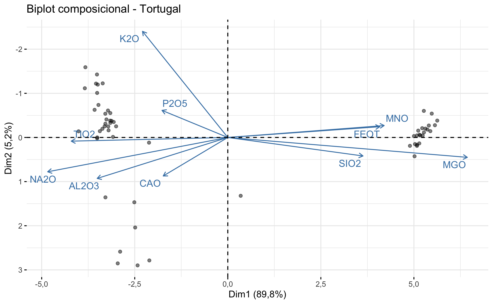

# Introducción

En las ciencias geológicas y de la tierra se trabajan con diversos tipos de datos especiales: datos espaciales, datos direccionales, y datos cerrados [@swan1995]. El presente trabajo se enfoca en estos últimos, en lo que los hacen especiales, cuáles han sido los problemas de tratar con este tipo de datos, y cómo se deben trabajar especialmente desde un punto de vista estadístico.

Datos cerrados son un caso particular de lo que generalmente se denominan datos composicionales. Datos composicionales son datos positivos que guardan información relativa y sus componentes (partes) son parte de un todo, un total, el cual por lo general corresponde con 100%, 1 (proporciones), partes por millón (ppm), mg/l, mg/kg, donde típicamente este total no es de importancia, y el interés es más en la relación entre las partes (${x_i}/{x_j}$) [@vandenboogaart2013; @greenacre2019a; @aitchison1986; @filzmoser2018; @pawlowsky-glahn2011; @pawlowsky-glahn2015]. Datos composicionales se pueden representar como un vector con $D$ partes y que puede cerrar a un valor total $k$ (Ecuación \@ref(eq:partes)).


\begin{equation}
  S^D = {(x_1, x_2, \cdots, x_D): x_1>0, x_2>0, \cdots, x_D>0; x_1 + x_2+, \cdots, + x_D=k}
  (\#eq:partes)
\end{equation}


En geología datos composicionales se encuentran de forma importante en geoquímica (óxidos mayores, elementos menores), petrografía (componentes de rocas), hidrogeoquímica (iones, cationes, etc.), análisis de sedimentos (arenas, limos, arcillas), de ahí la importancia de conocer cómo trabajar con este tipo de datos de una forma apropiada.

El problema con este tipo de datos, es que como suman a un total ($k$, Ecuación \@ref(eq:partes)), el espacio en donde habitan los datos se encuentra restringido (0-1, 0-100%) y las técnicas estadísticas no son válidas, ya que éstas operan en el espacio $-\infty,\infty$. Estos problemas, especialmente las correlaciones espurias, han sido de conocimiento desde los trabajos de @pearson1897prsl, @chayes1960jgr, @chayes1962tjog, pero una solución o forma apropiada de trabajar con estos datos no fue introducida hasta los trabajos de @aitchison1982jrsssbm, @aitchison1984mg, @aitchison1986. Este trabajo hace un esfuerzo en resumir lo básico de lo establecido por estos trabajos seminales y trabajos posteriores que se han basado y ampliado lo desarrollado por Aitchison.

La metodología de análisis de datos composicionales es reciente, como se mencionó anteriormente, y realmente no ha tenido mucha acogida aplicados a temas en geociencias hasta años recientes. Lo anterior se ve reflejado en artículos que hacen uso de este análisis en geociencias, donde hay trabajos principalmente por Aitchison a principios de los años 2000 [@thomas2003pcdaw; @buccianti2005mg; @thomas2005mg]. En la última década se han dedicado volúmenes especiales de revistas internacionales a estudios que hacen uso de estos análisis (Journal of Geochemical Exploration, 2014, Vol. 141; Applied Geochemistry, 2016, Vol. 75), y más recientemente en un estudio multidisciplinario de @montsion2019aes. Esto hace ver que aun hace falta impulsar el uso de esta metodología en las geociencias.

Para demostrar la teoría presentada se va a usar el software estadístico libre multiplataforma **R** [@R-base], así como una serie de paquetes específicamente desarrollados para análisis de datos composicionales [@R-compositions; @R-easyCODA; @R-zCompositions; @R-robCompositions], y diversos juegos de datos.

# Principios de análisis de datos composicionales

@aitchison1986 propuso ciertos principios que se deben respetar durante cualquier análisis de datos composicionales para que los resultados obtenidos se puedan considerar representativos y satisfactorios. 

## Invariancia escalar

Este principio se basa en que la relación entre componentes va a ser la misma sin importar la escala de los datos y el valor del total de la suma de los componentes. Por ejemplo los siguientes vectores representan la misma composición, independiente de las unidades: $a=[15,3,9], \ b=[300,60,180], \ c=[5,1,3]$, donde varían únicamente por los factores $w=20$ y $w=1/3$ para a-b y a-c respectivamente.

## Coherencia subcomposicional

Este principio establece que el analizar una parte de la composición "completa", que ha sido re-cerrada, debe arrojar los mimos resultados que al analizar la composición "completa". Esto es de vital importancia ya que @aitchison1986 hace alusión a que realmente nunca se tiene la composición completa ya que siempre va haber alguna parte o componente que no se mide por lo que en realidad siempre estamos trabajando con subcomposiciones. Se puede pensar como el análogo en estadística clásica de que una muestra nunca va a capturar la totalidad la población de interés, en el caso de datos composicionales refiriéndose a la totalidad de los componentes.

## Invariancia por permutación

Este hace referencia a que el orden de los componentes no debe afectar el análisis de los datos, las partes pueden ordenarse de cualquier manera que el resultado tiene que ser el mismo.

Para demostrar el problema con las correlaciones elucidado por @pearson1897prsl, @chayes1960jgr, y el incumplimiento del principio de coherencia subcomposicional al trabajar con los datos crudos y una subcomposición, se van a usar los datos geoquímicos de sedimentos glaciáricos del macizo Aar presentes en el paquete **compositions** [@R-compositions].

La Figura \@ref(fig:cor-espuria) muestra un ejemplo de calcular el coeficiente de correlación de Pearson para los mismos componentes (partes) para la composición "completa" (**A**) y una subcomposición (**B**). Se ve el efecto de las relaciones espurias (falsas, engañosas) y el incumplimiento de coherencia subcomposicional, los cuales son perjudiciales para obtener resultados y conclusiones significativas.


(ref:cor-espuria) **A** Correlación entre MgO y TiO2 para la composición "completa" del macizo Aar. Se observa una relación positiva y con un valor de $r=.765$, **B** Correlación entre MgO y TiO2 para la subcomposición TiO2, MnO, MgO, Fe2O3t. Se observa como cambia la relación a negativa y con un valor de $r=-.691$.

<div class="figure" style="text-align: center">

<p class="caption">(\#fig:cor-espuria)(ref:cor-espuria)</p>
</div>

# Transformaciones log-cocientes

@aitchison1982jrsssbm, @aitchison1984mg, y más formalmente @aitchison1986 introduce el concepto de log-cocientes ($log(x_i/x_j)=-log(x_j/x_i)$), los cuales no son solo más estables matemáticamente sino que también van a cumplir con los principios de análisis composicional, y reflejan la naturaleza de estos datos donde el interés está en la relación entre partes.

Dentro de las ventajas de la transformación log-cociente están que abre los datos al pasar de un espacio restringido (0-1, 0-100) a uno abierto ($-\infty,\infty$), lo que permite utilizar técnicas de análisis multivariable, y es coherente subcomposicionalmente. El número total de pares va a estar dado por la Ecuación \@ref(eq:pares-log), donde $D$ es el número de componentes (partes).


\begin{equation}
  pares = \frac{D(D-1)}{2}
  (\#eq:pares-log)
\end{equation}


Utilizando esta transformación y realizando una relación entre las partes $TiO_2/Fe_2O_3t$ y $MnO/MgO$ de los datos de Aar, se obtiene el mismo resultado a si se utiliza la composición "completa" o una subcomposición (Figura \@ref(fig:cor-log)), mostrando la fortaleza y consistencia de este método al trabajar con datos composicionales.

(ref:cor-log) **A** Correlación entre $log(TiO_2/Fe_2O_3t)$ y $log(MnO/MgO)$ para la composición "completa" del macizo Aar. Se observa una relación positiva y con un valor de $r=.517$, **B** Correlación entre $log(TiO_2/Fe_2O_3t)$ y $log(MnO/MgO)$ para la subcomposición $TiO_2$, $MnO$, $MgO$, $Fe_2O_3t$. Se observa la misma relación y valor de correlación.

<div class="figure" style="text-align: center">

<p class="caption">(\#fig:cor-log)(ref:cor-log)</p>
</div>

Dada la Ecuación \@ref(eq:pares-log) es claro que conforme más partes se tengan mayor el número de log-cocientes que se tienen. Es por esto que se han definido varios log-cocientes especiales, que van a resultar en $D$ o $D-1$ log-cocientes representativos de la composición general [@aitchison1986; @pawlowsky-glahn2011; @pawlowsky-glahn2015; @egozcue2003mg; @greenacre2020acag].

## Log-cociente aditivo (Additive logratio - ALR)

@aitchison1986 definió este log-cociente a como se muestra en la Ecuación \@ref(eq:alr) y describe a la composición en $D-1$ log-cocientes o coordenadas. En general se calcula usando una de las partes como denominador del resto, donde la selección del denominador puede tener un sentido práctico o ser aleatoria, donde lo típico o por defecto es usar la última parte.


\begin{equation}
  alr(x) = \Big[log \frac{x_1}{x_D}, \cdots , log \frac{x_{D-1}}{x_D}\Big]
  (\#eq:alr)
\end{equation}


Esta transformación es útil para hipótesis estadísticas y modelos lineales pero presenta los inconvenientes de que es asimétrica (no preserva las distancias y ángulos originales entre las partes) [@pawlowsky-glahn2011; @buccianti2014jge; @egozcue2003mg].

<!-- El Cuadro \@ref(tab:alr-ej) muestra las primera lineas de la transformación *alr* para los datos de Aar, usando $SiO_2$ como el denominador. -->


## Log-cociente centrado (Centered logratio - CLR)

Para solventar el hecho de la asimetría del *alr*, @aitchison1986 introdujo el log-cociente centrado (Ecuación \@ref(eq:clr)). Este log-cociente describe a la composición en $D$ log-cocientes o coordenadas. Se calcula usando la media geométrica de las observaciones (filas) de la composición ($g_m(x)$).


\begin{equation}
  clr(x) = \Big[log \frac{x_1}{g_m(x)} , \cdots , log \frac{x_{D-1}}{g_m(x)} \Big]
  (\#eq:clr)
\end{equation}

donde $g_m(x)=(x_1 x_2 \cdots x_D)^{1/D}$.

Al mantener las distancias y ángulos es útil en técnicas donde estos valores son importantes, como Análisis de Componentes Principales (Principal Component Analysis - PCA en inglés) y análisis de agrupamientos (Cluster analysis), pero no es coherente subcomposicionalmente ya que la media geométrica cambia con la presencia o ausencia de las partes, y además la matriz de covarianza es singular [@pawlowsky-glahn2011; @buccianti2014jge; @egozcue2003mg; @aitchison2008p3cdaw].

<!-- El Cuadro \@ref(tab:clr-ej) muestra las primera lineas de la transformación *clr* para los datos de Aar. -->


## Log-cociente isométrico (Isometric logratio - ILR)

Para trabajar con una transformación que mantiene todas las propiedades necesarias, @egozcue2003mg introdujeron el log-cociente isométrico. Esta transformación describe a la composición en $D-1$ log-cocientes o coordenadas. Existen dos formas principales para definir estas coordenadas: balances o pivotes. Los balances [@egozcue2005mg] se obtienen utilizando lo que se conoce como partición secuencial binaria (Sequential Binary Partition - SBP en inglés), donde de manera automática o definida por el usuario las partes de la composición se agrupan en subconjuntos (Ecuación \@ref(eq:ilr-balances)). Los pivotes [@fiserova2011mg] utilizan de igual manera la SBP pero de una forma escalonada donde en la primer coordenada (pivote) el primer subconjunto es la primer parte ($x_1$) y el segundo subconjunto es el resto de partes ($x_2,\cdots,x_D$), en la segunda coordenada (pivote) el primer subconjunto es la segunda parte ($x_2$) y el segundo subconjunto es el resto de partes ($x_3,\cdots,x_D$), así sucesivamente (Ecuación \@ref(eq:ilr-pivotes)).


\begin{equation}
  b_k = \sqrt{\frac{rs}{r+s}}log \frac{g(x_{r})}{g(x_{s})} 
  (\#eq:ilr-balances)
\end{equation}

En la expresión anterior $r$ y $g(x_{r})$ son el número de partes y media geométrica del subconjunto $r$, $s$ y $g(x_{s})$ son el número de partes y media geométrica del subconjunto $s$. Típicamente $r$ se codifica como $+1$ y $s$ como $-1$.

\begin{equation}
  z_i = \sqrt{\frac{D-i}{D-i+1}}log \frac{x_i}{\sqrt[D-i]{\prod^D_{j=i+1}x_j}}
  (\#eq:ilr-pivotes)
\end{equation}

Este log-cociente presente mucho atractivo matemático y teórico pero es tal vez el más difícil de interpretar si no se definen los subconjuntos explícitamente [@vandenboogaart2013; @greenacre2019a]. La construcción de los balances va a depender del área de estudio (naturaleza de los datos, ej: rocas ígneas, rocas sedimentarias, hidrogeoquímica), del problema a estudiar, y de las partes que se tengan [@vandenboogaart2013; @pawlowsky-glahn2015]. Ejemplos de posibles balances y pivotes se muestran en los Cuadros \@ref(tab:balances-hydro) y \@ref(tab:pivotes-hydro), respectivamente, para datos de hidro(geo)química, donde se toman en cuenta únicamente los aniones y cationes. Para los balances el analista tiene completo control sobre qué asignar en cada partición, mientras que para los pivotes lo importante es el orden de las partes. En general los subconjuntos en las particiones se codifican con $+1$ y $-1$ para diferenciar a cuál pertenecen. Estas matrices de partición binaria secuencial se usan para la construcción de las coordenadas (transformación) *ilr*.

```{=html}
<template id="64462a2c-f33a-4adf-b3df-bd3f70a77f2f"><style>
.tabwid table{
  border-collapse:collapse;
  line-height:1;
  margin-left:auto;
  margin-right:auto;
  border-width: 0;
  display: table;
  margin-top: 1.275em;
  margin-bottom: 1.275em;
  border-spacing: 0;
  border-color: transparent;
}
.tabwid_left table{
  margin-left:0;
}
.tabwid_right table{
  margin-right:0;
}
.tabwid td {
    padding: 0;
}
.tabwid a {
  text-decoration: none;
}
.tabwid thead {
    background-color: transparent;
}
.tabwid tfoot {
    background-color: transparent;
}
.tabwid table tr {
background-color: transparent;
}
</style><div class="tabwid"><style>.cl-7a9d0edc{border-collapse:collapse;}.cl-7a92d53e{font-family:'Helvetica';font-size:11pt;font-weight:bold;font-style:normal;text-decoration:none;color:rgba(0, 0, 0, 1.00);background-color:transparent;}.cl-7a92d566{font-family:'Helvetica';font-size:6.6pt;font-weight:bold;font-style:normal;text-decoration:none;color:rgba(0, 0, 0, 1.00);background-color:transparent;position: relative;bottom:3.3pt;}.cl-7a92d570{font-family:'Helvetica';font-size:6.6pt;font-weight:bold;font-style:normal;text-decoration:none;color:rgba(0, 0, 0, 1.00);background-color:transparent;position: relative;top:3.3pt;}.cl-7a92d57a{font-family:'Helvetica';font-size:11pt;font-weight:normal;font-style:normal;text-decoration:none;color:rgba(0, 0, 0, 1.00);background-color:transparent;}.cl-7a92e6a0{margin:0;text-align:center;border-bottom: 0 solid rgba(0, 0, 0, 1.00);border-top: 0 solid rgba(0, 0, 0, 1.00);border-left: 0 solid rgba(0, 0, 0, 1.00);border-right: 0 solid rgba(0, 0, 0, 1.00);padding-bottom:5pt;padding-top:5pt;padding-left:5pt;padding-right:5pt;line-height: 1;background-color:transparent;}.cl-7a9341fe{width:54pt;background-color:transparent;vertical-align: middle;border-bottom: 0 solid rgba(0, 0, 0, 1.00);border-top: 0 solid rgba(0, 0, 0, 1.00);border-left: 0 solid rgba(0, 0, 0, 1.00);border-right: 0 solid rgba(0, 0, 0, 1.00);margin-bottom:0;margin-top:0;margin-left:0;margin-right:0;}.cl-7a934230{width:54pt;background-color:transparent;vertical-align: middle;border-bottom: 2pt solid rgba(102, 102, 102, 1.00);border-top: 0 solid rgba(0, 0, 0, 1.00);border-left: 0 solid rgba(0, 0, 0, 1.00);border-right: 0 solid rgba(0, 0, 0, 1.00);margin-bottom:0;margin-top:0;margin-left:0;margin-right:0;}.cl-7a93423a{width:54pt;background-color:transparent;vertical-align: middle;border-bottom: 2pt solid rgba(102, 102, 102, 1.00);border-top: 2pt solid rgba(102, 102, 102, 1.00);border-left: 0 solid rgba(0, 0, 0, 1.00);border-right: 0 solid rgba(0, 0, 0, 1.00);margin-bottom:0;margin-top:0;margin-left:0;margin-right:0;}</style><table class='cl-7a9d0edc'>
```
<caption class="Table Caption">(\#tab:balances-hydro)Ejemplo de balances (SBP) para cationes y aniones mayores usados en hidro(geo)química.</caption>
```{=html}
<thead><tr style="overflow-wrap:break-word;"><td class="cl-7a93423a"><p class="cl-7a92e6a0"><span class="cl-7a92d53e">Balance</span></p></td><td class="cl-7a93423a"><p class="cl-7a92e6a0"><span class="cl-7a92d53e">Na</span><span class="cl-7a92d566">+</span></p></td><td class="cl-7a93423a"><p class="cl-7a92e6a0"><span class="cl-7a92d53e">K</span><span class="cl-7a92d566">+</span></p></td><td class="cl-7a93423a"><p class="cl-7a92e6a0"><span class="cl-7a92d53e">Ca</span><span class="cl-7a92d566">2+</span></p></td><td class="cl-7a93423a"><p class="cl-7a92e6a0"><span class="cl-7a92d53e">Mg</span><span class="cl-7a92d566">+</span></p></td><td class="cl-7a93423a"><p class="cl-7a92e6a0"><span class="cl-7a92d53e">Cl</span><span class="cl-7a92d566">-</span></p></td><td class="cl-7a93423a"><p class="cl-7a92e6a0"><span class="cl-7a92d53e">SO</span><span class="cl-7a92d570">4</span><span class="cl-7a92d566">2-</span></p></td><td class="cl-7a93423a"><p class="cl-7a92e6a0"><span class="cl-7a92d53e">HCO</span><span class="cl-7a92d570">3</span><span class="cl-7a92d566">-</span></p></td></tr></thead><tbody><tr style="overflow-wrap:break-word;"><td class="cl-7a9341fe"><p class="cl-7a92e6a0"><span class="cl-7a92d57a">b1</span></p></td><td class="cl-7a9341fe"><p class="cl-7a92e6a0"><span class="cl-7a92d57a">1</span></p></td><td class="cl-7a9341fe"><p class="cl-7a92e6a0"><span class="cl-7a92d57a">1</span></p></td><td class="cl-7a9341fe"><p class="cl-7a92e6a0"><span class="cl-7a92d57a">1</span></p></td><td class="cl-7a9341fe"><p class="cl-7a92e6a0"><span class="cl-7a92d57a">1</span></p></td><td class="cl-7a9341fe"><p class="cl-7a92e6a0"><span class="cl-7a92d57a">-1</span></p></td><td class="cl-7a9341fe"><p class="cl-7a92e6a0"><span class="cl-7a92d57a">-1</span></p></td><td class="cl-7a9341fe"><p class="cl-7a92e6a0"><span class="cl-7a92d57a">-1</span></p></td></tr><tr style="overflow-wrap:break-word;"><td class="cl-7a9341fe"><p class="cl-7a92e6a0"><span class="cl-7a92d57a">b2</span></p></td><td class="cl-7a9341fe"><p class="cl-7a92e6a0"><span class="cl-7a92d57a">1</span></p></td><td class="cl-7a9341fe"><p class="cl-7a92e6a0"><span class="cl-7a92d57a">1</span></p></td><td class="cl-7a9341fe"><p class="cl-7a92e6a0"><span class="cl-7a92d57a">-1</span></p></td><td class="cl-7a9341fe"><p class="cl-7a92e6a0"><span class="cl-7a92d57a">-1</span></p></td><td class="cl-7a9341fe"><p class="cl-7a92e6a0"><span class="cl-7a92d57a">0</span></p></td><td class="cl-7a9341fe"><p class="cl-7a92e6a0"><span class="cl-7a92d57a">0</span></p></td><td class="cl-7a9341fe"><p class="cl-7a92e6a0"><span class="cl-7a92d57a">0</span></p></td></tr><tr style="overflow-wrap:break-word;"><td class="cl-7a9341fe"><p class="cl-7a92e6a0"><span class="cl-7a92d57a">b3</span></p></td><td class="cl-7a9341fe"><p class="cl-7a92e6a0"><span class="cl-7a92d57a">1</span></p></td><td class="cl-7a9341fe"><p class="cl-7a92e6a0"><span class="cl-7a92d57a">-1</span></p></td><td class="cl-7a9341fe"><p class="cl-7a92e6a0"><span class="cl-7a92d57a">0</span></p></td><td class="cl-7a9341fe"><p class="cl-7a92e6a0"><span class="cl-7a92d57a">0</span></p></td><td class="cl-7a9341fe"><p class="cl-7a92e6a0"><span class="cl-7a92d57a">0</span></p></td><td class="cl-7a9341fe"><p class="cl-7a92e6a0"><span class="cl-7a92d57a">0</span></p></td><td class="cl-7a9341fe"><p class="cl-7a92e6a0"><span class="cl-7a92d57a">0</span></p></td></tr><tr style="overflow-wrap:break-word;"><td class="cl-7a9341fe"><p class="cl-7a92e6a0"><span class="cl-7a92d57a">b4</span></p></td><td class="cl-7a9341fe"><p class="cl-7a92e6a0"><span class="cl-7a92d57a">0</span></p></td><td class="cl-7a9341fe"><p class="cl-7a92e6a0"><span class="cl-7a92d57a">0</span></p></td><td class="cl-7a9341fe"><p class="cl-7a92e6a0"><span class="cl-7a92d57a">1</span></p></td><td class="cl-7a9341fe"><p class="cl-7a92e6a0"><span class="cl-7a92d57a">-1</span></p></td><td class="cl-7a9341fe"><p class="cl-7a92e6a0"><span class="cl-7a92d57a">0</span></p></td><td class="cl-7a9341fe"><p class="cl-7a92e6a0"><span class="cl-7a92d57a">0</span></p></td><td class="cl-7a9341fe"><p class="cl-7a92e6a0"><span class="cl-7a92d57a">0</span></p></td></tr><tr style="overflow-wrap:break-word;"><td class="cl-7a9341fe"><p class="cl-7a92e6a0"><span class="cl-7a92d57a">b5</span></p></td><td class="cl-7a9341fe"><p class="cl-7a92e6a0"><span class="cl-7a92d57a">0</span></p></td><td class="cl-7a9341fe"><p class="cl-7a92e6a0"><span class="cl-7a92d57a">0</span></p></td><td class="cl-7a9341fe"><p class="cl-7a92e6a0"><span class="cl-7a92d57a">0</span></p></td><td class="cl-7a9341fe"><p class="cl-7a92e6a0"><span class="cl-7a92d57a">0</span></p></td><td class="cl-7a9341fe"><p class="cl-7a92e6a0"><span class="cl-7a92d57a">1</span></p></td><td class="cl-7a9341fe"><p class="cl-7a92e6a0"><span class="cl-7a92d57a">1</span></p></td><td class="cl-7a9341fe"><p class="cl-7a92e6a0"><span class="cl-7a92d57a">-1</span></p></td></tr><tr style="overflow-wrap:break-word;"><td class="cl-7a934230"><p class="cl-7a92e6a0"><span class="cl-7a92d57a">b6</span></p></td><td class="cl-7a934230"><p class="cl-7a92e6a0"><span class="cl-7a92d57a">0</span></p></td><td class="cl-7a934230"><p class="cl-7a92e6a0"><span class="cl-7a92d57a">0</span></p></td><td class="cl-7a934230"><p class="cl-7a92e6a0"><span class="cl-7a92d57a">0</span></p></td><td class="cl-7a934230"><p class="cl-7a92e6a0"><span class="cl-7a92d57a">0</span></p></td><td class="cl-7a934230"><p class="cl-7a92e6a0"><span class="cl-7a92d57a">1</span></p></td><td class="cl-7a934230"><p class="cl-7a92e6a0"><span class="cl-7a92d57a">-1</span></p></td><td class="cl-7a934230"><p class="cl-7a92e6a0"><span class="cl-7a92d57a">0</span></p></td></tr></tbody></table></div></template>
<div class="flextable-shadow-host" id="5dfd0ffd-98c4-4b10-9d17-8f32ea508d37"></div>
<script>
var dest = document.getElementById("5dfd0ffd-98c4-4b10-9d17-8f32ea508d37");
var template = document.getElementById("64462a2c-f33a-4adf-b3df-bd3f70a77f2f");
var caption = template.content.querySelector("caption");
if(caption) {
  caption.style.cssText = "display:block;text-align:center;";
  var newcapt = document.createElement("p");
  newcapt.appendChild(caption)
  dest.parentNode.insertBefore(newcapt, dest.previousSibling);
}
var fantome = dest.attachShadow({mode: 'open'});
var templateContent = template.content;
fantome.appendChild(templateContent);
</script>

```

```{=html}
<template id="8f866907-307d-4619-8477-37d6cb53baa1"><style>
.tabwid table{
  border-collapse:collapse;
  line-height:1;
  margin-left:auto;
  margin-right:auto;
  border-width: 0;
  display: table;
  margin-top: 1.275em;
  margin-bottom: 1.275em;
  border-spacing: 0;
  border-color: transparent;
}
.tabwid_left table{
  margin-left:0;
}
.tabwid_right table{
  margin-right:0;
}
.tabwid td {
    padding: 0;
}
.tabwid a {
  text-decoration: none;
}
.tabwid thead {
    background-color: transparent;
}
.tabwid tfoot {
    background-color: transparent;
}
.tabwid table tr {
background-color: transparent;
}
</style><div class="tabwid"><style>.cl-7ad6f66a{border-collapse:collapse;}.cl-7acd034e{font-family:'Helvetica';font-size:11pt;font-weight:bold;font-style:normal;text-decoration:none;color:rgba(0, 0, 0, 1.00);background-color:transparent;}.cl-7acd0376{font-family:'Helvetica';font-size:6.6pt;font-weight:bold;font-style:normal;text-decoration:none;color:rgba(0, 0, 0, 1.00);background-color:transparent;position: relative;bottom:3.3pt;}.cl-7acd0394{font-family:'Helvetica';font-size:6.6pt;font-weight:bold;font-style:normal;text-decoration:none;color:rgba(0, 0, 0, 1.00);background-color:transparent;position: relative;top:3.3pt;}.cl-7acd039e{font-family:'Helvetica';font-size:11pt;font-weight:normal;font-style:normal;text-decoration:none;color:rgba(0, 0, 0, 1.00);background-color:transparent;}.cl-7acd14ba{margin:0;text-align:center;border-bottom: 0 solid rgba(0, 0, 0, 1.00);border-top: 0 solid rgba(0, 0, 0, 1.00);border-left: 0 solid rgba(0, 0, 0, 1.00);border-right: 0 solid rgba(0, 0, 0, 1.00);padding-bottom:5pt;padding-top:5pt;padding-left:5pt;padding-right:5pt;line-height: 1;background-color:transparent;}.cl-7acd5b64{width:54pt;background-color:transparent;vertical-align: middle;border-bottom: 0 solid rgba(0, 0, 0, 1.00);border-top: 0 solid rgba(0, 0, 0, 1.00);border-left: 0 solid rgba(0, 0, 0, 1.00);border-right: 0 solid rgba(0, 0, 0, 1.00);margin-bottom:0;margin-top:0;margin-left:0;margin-right:0;}.cl-7acd5b8c{width:54pt;background-color:transparent;vertical-align: middle;border-bottom: 2pt solid rgba(102, 102, 102, 1.00);border-top: 0 solid rgba(0, 0, 0, 1.00);border-left: 0 solid rgba(0, 0, 0, 1.00);border-right: 0 solid rgba(0, 0, 0, 1.00);margin-bottom:0;margin-top:0;margin-left:0;margin-right:0;}.cl-7acd5b96{width:54pt;background-color:transparent;vertical-align: middle;border-bottom: 2pt solid rgba(102, 102, 102, 1.00);border-top: 2pt solid rgba(102, 102, 102, 1.00);border-left: 0 solid rgba(0, 0, 0, 1.00);border-right: 0 solid rgba(0, 0, 0, 1.00);margin-bottom:0;margin-top:0;margin-left:0;margin-right:0;}</style><table class='cl-7ad6f66a'>
```
<caption class="Table Caption">(\#tab:pivotes-hydro)Ejemplo de pivotes (SBP escalonada) para cationes y aniones mayores usados en hidro(geo)química.</caption>
```{=html}
<thead><tr style="overflow-wrap:break-word;"><td class="cl-7acd5b96"><p class="cl-7acd14ba"><span class="cl-7acd034e">Pivote</span></p></td><td class="cl-7acd5b96"><p class="cl-7acd14ba"><span class="cl-7acd034e">Na</span><span class="cl-7acd0376">+</span></p></td><td class="cl-7acd5b96"><p class="cl-7acd14ba"><span class="cl-7acd034e">K</span><span class="cl-7acd0376">+</span></p></td><td class="cl-7acd5b96"><p class="cl-7acd14ba"><span class="cl-7acd034e">Ca</span><span class="cl-7acd0376">2+</span></p></td><td class="cl-7acd5b96"><p class="cl-7acd14ba"><span class="cl-7acd034e">Mg</span><span class="cl-7acd0376">+</span></p></td><td class="cl-7acd5b96"><p class="cl-7acd14ba"><span class="cl-7acd034e">Cl</span><span class="cl-7acd0376">-</span></p></td><td class="cl-7acd5b96"><p class="cl-7acd14ba"><span class="cl-7acd034e">SO</span><span class="cl-7acd0394">4</span><span class="cl-7acd0376">2-</span></p></td><td class="cl-7acd5b96"><p class="cl-7acd14ba"><span class="cl-7acd034e">HCO</span><span class="cl-7acd0394">3</span><span class="cl-7acd0376">-</span></p></td></tr></thead><tbody><tr style="overflow-wrap:break-word;"><td class="cl-7acd5b64"><p class="cl-7acd14ba"><span class="cl-7acd039e">z1</span></p></td><td class="cl-7acd5b64"><p class="cl-7acd14ba"><span class="cl-7acd039e">1</span></p></td><td class="cl-7acd5b64"><p class="cl-7acd14ba"><span class="cl-7acd039e">-1</span></p></td><td class="cl-7acd5b64"><p class="cl-7acd14ba"><span class="cl-7acd039e">-1</span></p></td><td class="cl-7acd5b64"><p class="cl-7acd14ba"><span class="cl-7acd039e">-1</span></p></td><td class="cl-7acd5b64"><p class="cl-7acd14ba"><span class="cl-7acd039e">-1</span></p></td><td class="cl-7acd5b64"><p class="cl-7acd14ba"><span class="cl-7acd039e">-1</span></p></td><td class="cl-7acd5b64"><p class="cl-7acd14ba"><span class="cl-7acd039e">-1</span></p></td></tr><tr style="overflow-wrap:break-word;"><td class="cl-7acd5b64"><p class="cl-7acd14ba"><span class="cl-7acd039e">z2</span></p></td><td class="cl-7acd5b64"><p class="cl-7acd14ba"><span class="cl-7acd039e">0</span></p></td><td class="cl-7acd5b64"><p class="cl-7acd14ba"><span class="cl-7acd039e">1</span></p></td><td class="cl-7acd5b64"><p class="cl-7acd14ba"><span class="cl-7acd039e">-1</span></p></td><td class="cl-7acd5b64"><p class="cl-7acd14ba"><span class="cl-7acd039e">-1</span></p></td><td class="cl-7acd5b64"><p class="cl-7acd14ba"><span class="cl-7acd039e">-1</span></p></td><td class="cl-7acd5b64"><p class="cl-7acd14ba"><span class="cl-7acd039e">-1</span></p></td><td class="cl-7acd5b64"><p class="cl-7acd14ba"><span class="cl-7acd039e">-1</span></p></td></tr><tr style="overflow-wrap:break-word;"><td class="cl-7acd5b64"><p class="cl-7acd14ba"><span class="cl-7acd039e">z3</span></p></td><td class="cl-7acd5b64"><p class="cl-7acd14ba"><span class="cl-7acd039e">0</span></p></td><td class="cl-7acd5b64"><p class="cl-7acd14ba"><span class="cl-7acd039e">0</span></p></td><td class="cl-7acd5b64"><p class="cl-7acd14ba"><span class="cl-7acd039e">1</span></p></td><td class="cl-7acd5b64"><p class="cl-7acd14ba"><span class="cl-7acd039e">-1</span></p></td><td class="cl-7acd5b64"><p class="cl-7acd14ba"><span class="cl-7acd039e">-1</span></p></td><td class="cl-7acd5b64"><p class="cl-7acd14ba"><span class="cl-7acd039e">-1</span></p></td><td class="cl-7acd5b64"><p class="cl-7acd14ba"><span class="cl-7acd039e">-1</span></p></td></tr><tr style="overflow-wrap:break-word;"><td class="cl-7acd5b64"><p class="cl-7acd14ba"><span class="cl-7acd039e">z4</span></p></td><td class="cl-7acd5b64"><p class="cl-7acd14ba"><span class="cl-7acd039e">0</span></p></td><td class="cl-7acd5b64"><p class="cl-7acd14ba"><span class="cl-7acd039e">0</span></p></td><td class="cl-7acd5b64"><p class="cl-7acd14ba"><span class="cl-7acd039e">0</span></p></td><td class="cl-7acd5b64"><p class="cl-7acd14ba"><span class="cl-7acd039e">1</span></p></td><td class="cl-7acd5b64"><p class="cl-7acd14ba"><span class="cl-7acd039e">-1</span></p></td><td class="cl-7acd5b64"><p class="cl-7acd14ba"><span class="cl-7acd039e">-1</span></p></td><td class="cl-7acd5b64"><p class="cl-7acd14ba"><span class="cl-7acd039e">-1</span></p></td></tr><tr style="overflow-wrap:break-word;"><td class="cl-7acd5b64"><p class="cl-7acd14ba"><span class="cl-7acd039e">z5</span></p></td><td class="cl-7acd5b64"><p class="cl-7acd14ba"><span class="cl-7acd039e">0</span></p></td><td class="cl-7acd5b64"><p class="cl-7acd14ba"><span class="cl-7acd039e">0</span></p></td><td class="cl-7acd5b64"><p class="cl-7acd14ba"><span class="cl-7acd039e">0</span></p></td><td class="cl-7acd5b64"><p class="cl-7acd14ba"><span class="cl-7acd039e">0</span></p></td><td class="cl-7acd5b64"><p class="cl-7acd14ba"><span class="cl-7acd039e">1</span></p></td><td class="cl-7acd5b64"><p class="cl-7acd14ba"><span class="cl-7acd039e">-1</span></p></td><td class="cl-7acd5b64"><p class="cl-7acd14ba"><span class="cl-7acd039e">-1</span></p></td></tr><tr style="overflow-wrap:break-word;"><td class="cl-7acd5b8c"><p class="cl-7acd14ba"><span class="cl-7acd039e">z6</span></p></td><td class="cl-7acd5b8c"><p class="cl-7acd14ba"><span class="cl-7acd039e">0</span></p></td><td class="cl-7acd5b8c"><p class="cl-7acd14ba"><span class="cl-7acd039e">0</span></p></td><td class="cl-7acd5b8c"><p class="cl-7acd14ba"><span class="cl-7acd039e">0</span></p></td><td class="cl-7acd5b8c"><p class="cl-7acd14ba"><span class="cl-7acd039e">0</span></p></td><td class="cl-7acd5b8c"><p class="cl-7acd14ba"><span class="cl-7acd039e">0</span></p></td><td class="cl-7acd5b8c"><p class="cl-7acd14ba"><span class="cl-7acd039e">1</span></p></td><td class="cl-7acd5b8c"><p class="cl-7acd14ba"><span class="cl-7acd039e">-1</span></p></td></tr></tbody></table></div></template>
<div class="flextable-shadow-host" id="6e241879-a8b3-4ad4-941e-bbfc7824b6b6"></div>
<script>
var dest = document.getElementById("6e241879-a8b3-4ad4-941e-bbfc7824b6b6");
var template = document.getElementById("8f866907-307d-4619-8477-37d6cb53baa1");
var caption = template.content.querySelector("caption");
if(caption) {
  caption.style.cssText = "display:block;text-align:center;";
  var newcapt = document.createElement("p");
  newcapt.appendChild(caption)
  dest.parentNode.insertBefore(newcapt, dest.previousSibling);
}
var fantome = dest.attachShadow({mode: 'open'});
var templateContent = template.content;
fantome.appendChild(templateContent);
</script>

```


<!-- El Cuadro \@ref(tab:ilr-ej) muestra las primera lineas de la transformación *ilr* para los datos de Aar, usando los subconjuntos por defecto escogidos por el software. -->


## Log-cociente sumado (Summated logratio - SLR)

@greenacre2020acag ha propuesto el uso de amalgamamiento (suma, unión) de partes para la creación de log-cocientes (Ecuación \@ref(eq:slr)), indicando que en muchas ocasiones hay sustento teórico y sentido práctico para crear log-cocientes que involucran diferentes partes agrupadas en subconjuntos. Esta transformación es asimétrica pero coherente subcomposicionalmente.

\begin{equation}
  slr(x) = \frac{\sum x_{J1}}{\sum x_{J2}}
  (\#eq:slr)
\end{equation}

donde $x_{J1} = \text{partes del subconjunto 1}$ y $x_{J2} = \text{partes del subconjunto 2}$, y el subconjunto puede corresponder con una única parte o una suma de partes.

Como ejemplo en geoquímica el autor menciona que se pueden agrupar las partes $MgO + Fe_2O_3t + MnO$ como la fracción máfica, las partes $Na_2O + SiO_2 + Al_2O_3 + K_2O$ como la fracción félsica, y las partes $CaO + P_2O_5$ como carbonato-apatito.

Al incluir amalgamamientos en la construcción de los log-cocientes se pueden crear más de $D$ log-cocientes, por lo que @greenacre2020acag sugiere usar la selección de variables (log-cocientes, balances) propuesta por @greenacre2019mg. Esta selección se basa en mantener los log-cocientes que expliquen la gran mayoría de la variación de la composición original.

## Ceros y datos perdidos

Es típico encontrar, en todas las ciencias, datos con ceros y/o datos perdidos por diversas razones, donde probablemente las más típicas corresponden con error en mediciones, valores muy bajos que se codifican como cero o redondead a cero, y valores por debajo del límite de detección. Como el análisis de datos composicionales se basa en log-cocientes es de mucha más importancia el saber lidiar con estos casos porque sino los cálculos se indefinen y no son de utilidad en el análisis [@greenacre2019a; @vandenboogaart2013]. Además hay diferentes tipos de ceros o datos perdidos, lo que hace aún más difícil saber como lidiar con cada tipo; @vandenboogaart2013, @filzmoser2018 y @pawlowsky-glahn2015 describen los diferentes tipos. @vandenboogaart2013 implementan de manera implicita su detección y como lidiar con ellos en el paquete **compositions** [@R-compositions].

@vandenboogaart2013, @filzmoser2018 y @greenacre2019a presentan capítulos dedicados a explorar y lidiar con este tipo de datos. @martin-fernandez2003mg, @palarea-albaladejo2014joge y @palarea-albaladejo2015cails introducen técnicas para lidiar con estos datos en el contexto específico de datos composicionales y  @palarea-albaladejo2015cails las implementan en el paquete **zCompositions** [@R-zCompositions] para **R**. El paquete **robCompositions** [@R-robCompositions] también presenta opciones para lidiar con estos datos teniendo en cuenta la naturaleza composicional de los mismos.

Los diferentes autores y la literatura en general recomiendan lidiar con estos datos en vez de ignorarlos (al final queda a criterio de quien analiza los datos). Con las técnicas propuestas por @palarea-albaladejo2014joge y @palarea-albaladejo2015cails, y los paquetes **zCompositions** [@R-zCompositions] y **robCompositions** [@R-robCompositions] disponibles en **R**, se cuentan con herramientas suficientes para poder utilizar toda la información disponible.

En general la técnica para lidiar con estos datos es conocida como *imputación* (imputation en inglés), y consiste en reemplazar los ceros (0) y/o datos perdidos (NA) por valores obtenidos mediante diferentes técnicas. Lo más típico que se ha usado por mucho tiempo antes de contar con técnicas apropiadas era agregar una cantidad pequeña a cada cero o valor perdido, pero no es lo más recomendado hoy en día [@vandenboogaart2013; @filzmoser2018].

Dentro de las técnicas disponibles se tiene las que usan la distribución de la variable/parte a imputar, y las que usan la relación presente entre la variable/parte a imputar con el resto de las variables/partes. Los métodos que usan la distribución de la variable se conocen como *reemplazamiento multiplicativo*. Los métodos que usan la relación entre partes son de tres tipos: uno que se basa en la distancia (similitud) entre parte completas y la parte incompleta (*knn*); uno iterativo que se conoce como *maximización de lo esperado* (*expectation-maximization - EM* en inglés) [@R-zCompositions; @R-robCompositions]; otro que se basa en iteración tipo Monte Carlo de la Cadena de Markov (Markov Chain Monte Carlo - MCMC en inglés) se conoce *aumento de datos* (*data augmentation - DA* en inglés) y es la alternativa Bayesiana para los procesos de máxima probabilidad (maximum likelihood) utilizados en el paradigma frecuentista [@palarea-albaladejo2015cails].

La Figura \@ref(fig:perdidos-ej) presenta un gráfico resumen de la información de datos perdidos para datos composicionales de los 10 óxidos mayores para la Isla del Coco, información tomada de la base de datos geoquímica GEOROC (Geochemistry of Rocks of the Oceans and Continents, http://georoc.mpch-mainz.gwdg.de). Esta figura presenta los diferentes patrones que se encontraron en los datos (combinación de parte perdida con el resto), el porcentaje de datos perdidos por parte/componente y el porcentaje de presencia de cada patrón.

(ref:perdidos-ej) Ejemplo de patrón de datos perdidos para datos de la Isla del Coco. Se observa que el $P_2O_5$ es el componente con más datos perdidos (31,58%) y el patrón dominante es el que tiene todos los componentes y representa un 64,91% del total de los datos. Las celdas azules corresponden con datos perdidos para el patrón específico y las celdas blancas presentan el valor de la media geométrica de cada componente para el patrón específico. Las barras superior y al costado cuantifican el porcentaje de datos perdidos por componente, y el porcentaje de presencia de cada patrón, respectivamente, ordenados de mayor a menor. En total estos datos presentan un 5,96% de datos perdidos.

<div class="figure" style="text-align: center">

<p class="caption">(\#fig:perdidos-ej)(ref:perdidos-ej)</p>
</div>


Para las siguientes secciones se va a trabajar con datos de óxidos mayores de basaltos del Complejo de Nicoya ($N=51$) y del Complejo de Tortugal ($N=59$) para determinar su similitud/disimilitud, usando el análisis de datos composicionales presentado en este trabajo. La información fue tomada de la base de datos geoquímica GEOROC (Geochemistry of Rocks of the Oceans and Continents, http://georoc.mpch-mainz.gwdg.de). 

Los datos del Complejo de Tortugal presentan un 3,73% de datos perdidos, sus patrones y resumen se presentan en la Figura \@ref(fig:perdidos-tortugal), donde se observan dos patrones: uno donde se tienen todas las partes completas y otro donde el $K_2O$ no se registró en un 37,29% del total de las observaciones. Este patrón muestra claras diferencias con el patrón completo, incluyendo un valor muy bajo para el $P_2O_5$. Para poder usar todas las observaciones se imputaron los valores perdidos usando el método de *reemplazamiento multiplicativo* [@R-zCompositions; @palarea-albaladejo2015cails].

(ref:perdidos-tortugal) Patrones y porcentajes de datos perdidos para los datos de óxidos mayores de basaltos del Complejo de Tortugal. Se observa que el único componente que presenta valores perdidos es $K_2O$.

<div class="figure" style="text-align: center">

<p class="caption">(\#fig:perdidos-tortugal)(ref:perdidos-tortugal)</p>
</div>

# Estadística 

En esta sección se introducen las medidas apropiadas para describir una composición, así como una técnica para visualizar las relación entre los componentes, y pruebas estadísticas básicas para realizar inferencias sobre datos composicionales, cumpliendo los principios establecidos anteriormente.

## Descriptiva

Un paso básico al trabajar con datos numéricos es obtener estadísticas que resuman estos datos para brindar una idea de los valores más típicos y la variación en los valores. Dada la naturaleza de los datos composicionales, medidas de tendencia central y dispersión típicas (media aritmética, varianza, dispersión, etc.) no aplican, por lo que se han desarrollado medidas específicas para describir a este tipo de datos.

### Media composicional o centro

@aitchison1997taciamg definió lo que se conoce como *centro* o *media composicional* (Ecuación \@ref(eq:centro)) y corresponde con un vector cerrado de medias geométricas de la composición original por columnas (partes).

\begin{equation}
  \bar{x} = \hat{g} = C[g(x)] = clr^{-1}\bigg( \frac{1}{N} \sum_{n=1}^{N} clr(x) \bigg)
  (\#eq:centro)
\end{equation}

donde $g(x) = (x_1 x_2 \cdots x_D)^{1/D}, \text{media geométrica de la composición}$, $C = \text{operación de cierre de los datos (0-1)}$.

El Cuadro \@ref(tab:centro) muestra la *media composicional* para los basaltos de los Complejos de Tortugal y Nicoya.

```{=html}
<template id="c4ee9bda-aab0-4f09-a141-de97215d5fb4"><style>
.tabwid table{
  border-collapse:collapse;
  line-height:1;
  margin-left:auto;
  margin-right:auto;
  border-width: 0;
  display: table;
  margin-top: 1.275em;
  margin-bottom: 1.275em;
  border-spacing: 0;
  border-color: transparent;
}
.tabwid_left table{
  margin-left:0;
}
.tabwid_right table{
  margin-right:0;
}
.tabwid td {
    padding: 0;
}
.tabwid a {
  text-decoration: none;
}
.tabwid thead {
    background-color: transparent;
}
.tabwid tfoot {
    background-color: transparent;
}
.tabwid table tr {
background-color: transparent;
}
</style><div class="tabwid"><style>.cl-8099af8e{border-collapse:collapse;}.cl-808800ae{font-family:'Helvetica';font-size:10pt;font-weight:bold;font-style:normal;text-decoration:none;color:rgba(0, 0, 0, 1.00);background-color:transparent;}.cl-808800cc{font-family:'Helvetica';font-size:10pt;font-weight:bold;font-style:italic;text-decoration:none;color:rgba(0, 0, 0, 1.00);background-color:transparent;}.cl-808800d6{font-family:'Helvetica';font-size:6pt;font-weight:bold;font-style:normal;text-decoration:none;color:rgba(0, 0, 0, 1.00);background-color:transparent;position: relative;top:3pt;}.cl-808800ea{font-family:'Helvetica';font-size:10pt;font-weight:normal;font-style:normal;text-decoration:none;color:rgba(0, 0, 0, 1.00);background-color:transparent;}.cl-808814e0{margin:0;text-align:center;border-bottom: 0 solid rgba(0, 0, 0, 1.00);border-top: 0 solid rgba(0, 0, 0, 1.00);border-left: 0 solid rgba(0, 0, 0, 1.00);border-right: 0 solid rgba(0, 0, 0, 1.00);padding-bottom:5pt;padding-top:5pt;padding-left:5pt;padding-right:5pt;line-height: 1;background-color:transparent;}.cl-80885784{width:38.4pt;background-color:transparent;vertical-align: middle;border-bottom: 0 solid rgba(0, 0, 0, 1.00);border-top: 0 solid rgba(0, 0, 0, 1.00);border-left: 0 solid rgba(0, 0, 0, 1.00);border-right: 0 solid rgba(0, 0, 0, 1.00);margin-bottom:0;margin-top:0;margin-left:0;margin-right:0;}.cl-808857a2{width:58.9pt;background-color:transparent;vertical-align: middle;border-bottom: 0 solid rgba(0, 0, 0, 1.00);border-top: 0 solid rgba(0, 0, 0, 1.00);border-left: 0 solid rgba(0, 0, 0, 1.00);border-right: 0 solid rgba(0, 0, 0, 1.00);margin-bottom:0;margin-top:0;margin-left:0;margin-right:0;}.cl-808857b6{width:32.8pt;background-color:transparent;vertical-align: middle;border-bottom: 0 solid rgba(0, 0, 0, 1.00);border-top: 0 solid rgba(0, 0, 0, 1.00);border-left: 0 solid rgba(0, 0, 0, 1.00);border-right: 0 solid rgba(0, 0, 0, 1.00);margin-bottom:0;margin-top:0;margin-left:0;margin-right:0;}.cl-808857c0{width:33.3pt;background-color:transparent;vertical-align: middle;border-bottom: 0 solid rgba(0, 0, 0, 1.00);border-top: 0 solid rgba(0, 0, 0, 1.00);border-left: 0 solid rgba(0, 0, 0, 1.00);border-right: 0 solid rgba(0, 0, 0, 1.00);margin-bottom:0;margin-top:0;margin-left:0;margin-right:0;}.cl-808857c1{width:36.7pt;background-color:transparent;vertical-align: middle;border-bottom: 0 solid rgba(0, 0, 0, 1.00);border-top: 0 solid rgba(0, 0, 0, 1.00);border-left: 0 solid rgba(0, 0, 0, 1.00);border-right: 0 solid rgba(0, 0, 0, 1.00);margin-bottom:0;margin-top:0;margin-left:0;margin-right:0;}.cl-808857ca{width:35.6pt;background-color:transparent;vertical-align: middle;border-bottom: 0 solid rgba(0, 0, 0, 1.00);border-top: 0 solid rgba(0, 0, 0, 1.00);border-left: 0 solid rgba(0, 0, 0, 1.00);border-right: 0 solid rgba(0, 0, 0, 1.00);margin-bottom:0;margin-top:0;margin-left:0;margin-right:0;}.cl-808857d4{width:38.4pt;background-color:transparent;vertical-align: middle;border-bottom: 2pt solid rgba(102, 102, 102, 1.00);border-top: 0 solid rgba(0, 0, 0, 1.00);border-left: 0 solid rgba(0, 0, 0, 1.00);border-right: 0 solid rgba(0, 0, 0, 1.00);margin-bottom:0;margin-top:0;margin-left:0;margin-right:0;}.cl-808857de{width:58.9pt;background-color:transparent;vertical-align: middle;border-bottom: 2pt solid rgba(102, 102, 102, 1.00);border-top: 0 solid rgba(0, 0, 0, 1.00);border-left: 0 solid rgba(0, 0, 0, 1.00);border-right: 0 solid rgba(0, 0, 0, 1.00);margin-bottom:0;margin-top:0;margin-left:0;margin-right:0;}.cl-808857e8{width:32.8pt;background-color:transparent;vertical-align: middle;border-bottom: 2pt solid rgba(102, 102, 102, 1.00);border-top: 0 solid rgba(0, 0, 0, 1.00);border-left: 0 solid rgba(0, 0, 0, 1.00);border-right: 0 solid rgba(0, 0, 0, 1.00);margin-bottom:0;margin-top:0;margin-left:0;margin-right:0;}.cl-808857f2{width:35.6pt;background-color:transparent;vertical-align: middle;border-bottom: 2pt solid rgba(102, 102, 102, 1.00);border-top: 0 solid rgba(0, 0, 0, 1.00);border-left: 0 solid rgba(0, 0, 0, 1.00);border-right: 0 solid rgba(0, 0, 0, 1.00);margin-bottom:0;margin-top:0;margin-left:0;margin-right:0;}.cl-808857fc{width:36.7pt;background-color:transparent;vertical-align: middle;border-bottom: 2pt solid rgba(102, 102, 102, 1.00);border-top: 0 solid rgba(0, 0, 0, 1.00);border-left: 0 solid rgba(0, 0, 0, 1.00);border-right: 0 solid rgba(0, 0, 0, 1.00);margin-bottom:0;margin-top:0;margin-left:0;margin-right:0;}.cl-80885806{width:33.3pt;background-color:transparent;vertical-align: middle;border-bottom: 2pt solid rgba(102, 102, 102, 1.00);border-top: 0 solid rgba(0, 0, 0, 1.00);border-left: 0 solid rgba(0, 0, 0, 1.00);border-right: 0 solid rgba(0, 0, 0, 1.00);margin-bottom:0;margin-top:0;margin-left:0;margin-right:0;}.cl-80885810{width:38.4pt;background-color:transparent;vertical-align: middle;border-bottom: 2pt solid rgba(102, 102, 102, 1.00);border-top: 2pt solid rgba(102, 102, 102, 1.00);border-left: 0 solid rgba(0, 0, 0, 1.00);border-right: 0 solid rgba(0, 0, 0, 1.00);margin-bottom:0;margin-top:0;margin-left:0;margin-right:0;}.cl-8088581a{width:32.8pt;background-color:transparent;vertical-align: middle;border-bottom: 2pt solid rgba(102, 102, 102, 1.00);border-top: 2pt solid rgba(102, 102, 102, 1.00);border-left: 0 solid rgba(0, 0, 0, 1.00);border-right: 0 solid rgba(0, 0, 0, 1.00);margin-bottom:0;margin-top:0;margin-left:0;margin-right:0;}.cl-80885824{width:36.7pt;background-color:transparent;vertical-align: middle;border-bottom: 2pt solid rgba(102, 102, 102, 1.00);border-top: 2pt solid rgba(102, 102, 102, 1.00);border-left: 0 solid rgba(0, 0, 0, 1.00);border-right: 0 solid rgba(0, 0, 0, 1.00);margin-bottom:0;margin-top:0;margin-left:0;margin-right:0;}.cl-80885825{width:33.3pt;background-color:transparent;vertical-align: middle;border-bottom: 2pt solid rgba(102, 102, 102, 1.00);border-top: 2pt solid rgba(102, 102, 102, 1.00);border-left: 0 solid rgba(0, 0, 0, 1.00);border-right: 0 solid rgba(0, 0, 0, 1.00);margin-bottom:0;margin-top:0;margin-left:0;margin-right:0;}.cl-8088582e{width:58.9pt;background-color:transparent;vertical-align: middle;border-bottom: 2pt solid rgba(102, 102, 102, 1.00);border-top: 2pt solid rgba(102, 102, 102, 1.00);border-left: 0 solid rgba(0, 0, 0, 1.00);border-right: 0 solid rgba(0, 0, 0, 1.00);margin-bottom:0;margin-top:0;margin-left:0;margin-right:0;}.cl-80885838{width:35.6pt;background-color:transparent;vertical-align: middle;border-bottom: 2pt solid rgba(102, 102, 102, 1.00);border-top: 2pt solid rgba(102, 102, 102, 1.00);border-left: 0 solid rgba(0, 0, 0, 1.00);border-right: 0 solid rgba(0, 0, 0, 1.00);margin-bottom:0;margin-top:0;margin-left:0;margin-right:0;}</style><table class='cl-8099af8e'>
```
<caption class="Table Caption">(\#tab:centro)Media composicional para los basaltos de los Complejos de Tortugal y Nicoya.</caption>
```{=html}
<thead><tr style="overflow-wrap:break-word;"><td class="cl-8088582e"><p class="cl-808814e0"><span class="cl-808800ae">Complejo</span></p></td><td class="cl-80885810"><p class="cl-808814e0"><span class="cl-808800cc">SiO</span><span class="cl-808800d6">2</span></p></td><td class="cl-8088581a"><p class="cl-808814e0"><span class="cl-808800cc">TiO</span><span class="cl-808800d6">2</span></p></td><td class="cl-80885810"><p class="cl-808814e0"><span class="cl-808800cc">Al</span><span class="cl-808800d6">2</span><span class="cl-808800cc">O</span><span class="cl-808800d6">3</span></p></td><td class="cl-80885810"><p class="cl-808814e0"><span class="cl-808800cc">FeOt</span></p></td><td class="cl-80885810"><p class="cl-808814e0"><span class="cl-808800cc">CaO</span></p></td><td class="cl-80885810"><p class="cl-808814e0"><span class="cl-808800cc">MgO</span></p></td><td class="cl-80885838"><p class="cl-808814e0"><span class="cl-808800cc">MnO</span></p></td><td class="cl-8088581a"><p class="cl-808814e0"><span class="cl-808800cc">K</span><span class="cl-808800d6">2</span><span class="cl-808800cc">O</span></p></td><td class="cl-80885824"><p class="cl-808814e0"><span class="cl-808800cc">Na</span><span class="cl-808800d6">2</span><span class="cl-808800cc">O</span></p></td><td class="cl-80885825"><p class="cl-808814e0"><span class="cl-808800cc">P</span><span class="cl-808800d6">2</span><span class="cl-808800cc">O</span><span class="cl-808800d6">5</span></p></td></tr></thead><tbody><tr style="overflow-wrap:break-word;"><td class="cl-808857a2"><p class="cl-808814e0"><span class="cl-808800ea">Tortugal</span></p></td><td class="cl-80885784"><p class="cl-808814e0"><span class="cl-808800ea">60,93</span></p></td><td class="cl-808857b6"><p class="cl-808814e0"><span class="cl-808800ea">0,24</span></p></td><td class="cl-80885784"><p class="cl-808814e0"><span class="cl-808800ea">2,23</span></p></td><td class="cl-80885784"><p class="cl-808814e0"><span class="cl-808800ea">9,55</span></p></td><td class="cl-80885784"><p class="cl-808814e0"><span class="cl-808800ea">3,31</span></p></td><td class="cl-80885784"><p class="cl-808814e0"><span class="cl-808800ea">23,14</span></p></td><td class="cl-808857ca"><p class="cl-808814e0"><span class="cl-808800ea">0,15</span></p></td><td class="cl-808857b6"><p class="cl-808814e0"><span class="cl-808800ea">0,11</span></p></td><td class="cl-808857c1"><p class="cl-808814e0"><span class="cl-808800ea">0,29</span></p></td><td class="cl-808857c0"><p class="cl-808814e0"><span class="cl-808800ea">0,05</span></p></td></tr><tr style="overflow-wrap:break-word;"><td class="cl-808857de"><p class="cl-808814e0"><span class="cl-808800ea">Nicoya</span></p></td><td class="cl-808857d4"><p class="cl-808814e0"><span class="cl-808800ea">50,32</span></p></td><td class="cl-808857e8"><p class="cl-808814e0"><span class="cl-808800ea">1,20</span></p></td><td class="cl-808857d4"><p class="cl-808814e0"><span class="cl-808800ea">14,19</span></p></td><td class="cl-808857d4"><p class="cl-808814e0"><span class="cl-808800ea">12,09</span></p></td><td class="cl-808857d4"><p class="cl-808814e0"><span class="cl-808800ea">11,35</span></p></td><td class="cl-808857d4"><p class="cl-808814e0"><span class="cl-808800ea">7,90</span></p></td><td class="cl-808857f2"><p class="cl-808814e0"><span class="cl-808800ea">0,21</span></p></td><td class="cl-808857e8"><p class="cl-808814e0"><span class="cl-808800ea">0,18</span></p></td><td class="cl-808857fc"><p class="cl-808814e0"><span class="cl-808800ea">2,46</span></p></td><td class="cl-80885806"><p class="cl-808814e0"><span class="cl-808800ea">0,09</span></p></td></tr></tbody></table></div></template>
<div class="flextable-shadow-host" id="ca1455a7-38f6-4698-b923-be9304f58ae7"></div>
<script>
var dest = document.getElementById("ca1455a7-38f6-4698-b923-be9304f58ae7");
var template = document.getElementById("c4ee9bda-aab0-4f09-a141-de97215d5fb4");
var caption = template.content.querySelector("caption");
if(caption) {
  caption.style.cssText = "display:block;text-align:center;";
  var newcapt = document.createElement("p");
  newcapt.appendChild(caption)
  dest.parentNode.insertBefore(newcapt, dest.previousSibling);
}
var fantome = dest.attachShadow({mode: 'open'});
var templateContent = template.content;
fantome.appendChild(templateContent);
</script>

```


### Matriz de variación

@aitchison1986 también definió la *matriz de variación* (Ecuación \@ref(eq:var-matrix)), que describe la variación para cada par de log-cocientes, y corresponde con una matriz simétrica ($\tau_{ij}=\tau_{ji}$).

\begin{equation}
  T = \tau_{ij} = var\Big( log\frac{x_i}{x_j} \Big)
  (\#eq:var-matrix)
\end{equation}

El Cuadro \@ref(tab:var-matrix-complejos) muestra la *matriz de variación* para los basaltos del Complejo de Tortugal (triángulo superior) y Complejo de Nicoya (triángulo inferior). Observando esta matriz se ve que en general los log-cocientes para los basaltos de Tortugal presenta mayor variación que los del de Nicoya.

```{=html}
<template id="d13203f8-d4f0-45fc-af1c-6b826ad5c1a2"><style>
.tabwid table{
  border-collapse:collapse;
  line-height:1;
  margin-left:auto;
  margin-right:auto;
  border-width: 0;
  display: table;
  margin-top: 1.275em;
  margin-bottom: 1.275em;
  border-spacing: 0;
  border-color: transparent;
}
.tabwid_left table{
  margin-left:0;
}
.tabwid_right table{
  margin-right:0;
}
.tabwid td {
    padding: 0;
}
.tabwid a {
  text-decoration: none;
}
.tabwid thead {
    background-color: transparent;
}
.tabwid tfoot {
    background-color: transparent;
}
.tabwid table tr {
background-color: transparent;
}
</style><div class="tabwid"><style>.cl-817fa3ea{border-collapse:collapse;}.cl-8173002c{font-family:'Helvetica';font-size:10pt;font-weight:bold;font-style:normal;text-decoration:none;color:rgba(0, 0, 0, 1.00);background-color:transparent;}.cl-81730054{font-family:'Helvetica';font-size:10pt;font-weight:bold;font-style:italic;text-decoration:none;color:rgba(0, 0, 0, 1.00);background-color:transparent;}.cl-81730068{font-family:'Helvetica';font-size:6pt;font-weight:bold;font-style:normal;text-decoration:none;color:rgba(0, 0, 0, 1.00);background-color:transparent;position: relative;top:3pt;}.cl-81730072{font-family:'Helvetica';font-size:10pt;font-weight:normal;font-style:italic;text-decoration:none;color:rgba(0, 0, 0, 1.00);background-color:transparent;}.cl-8173007c{font-family:'Helvetica';font-size:6pt;font-weight:normal;font-style:normal;text-decoration:none;color:rgba(0, 0, 0, 1.00);background-color:transparent;position: relative;top:3pt;}.cl-81730086{font-family:'Helvetica';font-size:10pt;font-weight:normal;font-style:normal;text-decoration:none;color:rgba(0, 0, 0, 1.00);background-color:transparent;}.cl-81731170{margin:0;text-align:center;border-bottom: 0 solid rgba(0, 0, 0, 1.00);border-top: 0 solid rgba(0, 0, 0, 1.00);border-left: 0 solid rgba(0, 0, 0, 1.00);border-right: 0 solid rgba(0, 0, 0, 1.00);padding-bottom:5pt;padding-top:5pt;padding-left:5pt;padding-right:5pt;line-height: 1;background-color:transparent;}.cl-817370ca{width:36.1pt;background-color:transparent;vertical-align: middle;border-bottom: 0 solid rgba(0, 0, 0, 1.00);border-top: 0 solid rgba(0, 0, 0, 1.00);border-left: 0 solid rgba(0, 0, 0, 1.00);border-right: 0 solid rgba(0, 0, 0, 1.00);margin-bottom:0;margin-top:0;margin-left:0;margin-right:0;}.cl-817370f2{width:36.7pt;background-color:transparent;vertical-align: middle;border-bottom: 0 solid rgba(0, 0, 0, 1.00);border-top: 0 solid rgba(0, 0, 0, 1.00);border-left: 0 solid rgba(0, 0, 0, 1.00);border-right: 0 solid rgba(0, 0, 0, 1.00);margin-bottom:0;margin-top:0;margin-left:0;margin-right:0;}.cl-817370fc{width:38.4pt;background-color:transparent;vertical-align: middle;border-bottom: 0 solid rgba(0, 0, 0, 1.00);border-top: 0 solid rgba(0, 0, 0, 1.00);border-left: 0 solid rgba(0, 0, 0, 1.00);border-right: 0 solid rgba(0, 0, 0, 1.00);margin-bottom:0;margin-top:0;margin-left:0;margin-right:0;}.cl-81737106{width:32.8pt;background-color:transparent;vertical-align: middle;border-bottom: 0 solid rgba(0, 0, 0, 1.00);border-top: 0 solid rgba(0, 0, 0, 1.00);border-left: 0 solid rgba(0, 0, 0, 1.00);border-right: 0 solid rgba(0, 0, 0, 1.00);margin-bottom:0;margin-top:0;margin-left:0;margin-right:0;}.cl-8173711a{width:33.9pt;background-color:transparent;vertical-align: middle;border-bottom: 0 solid rgba(0, 0, 0, 1.00);border-top: 0 solid rgba(0, 0, 0, 1.00);border-left: 0 solid rgba(0, 0, 0, 1.00);border-right: 0 solid rgba(0, 0, 0, 1.00);margin-bottom:0;margin-top:0;margin-left:0;margin-right:0;}.cl-8173711b{width:33.3pt;background-color:transparent;vertical-align: middle;border-bottom: 0 solid rgba(0, 0, 0, 1.00);border-top: 0 solid rgba(0, 0, 0, 1.00);border-left: 0 solid rgba(0, 0, 0, 1.00);border-right: 0 solid rgba(0, 0, 0, 1.00);margin-bottom:0;margin-top:0;margin-left:0;margin-right:0;}.cl-81737124{width:36.7pt;background-color:transparent;vertical-align: middle;border-bottom: 0 solid rgba(0, 0, 0, 1.00);border-top: 0 solid rgba(0, 0, 0, 1.00);border-left: 0 solid rgba(0, 0, 0, 1.00);border-right: 0 solid rgba(0, 0, 0, 1.00);margin-bottom:0;margin-top:0;margin-left:0;margin-right:0;}.cl-8173712e{width:35.6pt;background-color:transparent;vertical-align: middle;border-bottom: 0 solid rgba(0, 0, 0, 1.00);border-top: 0 solid rgba(0, 0, 0, 1.00);border-left: 0 solid rgba(0, 0, 0, 1.00);border-right: 0 solid rgba(0, 0, 0, 1.00);margin-bottom:0;margin-top:0;margin-left:0;margin-right:0;}.cl-81737138{width:33.3pt;background-color:transparent;vertical-align: middle;border-bottom: 0 solid rgba(0, 0, 0, 1.00);border-top: 0 solid rgba(0, 0, 0, 1.00);border-left: 0 solid rgba(0, 0, 0, 1.00);border-right: 0 solid rgba(0, 0, 0, 1.00);margin-bottom:0;margin-top:0;margin-left:0;margin-right:0;}.cl-81737142{width:38.4pt;background-color:transparent;vertical-align: middle;border-bottom: 2pt solid rgba(102, 102, 102, 1.00);border-top: 0 solid rgba(0, 0, 0, 1.00);border-left: 0 solid rgba(0, 0, 0, 1.00);border-right: 0 solid rgba(0, 0, 0, 1.00);margin-bottom:0;margin-top:0;margin-left:0;margin-right:0;}.cl-8173714c{width:35.6pt;background-color:transparent;vertical-align: middle;border-bottom: 2pt solid rgba(102, 102, 102, 1.00);border-top: 0 solid rgba(0, 0, 0, 1.00);border-left: 0 solid rgba(0, 0, 0, 1.00);border-right: 0 solid rgba(0, 0, 0, 1.00);margin-bottom:0;margin-top:0;margin-left:0;margin-right:0;}.cl-8173714d{width:33.9pt;background-color:transparent;vertical-align: middle;border-bottom: 2pt solid rgba(102, 102, 102, 1.00);border-top: 0 solid rgba(0, 0, 0, 1.00);border-left: 0 solid rgba(0, 0, 0, 1.00);border-right: 0 solid rgba(0, 0, 0, 1.00);margin-bottom:0;margin-top:0;margin-left:0;margin-right:0;}.cl-81737156{width:36.1pt;background-color:transparent;vertical-align: middle;border-bottom: 2pt solid rgba(102, 102, 102, 1.00);border-top: 0 solid rgba(0, 0, 0, 1.00);border-left: 0 solid rgba(0, 0, 0, 1.00);border-right: 0 solid rgba(0, 0, 0, 1.00);margin-bottom:0;margin-top:0;margin-left:0;margin-right:0;}.cl-81737160{width:36.7pt;background-color:transparent;vertical-align: middle;border-bottom: 2pt solid rgba(102, 102, 102, 1.00);border-top: 0 solid rgba(0, 0, 0, 1.00);border-left: 0 solid rgba(0, 0, 0, 1.00);border-right: 0 solid rgba(0, 0, 0, 1.00);margin-bottom:0;margin-top:0;margin-left:0;margin-right:0;}.cl-8173716a{width:33.3pt;background-color:transparent;vertical-align: middle;border-bottom: 2pt solid rgba(102, 102, 102, 1.00);border-top: 0 solid rgba(0, 0, 0, 1.00);border-left: 0 solid rgba(0, 0, 0, 1.00);border-right: 0 solid rgba(0, 0, 0, 1.00);margin-bottom:0;margin-top:0;margin-left:0;margin-right:0;}.cl-81737174{width:33.3pt;background-color:transparent;vertical-align: middle;border-bottom: 2pt solid rgba(102, 102, 102, 1.00);border-top: 0 solid rgba(0, 0, 0, 1.00);border-left: 0 solid rgba(0, 0, 0, 1.00);border-right: 0 solid rgba(0, 0, 0, 1.00);margin-bottom:0;margin-top:0;margin-left:0;margin-right:0;}.cl-8173717e{width:32.8pt;background-color:transparent;vertical-align: middle;border-bottom: 2pt solid rgba(102, 102, 102, 1.00);border-top: 0 solid rgba(0, 0, 0, 1.00);border-left: 0 solid rgba(0, 0, 0, 1.00);border-right: 0 solid rgba(0, 0, 0, 1.00);margin-bottom:0;margin-top:0;margin-left:0;margin-right:0;}.cl-81737188{width:36.7pt;background-color:transparent;vertical-align: middle;border-bottom: 2pt solid rgba(102, 102, 102, 1.00);border-top: 0 solid rgba(0, 0, 0, 1.00);border-left: 0 solid rgba(0, 0, 0, 1.00);border-right: 0 solid rgba(0, 0, 0, 1.00);margin-bottom:0;margin-top:0;margin-left:0;margin-right:0;}.cl-81737192{width:32.8pt;background-color:transparent;vertical-align: middle;border-bottom: 0 solid rgba(0, 0, 0, 1.00);border-top: 0 solid rgba(0, 0, 0, 1.00);border-left: 0 solid rgba(0, 0, 0, 1.00);border-right: 0 solid rgba(0, 0, 0, 1.00);margin-bottom:0;margin-top:0;margin-left:0;margin-right:0;}.cl-81737193{width:35.6pt;background-color:transparent;vertical-align: middle;border-bottom: 0 solid rgba(0, 0, 0, 1.00);border-top: 0 solid rgba(0, 0, 0, 1.00);border-left: 0 solid rgba(0, 0, 0, 1.00);border-right: 0 solid rgba(0, 0, 0, 1.00);margin-bottom:0;margin-top:0;margin-left:0;margin-right:0;}.cl-8173719c{width:33.3pt;background-color:transparent;vertical-align: middle;border-bottom: 0 solid rgba(0, 0, 0, 1.00);border-top: 0 solid rgba(0, 0, 0, 1.00);border-left: 0 solid rgba(0, 0, 0, 1.00);border-right: 0 solid rgba(0, 0, 0, 1.00);margin-bottom:0;margin-top:0;margin-left:0;margin-right:0;}.cl-817371a6{width:36.7pt;background-color:transparent;vertical-align: middle;border-bottom: 0 solid rgba(0, 0, 0, 1.00);border-top: 0 solid rgba(0, 0, 0, 1.00);border-left: 0 solid rgba(0, 0, 0, 1.00);border-right: 0 solid rgba(0, 0, 0, 1.00);margin-bottom:0;margin-top:0;margin-left:0;margin-right:0;}.cl-817371b0{width:38.4pt;background-color:transparent;vertical-align: middle;border-bottom: 0 solid rgba(0, 0, 0, 1.00);border-top: 0 solid rgba(0, 0, 0, 1.00);border-left: 0 solid rgba(0, 0, 0, 1.00);border-right: 0 solid rgba(0, 0, 0, 1.00);margin-bottom:0;margin-top:0;margin-left:0;margin-right:0;}.cl-817371ba{width:33.3pt;background-color:transparent;vertical-align: middle;border-bottom: 0 solid rgba(0, 0, 0, 1.00);border-top: 0 solid rgba(0, 0, 0, 1.00);border-left: 0 solid rgba(0, 0, 0, 1.00);border-right: 0 solid rgba(0, 0, 0, 1.00);margin-bottom:0;margin-top:0;margin-left:0;margin-right:0;}.cl-817371c4{width:33.9pt;background-color:transparent;vertical-align: middle;border-bottom: 0 solid rgba(0, 0, 0, 1.00);border-top: 0 solid rgba(0, 0, 0, 1.00);border-left: 0 solid rgba(0, 0, 0, 1.00);border-right: 0 solid rgba(0, 0, 0, 1.00);margin-bottom:0;margin-top:0;margin-left:0;margin-right:0;}.cl-817371ce{width:36.7pt;background-color:transparent;vertical-align: middle;border-bottom: 0 solid rgba(0, 0, 0, 1.00);border-top: 0 solid rgba(0, 0, 0, 1.00);border-left: 0 solid rgba(0, 0, 0, 1.00);border-right: 0 solid rgba(0, 0, 0, 1.00);margin-bottom:0;margin-top:0;margin-left:0;margin-right:0;}.cl-817371d8{width:36.1pt;background-color:transparent;vertical-align: middle;border-bottom: 0 solid rgba(0, 0, 0, 1.00);border-top: 0 solid rgba(0, 0, 0, 1.00);border-left: 0 solid rgba(0, 0, 0, 1.00);border-right: 0 solid rgba(0, 0, 0, 1.00);margin-bottom:0;margin-top:0;margin-left:0;margin-right:0;}.cl-817371d9{width:33.3pt;background-color:transparent;vertical-align: middle;border-bottom: 0 solid rgba(0, 0, 0, 1.00);border-top: 0 solid rgba(0, 0, 0, 1.00);border-left: 0 solid rgba(0, 0, 0, 1.00);border-right: 0 solid rgba(0, 0, 0, 1.00);margin-bottom:0;margin-top:0;margin-left:0;margin-right:0;}.cl-817371e2{width:36.7pt;background-color:transparent;vertical-align: middle;border-bottom: 0 solid rgba(0, 0, 0, 1.00);border-top: 0 solid rgba(0, 0, 0, 1.00);border-left: 0 solid rgba(0, 0, 0, 1.00);border-right: 0 solid rgba(0, 0, 0, 1.00);margin-bottom:0;margin-top:0;margin-left:0;margin-right:0;}.cl-817371ec{width:38.4pt;background-color:transparent;vertical-align: middle;border-bottom: 0 solid rgba(0, 0, 0, 1.00);border-top: 0 solid rgba(0, 0, 0, 1.00);border-left: 0 solid rgba(0, 0, 0, 1.00);border-right: 0 solid rgba(0, 0, 0, 1.00);margin-bottom:0;margin-top:0;margin-left:0;margin-right:0;}.cl-817371f6{width:35.6pt;background-color:transparent;vertical-align: middle;border-bottom: 0 solid rgba(0, 0, 0, 1.00);border-top: 0 solid rgba(0, 0, 0, 1.00);border-left: 0 solid rgba(0, 0, 0, 1.00);border-right: 0 solid rgba(0, 0, 0, 1.00);margin-bottom:0;margin-top:0;margin-left:0;margin-right:0;}.cl-81737200{width:32.8pt;background-color:transparent;vertical-align: middle;border-bottom: 0 solid rgba(0, 0, 0, 1.00);border-top: 0 solid rgba(0, 0, 0, 1.00);border-left: 0 solid rgba(0, 0, 0, 1.00);border-right: 0 solid rgba(0, 0, 0, 1.00);margin-bottom:0;margin-top:0;margin-left:0;margin-right:0;}.cl-8173720a{width:36.1pt;background-color:transparent;vertical-align: middle;border-bottom: 0 solid rgba(0, 0, 0, 1.00);border-top: 0 solid rgba(0, 0, 0, 1.00);border-left: 0 solid rgba(0, 0, 0, 1.00);border-right: 0 solid rgba(0, 0, 0, 1.00);margin-bottom:0;margin-top:0;margin-left:0;margin-right:0;}.cl-8173720b{width:33.3pt;background-color:transparent;vertical-align: middle;border-bottom: 0 solid rgba(0, 0, 0, 1.00);border-top: 0 solid rgba(0, 0, 0, 1.00);border-left: 0 solid rgba(0, 0, 0, 1.00);border-right: 0 solid rgba(0, 0, 0, 1.00);margin-bottom:0;margin-top:0;margin-left:0;margin-right:0;}.cl-81737214{width:33.9pt;background-color:transparent;vertical-align: middle;border-bottom: 0 solid rgba(0, 0, 0, 1.00);border-top: 0 solid rgba(0, 0, 0, 1.00);border-left: 0 solid rgba(0, 0, 0, 1.00);border-right: 0 solid rgba(0, 0, 0, 1.00);margin-bottom:0;margin-top:0;margin-left:0;margin-right:0;}.cl-8173721e{width:36.7pt;background-color:transparent;vertical-align: middle;border-bottom: 0 solid rgba(0, 0, 0, 1.00);border-top: 0 solid rgba(0, 0, 0, 1.00);border-left: 0 solid rgba(0, 0, 0, 1.00);border-right: 0 solid rgba(0, 0, 0, 1.00);margin-bottom:0;margin-top:0;margin-left:0;margin-right:0;}.cl-81737228{width:36.7pt;background-color:transparent;vertical-align: middle;border-bottom: 2pt solid rgba(102, 102, 102, 1.00);border-top: 2pt solid rgba(102, 102, 102, 1.00);border-left: 0 solid rgba(0, 0, 0, 1.00);border-right: 0 solid rgba(0, 0, 0, 1.00);margin-bottom:0;margin-top:0;margin-left:0;margin-right:0;}.cl-81737232{width:38.4pt;background-color:transparent;vertical-align: middle;border-bottom: 2pt solid rgba(102, 102, 102, 1.00);border-top: 2pt solid rgba(102, 102, 102, 1.00);border-left: 0 solid rgba(0, 0, 0, 1.00);border-right: 0 solid rgba(0, 0, 0, 1.00);margin-bottom:0;margin-top:0;margin-left:0;margin-right:0;}.cl-8173723c{width:36.7pt;background-color:transparent;vertical-align: middle;border-bottom: 2pt solid rgba(102, 102, 102, 1.00);border-top: 2pt solid rgba(102, 102, 102, 1.00);border-left: 0 solid rgba(0, 0, 0, 1.00);border-right: 0 solid rgba(0, 0, 0, 1.00);margin-bottom:0;margin-top:0;margin-left:0;margin-right:0;}.cl-81737246{width:32.8pt;background-color:transparent;vertical-align: middle;border-bottom: 2pt solid rgba(102, 102, 102, 1.00);border-top: 2pt solid rgba(102, 102, 102, 1.00);border-left: 0 solid rgba(0, 0, 0, 1.00);border-right: 0 solid rgba(0, 0, 0, 1.00);margin-bottom:0;margin-top:0;margin-left:0;margin-right:0;}.cl-81737250{width:33.3pt;background-color:transparent;vertical-align: middle;border-bottom: 2pt solid rgba(102, 102, 102, 1.00);border-top: 2pt solid rgba(102, 102, 102, 1.00);border-left: 0 solid rgba(0, 0, 0, 1.00);border-right: 0 solid rgba(0, 0, 0, 1.00);margin-bottom:0;margin-top:0;margin-left:0;margin-right:0;}.cl-8173725a{width:35.6pt;background-color:transparent;vertical-align: middle;border-bottom: 2pt solid rgba(102, 102, 102, 1.00);border-top: 2pt solid rgba(102, 102, 102, 1.00);border-left: 0 solid rgba(0, 0, 0, 1.00);border-right: 0 solid rgba(0, 0, 0, 1.00);margin-bottom:0;margin-top:0;margin-left:0;margin-right:0;}.cl-8173725b{width:33.9pt;background-color:transparent;vertical-align: middle;border-bottom: 2pt solid rgba(102, 102, 102, 1.00);border-top: 2pt solid rgba(102, 102, 102, 1.00);border-left: 0 solid rgba(0, 0, 0, 1.00);border-right: 0 solid rgba(0, 0, 0, 1.00);margin-bottom:0;margin-top:0;margin-left:0;margin-right:0;}.cl-81737264{width:33.3pt;background-color:transparent;vertical-align: middle;border-bottom: 2pt solid rgba(102, 102, 102, 1.00);border-top: 2pt solid rgba(102, 102, 102, 1.00);border-left: 0 solid rgba(0, 0, 0, 1.00);border-right: 0 solid rgba(0, 0, 0, 1.00);margin-bottom:0;margin-top:0;margin-left:0;margin-right:0;}.cl-8173726e{width:36.1pt;background-color:transparent;vertical-align: middle;border-bottom: 2pt solid rgba(102, 102, 102, 1.00);border-top: 2pt solid rgba(102, 102, 102, 1.00);border-left: 0 solid rgba(0, 0, 0, 1.00);border-right: 0 solid rgba(0, 0, 0, 1.00);margin-bottom:0;margin-top:0;margin-left:0;margin-right:0;}</style><table class='cl-817fa3ea'>
```
<caption class="Table Caption">(\#tab:var-matrix-complejos)Matriz de variación para los Complejos de Tortugal (triángulo superior) y Nicoya (triángulo inferior).</caption>
```{=html}
<thead><tr style="overflow-wrap:break-word;"><td class="cl-81737228"><p class="cl-81731170"><span class="cl-8173002c"> </span></p></td><td class="cl-81737264"><p class="cl-81731170"><span class="cl-81730054">SiO</span><span class="cl-81730068">2</span></p></td><td class="cl-81737246"><p class="cl-81731170"><span class="cl-81730054">TiO</span><span class="cl-81730068">2</span></p></td><td class="cl-8173723c"><p class="cl-81731170"><span class="cl-81730054">Al</span><span class="cl-81730068">2</span><span class="cl-81730054">O</span><span class="cl-81730068">3</span></p></td><td class="cl-8173726e"><p class="cl-81731170"><span class="cl-81730054">FeOt</span></p></td><td class="cl-8173725b"><p class="cl-81731170"><span class="cl-81730054">CaO</span></p></td><td class="cl-81737232"><p class="cl-81731170"><span class="cl-81730054">MgO</span></p></td><td class="cl-8173725a"><p class="cl-81731170"><span class="cl-81730054">MnO</span></p></td><td class="cl-81737246"><p class="cl-81731170"><span class="cl-81730054">K</span><span class="cl-81730068">2</span><span class="cl-81730054">O</span></p></td><td class="cl-81737232"><p class="cl-81731170"><span class="cl-81730054">Na</span><span class="cl-81730068">2</span><span class="cl-81730054">O</span></p></td><td class="cl-81737250"><p class="cl-81731170"><span class="cl-81730054">P</span><span class="cl-81730068">2</span><span class="cl-81730054">O</span><span class="cl-81730068">5</span></p></td></tr></thead><tbody><tr style="overflow-wrap:break-word;"><td class="cl-817370f2"><p class="cl-81731170"><span class="cl-81730072">SiO</span><span class="cl-8173007c">2</span></p></td><td class="cl-8173711b"><p class="cl-81731170"><span class="cl-81730086"></span></p></td><td class="cl-81737106"><p class="cl-81731170"><span class="cl-81730086">6,89</span></p></td><td class="cl-81737124"><p class="cl-81731170"><span class="cl-81730086">5,69</span></p></td><td class="cl-817370ca"><p class="cl-81731170"><span class="cl-81730086">0,26</span></p></td><td class="cl-8173711a"><p class="cl-81731170"><span class="cl-81730086">3,24</span></p></td><td class="cl-817370fc"><p class="cl-81731170"><span class="cl-81730086">0,90</span></p></td><td class="cl-8173712e"><p class="cl-81731170"><span class="cl-81730086">0,36</span></p></td><td class="cl-81737106"><p class="cl-81731170"><span class="cl-81730086">4,76</span></p></td><td class="cl-817370fc"><p class="cl-81731170"><span class="cl-81730086">8,03</span></p></td><td class="cl-81737138"><p class="cl-81731170"><span class="cl-81730086">3,54</span></p></td></tr><tr style="overflow-wrap:break-word;"><td class="cl-817370f2"><p class="cl-81731170"><span class="cl-81730072">TiO</span><span class="cl-8173007c">2</span></p></td><td class="cl-8173711b"><p class="cl-81731170"><span class="cl-81730086">0,09</span></p></td><td class="cl-81737106"><p class="cl-81731170"><span class="cl-81730086"></span></p></td><td class="cl-81737124"><p class="cl-81731170"><span class="cl-81730086">0,29</span></p></td><td class="cl-817370ca"><p class="cl-81731170"><span class="cl-81730086">7,73</span></p></td><td class="cl-8173711a"><p class="cl-81731170"><span class="cl-81730086">0,87</span></p></td><td class="cl-817370fc"><p class="cl-81731170"><span class="cl-81730086">12,62</span></p></td><td class="cl-8173712e"><p class="cl-81731170"><span class="cl-81730086">7,99</span></p></td><td class="cl-81737106"><p class="cl-81731170"><span class="cl-81730086">1,33</span></p></td><td class="cl-817370fc"><p class="cl-81731170"><span class="cl-81730086">0,50</span></p></td><td class="cl-81737138"><p class="cl-81731170"><span class="cl-81730086">0,88</span></p></td></tr><tr style="overflow-wrap:break-word;"><td class="cl-817370f2"><p class="cl-81731170"><span class="cl-81730072">Al</span><span class="cl-8173007c">2</span><span class="cl-81730072">O</span><span class="cl-8173007c">3</span></p></td><td class="cl-8173711b"><p class="cl-81731170"><span class="cl-81730086">0,00</span></p></td><td class="cl-81737106"><p class="cl-81731170"><span class="cl-81730086">0,11</span></p></td><td class="cl-81737124"><p class="cl-81731170"><span class="cl-81730086"></span></p></td><td class="cl-817370ca"><p class="cl-81731170"><span class="cl-81730086">6,63</span></p></td><td class="cl-8173711a"><p class="cl-81731170"><span class="cl-81730086">0,46</span></p></td><td class="cl-817370fc"><p class="cl-81731170"><span class="cl-81730086">10,97</span></p></td><td class="cl-8173712e"><p class="cl-81731170"><span class="cl-81730086">6,87</span></p></td><td class="cl-81737106"><p class="cl-81731170"><span class="cl-81730086">1,43</span></p></td><td class="cl-817370fc"><p class="cl-81731170"><span class="cl-81730086">0,38</span></p></td><td class="cl-81737138"><p class="cl-81731170"><span class="cl-81730086">0,92</span></p></td></tr><tr style="overflow-wrap:break-word;"><td class="cl-817370f2"><p class="cl-81731170"><span class="cl-81730072">FeOt</span></p></td><td class="cl-8173711b"><p class="cl-81731170"><span class="cl-81730086">0,02</span></p></td><td class="cl-81737106"><p class="cl-81731170"><span class="cl-81730086">0,04</span></p></td><td class="cl-81737124"><p class="cl-81731170"><span class="cl-81730086">0,03</span></p></td><td class="cl-817370ca"><p class="cl-81731170"><span class="cl-81730086"></span></p></td><td class="cl-8173711a"><p class="cl-81731170"><span class="cl-81730086">4,11</span></p></td><td class="cl-817370fc"><p class="cl-81731170"><span class="cl-81730086">0,99</span></p></td><td class="cl-8173712e"><p class="cl-81731170"><span class="cl-81730086">0,25</span></p></td><td class="cl-81737106"><p class="cl-81731170"><span class="cl-81730086">5,19</span></p></td><td class="cl-817370fc"><p class="cl-81731170"><span class="cl-81730086">9,02</span></p></td><td class="cl-81737138"><p class="cl-81731170"><span class="cl-81730086">4,16</span></p></td></tr><tr style="overflow-wrap:break-word;"><td class="cl-817370f2"><p class="cl-81731170"><span class="cl-81730072">CaO</span></p></td><td class="cl-8173711b"><p class="cl-81731170"><span class="cl-81730086">0,01</span></p></td><td class="cl-81737106"><p class="cl-81731170"><span class="cl-81730086">0,16</span></p></td><td class="cl-81737124"><p class="cl-81731170"><span class="cl-81730086">0,01</span></p></td><td class="cl-817370ca"><p class="cl-81731170"><span class="cl-81730086">0,06</span></p></td><td class="cl-8173711a"><p class="cl-81731170"><span class="cl-81730086"></span></p></td><td class="cl-817370fc"><p class="cl-81731170"><span class="cl-81730086">7,40</span></p></td><td class="cl-8173712e"><p class="cl-81731170"><span class="cl-81730086">4,27</span></p></td><td class="cl-81737106"><p class="cl-81731170"><span class="cl-81730086">1,30</span></p></td><td class="cl-817370fc"><p class="cl-81731170"><span class="cl-81730086">1,34</span></p></td><td class="cl-81737138"><p class="cl-81731170"><span class="cl-81730086">0,43</span></p></td></tr><tr style="overflow-wrap:break-word;"><td class="cl-817371a6"><p class="cl-81731170"><span class="cl-81730072">MgO</span></p></td><td class="cl-817371ba"><p class="cl-81731170"><span class="cl-81730086">0,02</span></p></td><td class="cl-81737192"><p class="cl-81731170"><span class="cl-81730086">0,19</span></p></td><td class="cl-817371ce"><p class="cl-81731170"><span class="cl-81730086">0,02</span></p></td><td class="cl-817371d8"><p class="cl-81731170"><span class="cl-81730086">0,09</span></p></td><td class="cl-817371c4"><p class="cl-81731170"><span class="cl-81730086">0,01</span></p></td><td class="cl-817371b0"><p class="cl-81731170"><span class="cl-81730086"></span></p></td><td class="cl-81737193"><p class="cl-81731170"><span class="cl-81730086">0,98</span></p></td><td class="cl-81737192"><p class="cl-81731170"><span class="cl-81730086">9,30</span></p></td><td class="cl-817371b0"><p class="cl-81731170"><span class="cl-81730086">14,21</span></p></td><td class="cl-8173719c"><p class="cl-81731170"><span class="cl-81730086">7,72</span></p></td></tr><tr style="overflow-wrap:break-word;"><td class="cl-8173721e"><p class="cl-81731170"><span class="cl-81730072">MnO</span></p></td><td class="cl-817371d9"><p class="cl-81731170"><span class="cl-81730086">0,03</span></p></td><td class="cl-81737200"><p class="cl-81731170"><span class="cl-81730086">0,08</span></p></td><td class="cl-817371e2"><p class="cl-81731170"><span class="cl-81730086">0,03</span></p></td><td class="cl-8173720a"><p class="cl-81731170"><span class="cl-81730086">0,02</span></p></td><td class="cl-81737214"><p class="cl-81731170"><span class="cl-81730086">0,05</span></p></td><td class="cl-817371ec"><p class="cl-81731170"><span class="cl-81730086">0,07</span></p></td><td class="cl-817371f6"><p class="cl-81731170"><span class="cl-81730086"></span></p></td><td class="cl-81737200"><p class="cl-81731170"><span class="cl-81730086">5,40</span></p></td><td class="cl-817371ec"><p class="cl-81731170"><span class="cl-81730086">9,30</span></p></td><td class="cl-8173720b"><p class="cl-81731170"><span class="cl-81730086">4,28</span></p></td></tr><tr style="overflow-wrap:break-word;"><td class="cl-817370f2"><p class="cl-81731170"><span class="cl-81730072">K</span><span class="cl-8173007c">2</span><span class="cl-81730072">O</span></p></td><td class="cl-8173711b"><p class="cl-81731170"><span class="cl-81730086">0,50</span></p></td><td class="cl-81737106"><p class="cl-81731170"><span class="cl-81730086">0,54</span></p></td><td class="cl-81737124"><p class="cl-81731170"><span class="cl-81730086">0,51</span></p></td><td class="cl-817370ca"><p class="cl-81731170"><span class="cl-81730086">0,49</span></p></td><td class="cl-8173711a"><p class="cl-81731170"><span class="cl-81730086">0,57</span></p></td><td class="cl-817370fc"><p class="cl-81731170"><span class="cl-81730086">0,56</span></p></td><td class="cl-8173712e"><p class="cl-81731170"><span class="cl-81730086">0,54</span></p></td><td class="cl-81737106"><p class="cl-81731170"><span class="cl-81730086"></span></p></td><td class="cl-817370fc"><p class="cl-81731170"><span class="cl-81730086">1,95</span></p></td><td class="cl-81737138"><p class="cl-81731170"><span class="cl-81730086">0,77</span></p></td></tr><tr style="overflow-wrap:break-word;"><td class="cl-817370f2"><p class="cl-81731170"><span class="cl-81730072">Na</span><span class="cl-8173007c">2</span><span class="cl-81730072">O</span></p></td><td class="cl-8173711b"><p class="cl-81731170"><span class="cl-81730086">0,06</span></p></td><td class="cl-81737106"><p class="cl-81731170"><span class="cl-81730086">0,06</span></p></td><td class="cl-81737124"><p class="cl-81731170"><span class="cl-81730086">0,06</span></p></td><td class="cl-817370ca"><p class="cl-81731170"><span class="cl-81730086">0,05</span></p></td><td class="cl-8173711a"><p class="cl-81731170"><span class="cl-81730086">0,11</span></p></td><td class="cl-817370fc"><p class="cl-81731170"><span class="cl-81730086">0,11</span></p></td><td class="cl-8173712e"><p class="cl-81731170"><span class="cl-81730086">0,05</span></p></td><td class="cl-81737106"><p class="cl-81731170"><span class="cl-81730086">0,45</span></p></td><td class="cl-817370fc"><p class="cl-81731170"><span class="cl-81730086"></span></p></td><td class="cl-81737138"><p class="cl-81731170"><span class="cl-81730086">1,74</span></p></td></tr><tr style="overflow-wrap:break-word;"><td class="cl-81737188"><p class="cl-81731170"><span class="cl-81730072">P</span><span class="cl-8173007c">2</span><span class="cl-81730072">O</span><span class="cl-8173007c">5</span></p></td><td class="cl-8173716a"><p class="cl-81731170"><span class="cl-81730086">0,14</span></p></td><td class="cl-8173717e"><p class="cl-81731170"><span class="cl-81730086">0,01</span></p></td><td class="cl-81737160"><p class="cl-81731170"><span class="cl-81730086">0,16</span></p></td><td class="cl-81737156"><p class="cl-81731170"><span class="cl-81730086">0,07</span></p></td><td class="cl-8173714d"><p class="cl-81731170"><span class="cl-81730086">0,22</span></p></td><td class="cl-81737142"><p class="cl-81731170"><span class="cl-81730086">0,26</span></p></td><td class="cl-8173714c"><p class="cl-81731170"><span class="cl-81730086">0,12</span></p></td><td class="cl-8173717e"><p class="cl-81731170"><span class="cl-81730086">0,58</span></p></td><td class="cl-81737142"><p class="cl-81731170"><span class="cl-81730086">0,08</span></p></td><td class="cl-81737174"><p class="cl-81731170"><span class="cl-81730086"></span></p></td></tr></tbody></table></div></template>
<div class="flextable-shadow-host" id="1785e43b-553f-4aeb-b139-f3ba80f8bf38"></div>
<script>
var dest = document.getElementById("1785e43b-553f-4aeb-b139-f3ba80f8bf38");
var template = document.getElementById("d13203f8-d4f0-45fc-af1c-6b826ad5c1a2");
var caption = template.content.querySelector("caption");
if(caption) {
  caption.style.cssText = "display:block;text-align:center;";
  var newcapt = document.createElement("p");
  newcapt.appendChild(caption)
  dest.parentNode.insertBefore(newcapt, dest.previousSibling);
}
var fantome = dest.attachShadow({mode: 'open'});
var templateContent = template.content;
fantome.appendChild(templateContent);
</script>

```

Esta matriz se puede usar para interpretar la relación/asociación entre las partes de la composición. @aitchison1986 sugiere que valores de $\tau_{ij} \sim 0$ indican buena proporcionalidad/asociación entre las partes, mientras que valores de $\tau_{ij} >> 0$ indican baja proporcionalidad/asociación entre las partes. @aitchison1997taciamg sugiere la expresión $exp(-\sqrt{\tau_{ij}})$ para transformar las varianzas a una métrica similar al coeficiente de correlación (con rango 0-1), donde valores cercanos a 0 (alta variabilidad) indican baja proporcionalidad/asociación, y valores cercanos a 1 (baja variabilidad) indican buena proporcionalidad/asociación entre las partes. El Cuadro \@ref(tab:proporcionalidad-complejos) muestra la matriz de variación, para ambos complejos, transformada usando la expresión sugerida, donde se observa como valores altos de varianza ($TiO_2/SiO_2$) ahora reflejan valores bajos de proporcionalidad/asociación y viceversa ($TiO_2/Al_2O_3$).

```{=html}
<template id="9e14a164-c88c-4d4c-9e16-dd70c0355743"><style>
.tabwid table{
  border-collapse:collapse;
  line-height:1;
  margin-left:auto;
  margin-right:auto;
  border-width: 0;
  display: table;
  margin-top: 1.275em;
  margin-bottom: 1.275em;
  border-spacing: 0;
  border-color: transparent;
}
.tabwid_left table{
  margin-left:0;
}
.tabwid_right table{
  margin-right:0;
}
.tabwid td {
    padding: 0;
}
.tabwid a {
  text-decoration: none;
}
.tabwid thead {
    background-color: transparent;
}
.tabwid tfoot {
    background-color: transparent;
}
.tabwid table tr {
background-color: transparent;
}
</style><div class="tabwid"><style>.cl-8221a438{border-collapse:collapse;}.cl-8214f8dc{font-family:'Helvetica';font-size:10pt;font-weight:bold;font-style:normal;text-decoration:none;color:rgba(0, 0, 0, 1.00);background-color:transparent;}.cl-8214f904{font-family:'Helvetica';font-size:10pt;font-weight:bold;font-style:italic;text-decoration:none;color:rgba(0, 0, 0, 1.00);background-color:transparent;}.cl-8214f918{font-family:'Helvetica';font-size:6pt;font-weight:bold;font-style:normal;text-decoration:none;color:rgba(0, 0, 0, 1.00);background-color:transparent;position: relative;top:3pt;}.cl-8214f92c{font-family:'Helvetica';font-size:10pt;font-weight:normal;font-style:italic;text-decoration:none;color:rgba(0, 0, 0, 1.00);background-color:transparent;}.cl-8214f936{font-family:'Helvetica';font-size:6pt;font-weight:normal;font-style:normal;text-decoration:none;color:rgba(0, 0, 0, 1.00);background-color:transparent;position: relative;top:3pt;}.cl-8214f94a{font-family:'Helvetica';font-size:10pt;font-weight:normal;font-style:normal;text-decoration:none;color:rgba(0, 0, 0, 1.00);background-color:transparent;}.cl-82151894{margin:0;text-align:center;border-bottom: 0 solid rgba(0, 0, 0, 1.00);border-top: 0 solid rgba(0, 0, 0, 1.00);border-left: 0 solid rgba(0, 0, 0, 1.00);border-right: 0 solid rgba(0, 0, 0, 1.00);padding-bottom:5pt;padding-top:5pt;padding-left:5pt;padding-right:5pt;line-height: 1;background-color:transparent;}.cl-82158c8e{width:36.1pt;background-color:transparent;vertical-align: middle;border-bottom: 0 solid rgba(0, 0, 0, 1.00);border-top: 0 solid rgba(0, 0, 0, 1.00);border-left: 0 solid rgba(0, 0, 0, 1.00);border-right: 0 solid rgba(0, 0, 0, 1.00);margin-bottom:0;margin-top:0;margin-left:0;margin-right:0;}.cl-82158cc0{width:36.7pt;background-color:transparent;vertical-align: middle;border-bottom: 0 solid rgba(0, 0, 0, 1.00);border-top: 0 solid rgba(0, 0, 0, 1.00);border-left: 0 solid rgba(0, 0, 0, 1.00);border-right: 0 solid rgba(0, 0, 0, 1.00);margin-bottom:0;margin-top:0;margin-left:0;margin-right:0;}.cl-82158cd4{width:35.6pt;background-color:transparent;vertical-align: middle;border-bottom: 0 solid rgba(0, 0, 0, 1.00);border-top: 0 solid rgba(0, 0, 0, 1.00);border-left: 0 solid rgba(0, 0, 0, 1.00);border-right: 0 solid rgba(0, 0, 0, 1.00);margin-bottom:0;margin-top:0;margin-left:0;margin-right:0;}.cl-82158cde{width:32.8pt;background-color:transparent;vertical-align: middle;border-bottom: 0 solid rgba(0, 0, 0, 1.00);border-top: 0 solid rgba(0, 0, 0, 1.00);border-left: 0 solid rgba(0, 0, 0, 1.00);border-right: 0 solid rgba(0, 0, 0, 1.00);margin-bottom:0;margin-top:0;margin-left:0;margin-right:0;}.cl-82158ce8{width:33.9pt;background-color:transparent;vertical-align: middle;border-bottom: 0 solid rgba(0, 0, 0, 1.00);border-top: 0 solid rgba(0, 0, 0, 1.00);border-left: 0 solid rgba(0, 0, 0, 1.00);border-right: 0 solid rgba(0, 0, 0, 1.00);margin-bottom:0;margin-top:0;margin-left:0;margin-right:0;}.cl-82158cf2{width:33.3pt;background-color:transparent;vertical-align: middle;border-bottom: 0 solid rgba(0, 0, 0, 1.00);border-top: 0 solid rgba(0, 0, 0, 1.00);border-left: 0 solid rgba(0, 0, 0, 1.00);border-right: 0 solid rgba(0, 0, 0, 1.00);margin-bottom:0;margin-top:0;margin-left:0;margin-right:0;}.cl-82158cfc{width:36.7pt;background-color:transparent;vertical-align: middle;border-bottom: 0 solid rgba(0, 0, 0, 1.00);border-top: 0 solid rgba(0, 0, 0, 1.00);border-left: 0 solid rgba(0, 0, 0, 1.00);border-right: 0 solid rgba(0, 0, 0, 1.00);margin-bottom:0;margin-top:0;margin-left:0;margin-right:0;}.cl-82158d06{width:33.3pt;background-color:transparent;vertical-align: middle;border-bottom: 0 solid rgba(0, 0, 0, 1.00);border-top: 0 solid rgba(0, 0, 0, 1.00);border-left: 0 solid rgba(0, 0, 0, 1.00);border-right: 0 solid rgba(0, 0, 0, 1.00);margin-bottom:0;margin-top:0;margin-left:0;margin-right:0;}.cl-82158d10{width:35.6pt;background-color:transparent;vertical-align: middle;border-bottom: 2pt solid rgba(102, 102, 102, 1.00);border-top: 0 solid rgba(0, 0, 0, 1.00);border-left: 0 solid rgba(0, 0, 0, 1.00);border-right: 0 solid rgba(0, 0, 0, 1.00);margin-bottom:0;margin-top:0;margin-left:0;margin-right:0;}.cl-82158d1a{width:36.7pt;background-color:transparent;vertical-align: middle;border-bottom: 2pt solid rgba(102, 102, 102, 1.00);border-top: 0 solid rgba(0, 0, 0, 1.00);border-left: 0 solid rgba(0, 0, 0, 1.00);border-right: 0 solid rgba(0, 0, 0, 1.00);margin-bottom:0;margin-top:0;margin-left:0;margin-right:0;}.cl-82158d1b{width:33.9pt;background-color:transparent;vertical-align: middle;border-bottom: 2pt solid rgba(102, 102, 102, 1.00);border-top: 0 solid rgba(0, 0, 0, 1.00);border-left: 0 solid rgba(0, 0, 0, 1.00);border-right: 0 solid rgba(0, 0, 0, 1.00);margin-bottom:0;margin-top:0;margin-left:0;margin-right:0;}.cl-82158d24{width:36.1pt;background-color:transparent;vertical-align: middle;border-bottom: 2pt solid rgba(102, 102, 102, 1.00);border-top: 0 solid rgba(0, 0, 0, 1.00);border-left: 0 solid rgba(0, 0, 0, 1.00);border-right: 0 solid rgba(0, 0, 0, 1.00);margin-bottom:0;margin-top:0;margin-left:0;margin-right:0;}.cl-82158d2e{width:36.7pt;background-color:transparent;vertical-align: middle;border-bottom: 2pt solid rgba(102, 102, 102, 1.00);border-top: 0 solid rgba(0, 0, 0, 1.00);border-left: 0 solid rgba(0, 0, 0, 1.00);border-right: 0 solid rgba(0, 0, 0, 1.00);margin-bottom:0;margin-top:0;margin-left:0;margin-right:0;}.cl-82158d38{width:33.3pt;background-color:transparent;vertical-align: middle;border-bottom: 2pt solid rgba(102, 102, 102, 1.00);border-top: 0 solid rgba(0, 0, 0, 1.00);border-left: 0 solid rgba(0, 0, 0, 1.00);border-right: 0 solid rgba(0, 0, 0, 1.00);margin-bottom:0;margin-top:0;margin-left:0;margin-right:0;}.cl-82158d42{width:33.3pt;background-color:transparent;vertical-align: middle;border-bottom: 2pt solid rgba(102, 102, 102, 1.00);border-top: 0 solid rgba(0, 0, 0, 1.00);border-left: 0 solid rgba(0, 0, 0, 1.00);border-right: 0 solid rgba(0, 0, 0, 1.00);margin-bottom:0;margin-top:0;margin-left:0;margin-right:0;}.cl-82158d4c{width:32.8pt;background-color:transparent;vertical-align: middle;border-bottom: 2pt solid rgba(102, 102, 102, 1.00);border-top: 0 solid rgba(0, 0, 0, 1.00);border-left: 0 solid rgba(0, 0, 0, 1.00);border-right: 0 solid rgba(0, 0, 0, 1.00);margin-bottom:0;margin-top:0;margin-left:0;margin-right:0;}.cl-82158d56{width:32.8pt;background-color:transparent;vertical-align: middle;border-bottom: 0 solid rgba(0, 0, 0, 1.00);border-top: 0 solid rgba(0, 0, 0, 1.00);border-left: 0 solid rgba(0, 0, 0, 1.00);border-right: 0 solid rgba(0, 0, 0, 1.00);margin-bottom:0;margin-top:0;margin-left:0;margin-right:0;}.cl-82158d60{width:35.6pt;background-color:transparent;vertical-align: middle;border-bottom: 0 solid rgba(0, 0, 0, 1.00);border-top: 0 solid rgba(0, 0, 0, 1.00);border-left: 0 solid rgba(0, 0, 0, 1.00);border-right: 0 solid rgba(0, 0, 0, 1.00);margin-bottom:0;margin-top:0;margin-left:0;margin-right:0;}.cl-82158d6a{width:33.3pt;background-color:transparent;vertical-align: middle;border-bottom: 0 solid rgba(0, 0, 0, 1.00);border-top: 0 solid rgba(0, 0, 0, 1.00);border-left: 0 solid rgba(0, 0, 0, 1.00);border-right: 0 solid rgba(0, 0, 0, 1.00);margin-bottom:0;margin-top:0;margin-left:0;margin-right:0;}.cl-82158d74{width:36.7pt;background-color:transparent;vertical-align: middle;border-bottom: 0 solid rgba(0, 0, 0, 1.00);border-top: 0 solid rgba(0, 0, 0, 1.00);border-left: 0 solid rgba(0, 0, 0, 1.00);border-right: 0 solid rgba(0, 0, 0, 1.00);margin-bottom:0;margin-top:0;margin-left:0;margin-right:0;}.cl-82158d7e{width:33.3pt;background-color:transparent;vertical-align: middle;border-bottom: 0 solid rgba(0, 0, 0, 1.00);border-top: 0 solid rgba(0, 0, 0, 1.00);border-left: 0 solid rgba(0, 0, 0, 1.00);border-right: 0 solid rgba(0, 0, 0, 1.00);margin-bottom:0;margin-top:0;margin-left:0;margin-right:0;}.cl-82158d88{width:33.9pt;background-color:transparent;vertical-align: middle;border-bottom: 0 solid rgba(0, 0, 0, 1.00);border-top: 0 solid rgba(0, 0, 0, 1.00);border-left: 0 solid rgba(0, 0, 0, 1.00);border-right: 0 solid rgba(0, 0, 0, 1.00);margin-bottom:0;margin-top:0;margin-left:0;margin-right:0;}.cl-82158d92{width:36.7pt;background-color:transparent;vertical-align: middle;border-bottom: 0 solid rgba(0, 0, 0, 1.00);border-top: 0 solid rgba(0, 0, 0, 1.00);border-left: 0 solid rgba(0, 0, 0, 1.00);border-right: 0 solid rgba(0, 0, 0, 1.00);margin-bottom:0;margin-top:0;margin-left:0;margin-right:0;}.cl-82158d9c{width:36.1pt;background-color:transparent;vertical-align: middle;border-bottom: 0 solid rgba(0, 0, 0, 1.00);border-top: 0 solid rgba(0, 0, 0, 1.00);border-left: 0 solid rgba(0, 0, 0, 1.00);border-right: 0 solid rgba(0, 0, 0, 1.00);margin-bottom:0;margin-top:0;margin-left:0;margin-right:0;}.cl-82158da6{width:36.7pt;background-color:transparent;vertical-align: middle;border-bottom: 0 solid rgba(0, 0, 0, 1.00);border-top: 0 solid rgba(0, 0, 0, 1.00);border-left: 0 solid rgba(0, 0, 0, 1.00);border-right: 0 solid rgba(0, 0, 0, 1.00);margin-bottom:0;margin-top:0;margin-left:0;margin-right:0;}.cl-82158db0{width:35.6pt;background-color:transparent;vertical-align: middle;border-bottom: 0 solid rgba(0, 0, 0, 1.00);border-top: 0 solid rgba(0, 0, 0, 1.00);border-left: 0 solid rgba(0, 0, 0, 1.00);border-right: 0 solid rgba(0, 0, 0, 1.00);margin-bottom:0;margin-top:0;margin-left:0;margin-right:0;}.cl-82158dba{width:32.8pt;background-color:transparent;vertical-align: middle;border-bottom: 0 solid rgba(0, 0, 0, 1.00);border-top: 0 solid rgba(0, 0, 0, 1.00);border-left: 0 solid rgba(0, 0, 0, 1.00);border-right: 0 solid rgba(0, 0, 0, 1.00);margin-bottom:0;margin-top:0;margin-left:0;margin-right:0;}.cl-82158dc4{width:33.3pt;background-color:transparent;vertical-align: middle;border-bottom: 0 solid rgba(0, 0, 0, 1.00);border-top: 0 solid rgba(0, 0, 0, 1.00);border-left: 0 solid rgba(0, 0, 0, 1.00);border-right: 0 solid rgba(0, 0, 0, 1.00);margin-bottom:0;margin-top:0;margin-left:0;margin-right:0;}.cl-82158dce{width:33.9pt;background-color:transparent;vertical-align: middle;border-bottom: 0 solid rgba(0, 0, 0, 1.00);border-top: 0 solid rgba(0, 0, 0, 1.00);border-left: 0 solid rgba(0, 0, 0, 1.00);border-right: 0 solid rgba(0, 0, 0, 1.00);margin-bottom:0;margin-top:0;margin-left:0;margin-right:0;}.cl-82158dd8{width:33.3pt;background-color:transparent;vertical-align: middle;border-bottom: 0 solid rgba(0, 0, 0, 1.00);border-top: 0 solid rgba(0, 0, 0, 1.00);border-left: 0 solid rgba(0, 0, 0, 1.00);border-right: 0 solid rgba(0, 0, 0, 1.00);margin-bottom:0;margin-top:0;margin-left:0;margin-right:0;}.cl-82158de2{width:36.7pt;background-color:transparent;vertical-align: middle;border-bottom: 0 solid rgba(0, 0, 0, 1.00);border-top: 0 solid rgba(0, 0, 0, 1.00);border-left: 0 solid rgba(0, 0, 0, 1.00);border-right: 0 solid rgba(0, 0, 0, 1.00);margin-bottom:0;margin-top:0;margin-left:0;margin-right:0;}.cl-82158de3{width:36.1pt;background-color:transparent;vertical-align: middle;border-bottom: 0 solid rgba(0, 0, 0, 1.00);border-top: 0 solid rgba(0, 0, 0, 1.00);border-left: 0 solid rgba(0, 0, 0, 1.00);border-right: 0 solid rgba(0, 0, 0, 1.00);margin-bottom:0;margin-top:0;margin-left:0;margin-right:0;}.cl-82158dec{width:36.7pt;background-color:transparent;vertical-align: middle;border-bottom: 2pt solid rgba(102, 102, 102, 1.00);border-top: 2pt solid rgba(102, 102, 102, 1.00);border-left: 0 solid rgba(0, 0, 0, 1.00);border-right: 0 solid rgba(0, 0, 0, 1.00);margin-bottom:0;margin-top:0;margin-left:0;margin-right:0;}.cl-82158df6{width:35.6pt;background-color:transparent;vertical-align: middle;border-bottom: 2pt solid rgba(102, 102, 102, 1.00);border-top: 2pt solid rgba(102, 102, 102, 1.00);border-left: 0 solid rgba(0, 0, 0, 1.00);border-right: 0 solid rgba(0, 0, 0, 1.00);margin-bottom:0;margin-top:0;margin-left:0;margin-right:0;}.cl-82158e00{width:36.7pt;background-color:transparent;vertical-align: middle;border-bottom: 2pt solid rgba(102, 102, 102, 1.00);border-top: 2pt solid rgba(102, 102, 102, 1.00);border-left: 0 solid rgba(0, 0, 0, 1.00);border-right: 0 solid rgba(0, 0, 0, 1.00);margin-bottom:0;margin-top:0;margin-left:0;margin-right:0;}.cl-82158e0a{width:32.8pt;background-color:transparent;vertical-align: middle;border-bottom: 2pt solid rgba(102, 102, 102, 1.00);border-top: 2pt solid rgba(102, 102, 102, 1.00);border-left: 0 solid rgba(0, 0, 0, 1.00);border-right: 0 solid rgba(0, 0, 0, 1.00);margin-bottom:0;margin-top:0;margin-left:0;margin-right:0;}.cl-82158e0b{width:33.3pt;background-color:transparent;vertical-align: middle;border-bottom: 2pt solid rgba(102, 102, 102, 1.00);border-top: 2pt solid rgba(102, 102, 102, 1.00);border-left: 0 solid rgba(0, 0, 0, 1.00);border-right: 0 solid rgba(0, 0, 0, 1.00);margin-bottom:0;margin-top:0;margin-left:0;margin-right:0;}.cl-82158e14{width:33.9pt;background-color:transparent;vertical-align: middle;border-bottom: 2pt solid rgba(102, 102, 102, 1.00);border-top: 2pt solid rgba(102, 102, 102, 1.00);border-left: 0 solid rgba(0, 0, 0, 1.00);border-right: 0 solid rgba(0, 0, 0, 1.00);margin-bottom:0;margin-top:0;margin-left:0;margin-right:0;}.cl-82158e1e{width:33.3pt;background-color:transparent;vertical-align: middle;border-bottom: 2pt solid rgba(102, 102, 102, 1.00);border-top: 2pt solid rgba(102, 102, 102, 1.00);border-left: 0 solid rgba(0, 0, 0, 1.00);border-right: 0 solid rgba(0, 0, 0, 1.00);margin-bottom:0;margin-top:0;margin-left:0;margin-right:0;}.cl-82158e28{width:36.1pt;background-color:transparent;vertical-align: middle;border-bottom: 2pt solid rgba(102, 102, 102, 1.00);border-top: 2pt solid rgba(102, 102, 102, 1.00);border-left: 0 solid rgba(0, 0, 0, 1.00);border-right: 0 solid rgba(0, 0, 0, 1.00);margin-bottom:0;margin-top:0;margin-left:0;margin-right:0;}</style><table class='cl-8221a438'>
```
<caption class="Table Caption">(\#tab:proporcionalidad-complejos)Matriz de proporcionalidad/asociación para los basaltos del Complejo de Tortugal (triángulo superior) y de Nicoya (triángulo inferior).</caption>
```{=html}
<thead><tr style="overflow-wrap:break-word;"><td class="cl-82158dec"><p class="cl-82151894"><span class="cl-8214f8dc"> </span></p></td><td class="cl-82158e1e"><p class="cl-82151894"><span class="cl-8214f904">SiO</span><span class="cl-8214f918">2</span></p></td><td class="cl-82158e0a"><p class="cl-82151894"><span class="cl-8214f904">TiO</span><span class="cl-8214f918">2</span></p></td><td class="cl-82158e00"><p class="cl-82151894"><span class="cl-8214f904">Al</span><span class="cl-8214f918">2</span><span class="cl-8214f904">O</span><span class="cl-8214f918">3</span></p></td><td class="cl-82158e28"><p class="cl-82151894"><span class="cl-8214f904">FeOt</span></p></td><td class="cl-82158e14"><p class="cl-82151894"><span class="cl-8214f904">CaO</span></p></td><td class="cl-82158df6"><p class="cl-82151894"><span class="cl-8214f904">MgO</span></p></td><td class="cl-82158df6"><p class="cl-82151894"><span class="cl-8214f904">MnO</span></p></td><td class="cl-82158e0a"><p class="cl-82151894"><span class="cl-8214f904">K</span><span class="cl-8214f918">2</span><span class="cl-8214f904">O</span></p></td><td class="cl-82158dec"><p class="cl-82151894"><span class="cl-8214f904">Na</span><span class="cl-8214f918">2</span><span class="cl-8214f904">O</span></p></td><td class="cl-82158e0b"><p class="cl-82151894"><span class="cl-8214f904">P</span><span class="cl-8214f918">2</span><span class="cl-8214f904">O</span><span class="cl-8214f918">5</span></p></td></tr></thead><tbody><tr style="overflow-wrap:break-word;"><td class="cl-82158cc0"><p class="cl-82151894"><span class="cl-8214f92c">SiO</span><span class="cl-8214f936">2</span></p></td><td class="cl-82158cf2"><p class="cl-82151894"><span class="cl-8214f94a"></span></p></td><td class="cl-82158cde"><p class="cl-82151894"><span class="cl-8214f94a">0,07</span></p></td><td class="cl-82158cfc"><p class="cl-82151894"><span class="cl-8214f94a">0,09</span></p></td><td class="cl-82158c8e"><p class="cl-82151894"><span class="cl-8214f94a">0,60</span></p></td><td class="cl-82158ce8"><p class="cl-82151894"><span class="cl-8214f94a">0,17</span></p></td><td class="cl-82158cd4"><p class="cl-82151894"><span class="cl-8214f94a">0,39</span></p></td><td class="cl-82158cd4"><p class="cl-82151894"><span class="cl-8214f94a">0,55</span></p></td><td class="cl-82158cde"><p class="cl-82151894"><span class="cl-8214f94a">0,11</span></p></td><td class="cl-82158cc0"><p class="cl-82151894"><span class="cl-8214f94a">0,06</span></p></td><td class="cl-82158d06"><p class="cl-82151894"><span class="cl-8214f94a">0,15</span></p></td></tr><tr style="overflow-wrap:break-word;"><td class="cl-82158cc0"><p class="cl-82151894"><span class="cl-8214f92c">TiO</span><span class="cl-8214f936">2</span></p></td><td class="cl-82158cf2"><p class="cl-82151894"><span class="cl-8214f94a">0,74</span></p></td><td class="cl-82158cde"><p class="cl-82151894"><span class="cl-8214f94a"></span></p></td><td class="cl-82158cfc"><p class="cl-82151894"><span class="cl-8214f94a">0,58</span></p></td><td class="cl-82158c8e"><p class="cl-82151894"><span class="cl-8214f94a">0,06</span></p></td><td class="cl-82158ce8"><p class="cl-82151894"><span class="cl-8214f94a">0,39</span></p></td><td class="cl-82158cd4"><p class="cl-82151894"><span class="cl-8214f94a">0,03</span></p></td><td class="cl-82158cd4"><p class="cl-82151894"><span class="cl-8214f94a">0,06</span></p></td><td class="cl-82158cde"><p class="cl-82151894"><span class="cl-8214f94a">0,32</span></p></td><td class="cl-82158cc0"><p class="cl-82151894"><span class="cl-8214f94a">0,49</span></p></td><td class="cl-82158d06"><p class="cl-82151894"><span class="cl-8214f94a">0,39</span></p></td></tr><tr style="overflow-wrap:break-word;"><td class="cl-82158cc0"><p class="cl-82151894"><span class="cl-8214f92c">Al</span><span class="cl-8214f936">2</span><span class="cl-8214f92c">O</span><span class="cl-8214f936">3</span></p></td><td class="cl-82158cf2"><p class="cl-82151894"><span class="cl-8214f94a">0,96</span></p></td><td class="cl-82158cde"><p class="cl-82151894"><span class="cl-8214f94a">0,72</span></p></td><td class="cl-82158cfc"><p class="cl-82151894"><span class="cl-8214f94a"></span></p></td><td class="cl-82158c8e"><p class="cl-82151894"><span class="cl-8214f94a">0,08</span></p></td><td class="cl-82158ce8"><p class="cl-82151894"><span class="cl-8214f94a">0,51</span></p></td><td class="cl-82158cd4"><p class="cl-82151894"><span class="cl-8214f94a">0,04</span></p></td><td class="cl-82158cd4"><p class="cl-82151894"><span class="cl-8214f94a">0,07</span></p></td><td class="cl-82158cde"><p class="cl-82151894"><span class="cl-8214f94a">0,30</span></p></td><td class="cl-82158cc0"><p class="cl-82151894"><span class="cl-8214f94a">0,54</span></p></td><td class="cl-82158d06"><p class="cl-82151894"><span class="cl-8214f94a">0,38</span></p></td></tr><tr style="overflow-wrap:break-word;"><td class="cl-82158cc0"><p class="cl-82151894"><span class="cl-8214f92c">FeOt</span></p></td><td class="cl-82158cf2"><p class="cl-82151894"><span class="cl-8214f94a">0,86</span></p></td><td class="cl-82158cde"><p class="cl-82151894"><span class="cl-8214f94a">0,81</span></p></td><td class="cl-82158cfc"><p class="cl-82151894"><span class="cl-8214f94a">0,84</span></p></td><td class="cl-82158c8e"><p class="cl-82151894"><span class="cl-8214f94a"></span></p></td><td class="cl-82158ce8"><p class="cl-82151894"><span class="cl-8214f94a">0,13</span></p></td><td class="cl-82158cd4"><p class="cl-82151894"><span class="cl-8214f94a">0,37</span></p></td><td class="cl-82158cd4"><p class="cl-82151894"><span class="cl-8214f94a">0,61</span></p></td><td class="cl-82158cde"><p class="cl-82151894"><span class="cl-8214f94a">0,10</span></p></td><td class="cl-82158cc0"><p class="cl-82151894"><span class="cl-8214f94a">0,05</span></p></td><td class="cl-82158d06"><p class="cl-82151894"><span class="cl-8214f94a">0,13</span></p></td></tr><tr style="overflow-wrap:break-word;"><td class="cl-82158cc0"><p class="cl-82151894"><span class="cl-8214f92c">CaO</span></p></td><td class="cl-82158cf2"><p class="cl-82151894"><span class="cl-8214f94a">0,89</span></p></td><td class="cl-82158cde"><p class="cl-82151894"><span class="cl-8214f94a">0,67</span></p></td><td class="cl-82158cfc"><p class="cl-82151894"><span class="cl-8214f94a">0,91</span></p></td><td class="cl-82158c8e"><p class="cl-82151894"><span class="cl-8214f94a">0,79</span></p></td><td class="cl-82158ce8"><p class="cl-82151894"><span class="cl-8214f94a"></span></p></td><td class="cl-82158cd4"><p class="cl-82151894"><span class="cl-8214f94a">0,07</span></p></td><td class="cl-82158cd4"><p class="cl-82151894"><span class="cl-8214f94a">0,13</span></p></td><td class="cl-82158cde"><p class="cl-82151894"><span class="cl-8214f94a">0,32</span></p></td><td class="cl-82158cc0"><p class="cl-82151894"><span class="cl-8214f94a">0,31</span></p></td><td class="cl-82158d06"><p class="cl-82151894"><span class="cl-8214f94a">0,52</span></p></td></tr><tr style="overflow-wrap:break-word;"><td class="cl-82158d74"><p class="cl-82151894"><span class="cl-8214f92c">MgO</span></p></td><td class="cl-82158d7e"><p class="cl-82151894"><span class="cl-8214f94a">0,86</span></p></td><td class="cl-82158d56"><p class="cl-82151894"><span class="cl-8214f94a">0,64</span></p></td><td class="cl-82158d92"><p class="cl-82151894"><span class="cl-8214f94a">0,87</span></p></td><td class="cl-82158d9c"><p class="cl-82151894"><span class="cl-8214f94a">0,75</span></p></td><td class="cl-82158d88"><p class="cl-82151894"><span class="cl-8214f94a">0,89</span></p></td><td class="cl-82158d60"><p class="cl-82151894"><span class="cl-8214f94a"></span></p></td><td class="cl-82158d60"><p class="cl-82151894"><span class="cl-8214f94a">0,37</span></p></td><td class="cl-82158d56"><p class="cl-82151894"><span class="cl-8214f94a">0,05</span></p></td><td class="cl-82158d74"><p class="cl-82151894"><span class="cl-8214f94a">0,02</span></p></td><td class="cl-82158d6a"><p class="cl-82151894"><span class="cl-8214f94a">0,06</span></p></td></tr><tr style="overflow-wrap:break-word;"><td class="cl-82158cc0"><p class="cl-82151894"><span class="cl-8214f92c">MnO</span></p></td><td class="cl-82158cf2"><p class="cl-82151894"><span class="cl-8214f94a">0,85</span></p></td><td class="cl-82158cde"><p class="cl-82151894"><span class="cl-8214f94a">0,76</span></p></td><td class="cl-82158cfc"><p class="cl-82151894"><span class="cl-8214f94a">0,84</span></p></td><td class="cl-82158c8e"><p class="cl-82151894"><span class="cl-8214f94a">0,86</span></p></td><td class="cl-82158ce8"><p class="cl-82151894"><span class="cl-8214f94a">0,80</span></p></td><td class="cl-82158cd4"><p class="cl-82151894"><span class="cl-8214f94a">0,77</span></p></td><td class="cl-82158cd4"><p class="cl-82151894"><span class="cl-8214f94a"></span></p></td><td class="cl-82158cde"><p class="cl-82151894"><span class="cl-8214f94a">0,10</span></p></td><td class="cl-82158cc0"><p class="cl-82151894"><span class="cl-8214f94a">0,05</span></p></td><td class="cl-82158d06"><p class="cl-82151894"><span class="cl-8214f94a">0,13</span></p></td></tr><tr style="overflow-wrap:break-word;"><td class="cl-82158da6"><p class="cl-82151894"><span class="cl-8214f92c">K</span><span class="cl-8214f936">2</span><span class="cl-8214f92c">O</span></p></td><td class="cl-82158dc4"><p class="cl-82151894"><span class="cl-8214f94a">0,49</span></p></td><td class="cl-82158dba"><p class="cl-82151894"><span class="cl-8214f94a">0,48</span></p></td><td class="cl-82158de2"><p class="cl-82151894"><span class="cl-8214f94a">0,49</span></p></td><td class="cl-82158de3"><p class="cl-82151894"><span class="cl-8214f94a">0,50</span></p></td><td class="cl-82158dce"><p class="cl-82151894"><span class="cl-8214f94a">0,47</span></p></td><td class="cl-82158db0"><p class="cl-82151894"><span class="cl-8214f94a">0,47</span></p></td><td class="cl-82158db0"><p class="cl-82151894"><span class="cl-8214f94a">0,48</span></p></td><td class="cl-82158dba"><p class="cl-82151894"><span class="cl-8214f94a"></span></p></td><td class="cl-82158da6"><p class="cl-82151894"><span class="cl-8214f94a">0,25</span></p></td><td class="cl-82158dd8"><p class="cl-82151894"><span class="cl-8214f94a">0,42</span></p></td></tr><tr style="overflow-wrap:break-word;"><td class="cl-82158da6"><p class="cl-82151894"><span class="cl-8214f92c">Na</span><span class="cl-8214f936">2</span><span class="cl-8214f92c">O</span></p></td><td class="cl-82158dc4"><p class="cl-82151894"><span class="cl-8214f94a">0,79</span></p></td><td class="cl-82158dba"><p class="cl-82151894"><span class="cl-8214f94a">0,78</span></p></td><td class="cl-82158de2"><p class="cl-82151894"><span class="cl-8214f94a">0,78</span></p></td><td class="cl-82158de3"><p class="cl-82151894"><span class="cl-8214f94a">0,80</span></p></td><td class="cl-82158dce"><p class="cl-82151894"><span class="cl-8214f94a">0,71</span></p></td><td class="cl-82158db0"><p class="cl-82151894"><span class="cl-8214f94a">0,71</span></p></td><td class="cl-82158db0"><p class="cl-82151894"><span class="cl-8214f94a">0,79</span></p></td><td class="cl-82158dba"><p class="cl-82151894"><span class="cl-8214f94a">0,51</span></p></td><td class="cl-82158da6"><p class="cl-82151894"><span class="cl-8214f94a"></span></p></td><td class="cl-82158dd8"><p class="cl-82151894"><span class="cl-8214f94a">0,27</span></p></td></tr><tr style="overflow-wrap:break-word;"><td class="cl-82158d1a"><p class="cl-82151894"><span class="cl-8214f92c">P</span><span class="cl-8214f936">2</span><span class="cl-8214f92c">O</span><span class="cl-8214f936">5</span></p></td><td class="cl-82158d38"><p class="cl-82151894"><span class="cl-8214f94a">0,69</span></p></td><td class="cl-82158d4c"><p class="cl-82151894"><span class="cl-8214f94a">0,91</span></p></td><td class="cl-82158d2e"><p class="cl-82151894"><span class="cl-8214f94a">0,67</span></p></td><td class="cl-82158d24"><p class="cl-82151894"><span class="cl-8214f94a">0,76</span></p></td><td class="cl-82158d1b"><p class="cl-82151894"><span class="cl-8214f94a">0,63</span></p></td><td class="cl-82158d10"><p class="cl-82151894"><span class="cl-8214f94a">0,60</span></p></td><td class="cl-82158d10"><p class="cl-82151894"><span class="cl-8214f94a">0,71</span></p></td><td class="cl-82158d4c"><p class="cl-82151894"><span class="cl-8214f94a">0,47</span></p></td><td class="cl-82158d1a"><p class="cl-82151894"><span class="cl-8214f94a">0,75</span></p></td><td class="cl-82158d42"><p class="cl-82151894"><span class="cl-8214f94a"></span></p></td></tr></tbody></table></div></template>
<div class="flextable-shadow-host" id="70ec1bb3-01ec-4fcf-9fa7-eef0df566473"></div>
<script>
var dest = document.getElementById("70ec1bb3-01ec-4fcf-9fa7-eef0df566473");
var template = document.getElementById("9e14a164-c88c-4d4c-9e16-dd70c0355743");
var caption = template.content.querySelector("caption");
if(caption) {
  caption.style.cssText = "display:block;text-align:center;";
  var newcapt = document.createElement("p");
  newcapt.appendChild(caption)
  dest.parentNode.insertBefore(newcapt, dest.previousSibling);
}
var fantome = dest.attachShadow({mode: 'open'});
var templateContent = template.content;
fantome.appendChild(templateContent);
</script>

```

### Varianza total

La *varianza total* (Ecuación \@ref(eq:totvar)) describe la dispersión general del conjunto de observaciones de una muestra [@pawlowsky-glahn2001serra]. Para el caso de los basaltos del Complejo de Tortugal este valor es de 18,76, y para los basaltos del Complejo de Nicoya es de 0,75. Claramente hay una diferencia en la variación de los datos entre los basaltos de ambos complejos, lo cual se observó en las matrices de variación y proporcionalidad presentadas anteriormente.

\begin{equation}
  totvar(x) = \frac{1}{2D} \sum_{i,j=1}^{D} var\Big( log\frac{x_i}{x_j} \Big) = \sum_{i=1}^{D} var(clr_i(x))
  (\#eq:totvar)
\end{equation}

### Arreglo de variación

@aitchison1986 introdujo el concepto de arreglo de variación, donde se combinan la matriz de variación (triángulo superior) y la media de los log-cocientes (triángulo inferior), a como se muestra en el Cuadro \@ref(tab:var-array-tortugal) para los datos de Tortugal y en el Cuadro \@ref(tab:var-array-nicoya) para los datos de Nicoya. En ambos casos se agrega la media composicional y la varianza de cada parte.

```{=html}
<template id="3d997831-7c78-47af-a098-6eb21eed0839"><style>
.tabwid table{
  border-collapse:collapse;
  line-height:1;
  margin-left:auto;
  margin-right:auto;
  border-width: 0;
  display: table;
  margin-top: 1.275em;
  margin-bottom: 1.275em;
  border-spacing: 0;
  border-color: transparent;
}
.tabwid_left table{
  margin-left:0;
}
.tabwid_right table{
  margin-right:0;
}
.tabwid td {
    padding: 0;
}
.tabwid a {
  text-decoration: none;
}
.tabwid thead {
    background-color: transparent;
}
.tabwid tfoot {
    background-color: transparent;
}
.tabwid table tr {
background-color: transparent;
}
</style><div class="tabwid"><style>.cl-82cfaa4c{border-collapse:collapse;}.cl-82c369c6{font-family:'Helvetica';font-size:10pt;font-weight:bold;font-style:normal;text-decoration:none;color:rgba(0, 0, 0, 1.00);background-color:transparent;}.cl-82c36a02{font-family:'Helvetica';font-size:10pt;font-weight:bold;font-style:italic;text-decoration:none;color:rgba(0, 0, 0, 1.00);background-color:transparent;}.cl-82c36a0c{font-family:'Helvetica';font-size:6pt;font-weight:bold;font-style:normal;text-decoration:none;color:rgba(0, 0, 0, 1.00);background-color:transparent;position: relative;top:3pt;}.cl-82c36a20{font-family:'Helvetica';font-size:10pt;font-weight:normal;font-style:italic;text-decoration:none;color:rgba(0, 0, 0, 1.00);background-color:transparent;}.cl-82c36a21{font-family:'Helvetica';font-size:6pt;font-weight:normal;font-style:normal;text-decoration:none;color:rgba(0, 0, 0, 1.00);background-color:transparent;position: relative;top:3pt;}.cl-82c36a34{font-family:'Helvetica';font-size:10pt;font-weight:normal;font-style:normal;text-decoration:none;color:rgba(0, 0, 0, 1.00);background-color:transparent;}.cl-82c37ce0{margin:0;text-align:center;border-bottom: 0 solid rgba(0, 0, 0, 1.00);border-top: 0 solid rgba(0, 0, 0, 1.00);border-left: 0 solid rgba(0, 0, 0, 1.00);border-right: 0 solid rgba(0, 0, 0, 1.00);padding-bottom:5pt;padding-top:5pt;padding-left:5pt;padding-right:5pt;line-height: 1;background-color:transparent;}.cl-82c3e75c{width:33.3pt;background-color:transparent;vertical-align: middle;border-bottom: 0 solid rgba(0, 0, 0, 1.00);border-top: 0 solid rgba(0, 0, 0, 1.00);border-left: 0 solid rgba(0, 0, 0, 1.00);border-right: 0 solid rgba(0, 0, 0, 1.00);margin-bottom:0;margin-top:0;margin-left:0;margin-right:0;}.cl-82c3e78e{width:52.8pt;background-color:transparent;vertical-align: middle;border-bottom: 0 solid rgba(0, 0, 0, 1.00);border-top: 0 solid rgba(0, 0, 0, 1.00);border-left: 0 solid rgba(0, 0, 0, 1.00);border-right: 0 solid rgba(0, 0, 0, 1.00);margin-bottom:0;margin-top:0;margin-left:0;margin-right:0;}.cl-82c3e798{width:36.1pt;background-color:transparent;vertical-align: middle;border-bottom: 0 solid rgba(0, 0, 0, 1.00);border-top: 0 solid rgba(0, 0, 0, 1.00);border-left: 0 solid rgba(0, 0, 0, 1.00);border-right: 0 solid rgba(0, 0, 0, 1.00);margin-bottom:0;margin-top:0;margin-left:0;margin-right:0;}.cl-82c3e7a2{width:38.4pt;background-color:transparent;vertical-align: middle;border-bottom: 0 solid rgba(0, 0, 0, 1.00);border-top: 0 solid rgba(0, 0, 0, 1.00);border-left: 0 solid rgba(0, 0, 0, 1.00);border-right: 0 solid rgba(0, 0, 0, 1.00);margin-bottom:0;margin-top:0;margin-left:0;margin-right:0;}.cl-82c3e7ac{width:36.7pt;background-color:transparent;vertical-align: middle;border-bottom: 0 solid rgba(0, 0, 0, 1.00);border-top: 0 solid rgba(0, 0, 0, 1.00);border-left: 0 solid rgba(0, 0, 0, 1.00);border-right: 0 solid rgba(0, 0, 0, 1.00);margin-bottom:0;margin-top:0;margin-left:0;margin-right:0;}.cl-82c3e7b6{width:33.3pt;background-color:transparent;vertical-align: middle;border-bottom: 2pt solid rgba(0, 0, 0, 1.00);border-top: 0 solid rgba(0, 0, 0, 1.00);border-left: 0 solid rgba(0, 0, 0, 1.00);border-right: 0 solid rgba(0, 0, 0, 1.00);margin-bottom:0;margin-top:0;margin-left:0;margin-right:0;}.cl-82c3e7c0{width:38.4pt;background-color:transparent;vertical-align: middle;border-bottom: 2pt solid rgba(0, 0, 0, 1.00);border-top: 0 solid rgba(0, 0, 0, 1.00);border-left: 0 solid rgba(0, 0, 0, 1.00);border-right: 0 solid rgba(0, 0, 0, 1.00);margin-bottom:0;margin-top:0;margin-left:0;margin-right:0;}.cl-82c3e7ca{width:36.1pt;background-color:transparent;vertical-align: middle;border-bottom: 2pt solid rgba(0, 0, 0, 1.00);border-top: 0 solid rgba(0, 0, 0, 1.00);border-left: 0 solid rgba(0, 0, 0, 1.00);border-right: 0 solid rgba(0, 0, 0, 1.00);margin-bottom:0;margin-top:0;margin-left:0;margin-right:0;}.cl-82c3e7d4{width:52.8pt;background-color:transparent;vertical-align: middle;border-bottom: 2pt solid rgba(0, 0, 0, 1.00);border-top: 0 solid rgba(0, 0, 0, 1.00);border-left: 0 solid rgba(0, 0, 0, 1.00);border-right: 0 solid rgba(0, 0, 0, 1.00);margin-bottom:0;margin-top:0;margin-left:0;margin-right:0;}.cl-82c3e7de{width:36.7pt;background-color:transparent;vertical-align: middle;border-bottom: 2pt solid rgba(0, 0, 0, 1.00);border-top: 0 solid rgba(0, 0, 0, 1.00);border-left: 0 solid rgba(0, 0, 0, 1.00);border-right: 0 solid rgba(0, 0, 0, 1.00);margin-bottom:0;margin-top:0;margin-left:0;margin-right:0;}.cl-82c3e7e8{width:52.8pt;background-color:transparent;vertical-align: middle;border-bottom: 0 solid rgba(0, 0, 0, 1.00);border-top: 2pt solid rgba(0, 0, 0, 1.00);border-left: 0 solid rgba(0, 0, 0, 1.00);border-right: 0 solid rgba(0, 0, 0, 1.00);margin-bottom:0;margin-top:0;margin-left:0;margin-right:0;}.cl-82c3e7f2{width:36.1pt;background-color:transparent;vertical-align: middle;border-bottom: 0 solid rgba(0, 0, 0, 1.00);border-top: 2pt solid rgba(0, 0, 0, 1.00);border-left: 0 solid rgba(0, 0, 0, 1.00);border-right: 0 solid rgba(0, 0, 0, 1.00);margin-bottom:0;margin-top:0;margin-left:0;margin-right:0;}.cl-82c3e7fc{width:36.7pt;background-color:transparent;vertical-align: middle;border-bottom: 0 solid rgba(0, 0, 0, 1.00);border-top: 2pt solid rgba(0, 0, 0, 1.00);border-left: 0 solid rgba(0, 0, 0, 1.00);border-right: 0 solid rgba(0, 0, 0, 1.00);margin-bottom:0;margin-top:0;margin-left:0;margin-right:0;}.cl-82c3e806{width:38.4pt;background-color:transparent;vertical-align: middle;border-bottom: 0 solid rgba(0, 0, 0, 1.00);border-top: 2pt solid rgba(0, 0, 0, 1.00);border-left: 0 solid rgba(0, 0, 0, 1.00);border-right: 0 solid rgba(0, 0, 0, 1.00);margin-bottom:0;margin-top:0;margin-left:0;margin-right:0;}.cl-82c3e807{width:33.3pt;background-color:transparent;vertical-align: middle;border-bottom: 0 solid rgba(0, 0, 0, 1.00);border-top: 2pt solid rgba(0, 0, 0, 1.00);border-left: 0 solid rgba(0, 0, 0, 1.00);border-right: 0 solid rgba(0, 0, 0, 1.00);margin-bottom:0;margin-top:0;margin-left:0;margin-right:0;}.cl-82c3e810{width:52.8pt;background-color:transparent;vertical-align: middle;border-bottom: 2pt solid rgba(102, 102, 102, 1.00);border-top: 0 solid rgba(0, 0, 0, 1.00);border-left: 0 solid rgba(0, 0, 0, 1.00);border-right: 0 solid rgba(0, 0, 0, 1.00);margin-bottom:0;margin-top:0;margin-left:0;margin-right:0;}.cl-82c3e81a{width:33.3pt;background-color:transparent;vertical-align: middle;border-bottom: 2pt solid rgba(102, 102, 102, 1.00);border-top: 0 solid rgba(0, 0, 0, 1.00);border-left: 0 solid rgba(0, 0, 0, 1.00);border-right: 0 solid rgba(0, 0, 0, 1.00);margin-bottom:0;margin-top:0;margin-left:0;margin-right:0;}.cl-82c3e824{width:38.4pt;background-color:transparent;vertical-align: middle;border-bottom: 2pt solid rgba(102, 102, 102, 1.00);border-top: 0 solid rgba(0, 0, 0, 1.00);border-left: 0 solid rgba(0, 0, 0, 1.00);border-right: 0 solid rgba(0, 0, 0, 1.00);margin-bottom:0;margin-top:0;margin-left:0;margin-right:0;}.cl-82c3e82e{width:36.1pt;background-color:transparent;vertical-align: middle;border-bottom: 2pt solid rgba(102, 102, 102, 1.00);border-top: 0 solid rgba(0, 0, 0, 1.00);border-left: 0 solid rgba(0, 0, 0, 1.00);border-right: 0 solid rgba(0, 0, 0, 1.00);margin-bottom:0;margin-top:0;margin-left:0;margin-right:0;}.cl-82c3e838{width:36.7pt;background-color:transparent;vertical-align: middle;border-bottom: 2pt solid rgba(102, 102, 102, 1.00);border-top: 0 solid rgba(0, 0, 0, 1.00);border-left: 0 solid rgba(0, 0, 0, 1.00);border-right: 0 solid rgba(0, 0, 0, 1.00);margin-bottom:0;margin-top:0;margin-left:0;margin-right:0;}.cl-82c3e842{width:36.1pt;background-color:transparent;vertical-align: middle;border-bottom: 0 solid rgba(0, 0, 0, 1.00);border-top: 0 solid rgba(0, 0, 0, 1.00);border-left: 0 solid rgba(0, 0, 0, 1.00);border-right: 0 solid rgba(0, 0, 0, 1.00);margin-bottom:0;margin-top:0;margin-left:0;margin-right:0;}.cl-82c3e84c{width:52.8pt;background-color:transparent;vertical-align: middle;border-bottom: 0 solid rgba(0, 0, 0, 1.00);border-top: 0 solid rgba(0, 0, 0, 1.00);border-left: 0 solid rgba(0, 0, 0, 1.00);border-right: 0 solid rgba(0, 0, 0, 1.00);margin-bottom:0;margin-top:0;margin-left:0;margin-right:0;}.cl-82c3e856{width:33.3pt;background-color:transparent;vertical-align: middle;border-bottom: 0 solid rgba(0, 0, 0, 1.00);border-top: 0 solid rgba(0, 0, 0, 1.00);border-left: 0 solid rgba(0, 0, 0, 1.00);border-right: 0 solid rgba(0, 0, 0, 1.00);margin-bottom:0;margin-top:0;margin-left:0;margin-right:0;}.cl-82c3e860{width:38.4pt;background-color:transparent;vertical-align: middle;border-bottom: 0 solid rgba(0, 0, 0, 1.00);border-top: 0 solid rgba(0, 0, 0, 1.00);border-left: 0 solid rgba(0, 0, 0, 1.00);border-right: 0 solid rgba(0, 0, 0, 1.00);margin-bottom:0;margin-top:0;margin-left:0;margin-right:0;}.cl-82c3e861{width:36.7pt;background-color:transparent;vertical-align: middle;border-bottom: 0 solid rgba(0, 0, 0, 1.00);border-top: 0 solid rgba(0, 0, 0, 1.00);border-left: 0 solid rgba(0, 0, 0, 1.00);border-right: 0 solid rgba(0, 0, 0, 1.00);margin-bottom:0;margin-top:0;margin-left:0;margin-right:0;}.cl-82c3e86a{width:52.8pt;background-color:transparent;vertical-align: middle;border-bottom: 2pt solid rgba(102, 102, 102, 1.00);border-top: 2pt solid rgba(102, 102, 102, 1.00);border-left: 0 solid rgba(0, 0, 0, 1.00);border-right: 0 solid rgba(0, 0, 0, 1.00);margin-bottom:0;margin-top:0;margin-left:0;margin-right:0;}.cl-82c3e874{width:36.1pt;background-color:transparent;vertical-align: middle;border-bottom: 2pt solid rgba(102, 102, 102, 1.00);border-top: 2pt solid rgba(102, 102, 102, 1.00);border-left: 0 solid rgba(0, 0, 0, 1.00);border-right: 0 solid rgba(0, 0, 0, 1.00);margin-bottom:0;margin-top:0;margin-left:0;margin-right:0;}.cl-82c3e87e{width:38.4pt;background-color:transparent;vertical-align: middle;border-bottom: 2pt solid rgba(102, 102, 102, 1.00);border-top: 2pt solid rgba(102, 102, 102, 1.00);border-left: 0 solid rgba(0, 0, 0, 1.00);border-right: 0 solid rgba(0, 0, 0, 1.00);margin-bottom:0;margin-top:0;margin-left:0;margin-right:0;}.cl-82c3e87f{width:36.7pt;background-color:transparent;vertical-align: middle;border-bottom: 2pt solid rgba(102, 102, 102, 1.00);border-top: 2pt solid rgba(102, 102, 102, 1.00);border-left: 0 solid rgba(0, 0, 0, 1.00);border-right: 0 solid rgba(0, 0, 0, 1.00);margin-bottom:0;margin-top:0;margin-left:0;margin-right:0;}.cl-82c3e888{width:33.3pt;background-color:transparent;vertical-align: middle;border-bottom: 2pt solid rgba(102, 102, 102, 1.00);border-top: 2pt solid rgba(102, 102, 102, 1.00);border-left: 0 solid rgba(0, 0, 0, 1.00);border-right: 0 solid rgba(0, 0, 0, 1.00);margin-bottom:0;margin-top:0;margin-left:0;margin-right:0;}</style><table class='cl-82cfaa4c'>
```
<caption class="Table Caption">(\#tab:var-array-tortugal)Arreglo de variación para los basaltos del Complejo de Tortugal. Triángulo superior: $var \Big( log\frac{x_i}{x_j} \Big)$, triángulo inferior: $E\Big( log\frac{x_j}{x_i} \Big)$. Penúltima línea corresponde con el la media composicional. Última línea representa el aporte de cada parte a la varianza total, con base en la transformación *clr*.</caption>
```{=html}
<thead><tr style="overflow-wrap:break-word;"><td class="cl-82c3e86a"><p class="cl-82c37ce0"><span class="cl-82c369c6"> </span></p></td><td class="cl-82c3e87e"><p class="cl-82c37ce0"><span class="cl-82c36a02">SiO</span><span class="cl-82c36a0c">2</span></p></td><td class="cl-82c3e874"><p class="cl-82c37ce0"><span class="cl-82c36a02">TiO</span><span class="cl-82c36a0c">2</span></p></td><td class="cl-82c3e87f"><p class="cl-82c37ce0"><span class="cl-82c36a02">Al</span><span class="cl-82c36a0c">2</span><span class="cl-82c36a02">O</span><span class="cl-82c36a0c">3</span></p></td><td class="cl-82c3e874"><p class="cl-82c37ce0"><span class="cl-82c36a02">FeOt</span></p></td><td class="cl-82c3e874"><p class="cl-82c37ce0"><span class="cl-82c36a02">CaO</span></p></td><td class="cl-82c3e87e"><p class="cl-82c37ce0"><span class="cl-82c36a02">MgO</span></p></td><td class="cl-82c3e874"><p class="cl-82c37ce0"><span class="cl-82c36a02">MnO</span></p></td><td class="cl-82c3e874"><p class="cl-82c37ce0"><span class="cl-82c36a02">K</span><span class="cl-82c36a0c">2</span><span class="cl-82c36a02">O</span></p></td><td class="cl-82c3e87e"><p class="cl-82c37ce0"><span class="cl-82c36a02">Na</span><span class="cl-82c36a0c">2</span><span class="cl-82c36a02">O</span></p></td><td class="cl-82c3e888"><p class="cl-82c37ce0"><span class="cl-82c36a02">P</span><span class="cl-82c36a0c">2</span><span class="cl-82c36a02">O</span><span class="cl-82c36a0c">5</span></p></td></tr></thead><tbody><tr style="overflow-wrap:break-word;"><td class="cl-82c3e78e"><p class="cl-82c37ce0"><span class="cl-82c36a20">SiO</span><span class="cl-82c36a21">2</span></p></td><td class="cl-82c3e7a2"><p class="cl-82c37ce0"><span class="cl-82c36a34"></span></p></td><td class="cl-82c3e798"><p class="cl-82c37ce0"><span class="cl-82c36a34">6,89</span></p></td><td class="cl-82c3e7ac"><p class="cl-82c37ce0"><span class="cl-82c36a34">5,69</span></p></td><td class="cl-82c3e798"><p class="cl-82c37ce0"><span class="cl-82c36a34">0,26</span></p></td><td class="cl-82c3e798"><p class="cl-82c37ce0"><span class="cl-82c36a34">3,24</span></p></td><td class="cl-82c3e7a2"><p class="cl-82c37ce0"><span class="cl-82c36a34">0,90</span></p></td><td class="cl-82c3e798"><p class="cl-82c37ce0"><span class="cl-82c36a34">0,36</span></p></td><td class="cl-82c3e798"><p class="cl-82c37ce0"><span class="cl-82c36a34">4,76</span></p></td><td class="cl-82c3e7a2"><p class="cl-82c37ce0"><span class="cl-82c36a34">8,03</span></p></td><td class="cl-82c3e75c"><p class="cl-82c37ce0"><span class="cl-82c36a34">3,54</span></p></td></tr><tr style="overflow-wrap:break-word;"><td class="cl-82c3e78e"><p class="cl-82c37ce0"><span class="cl-82c36a20">TiO</span><span class="cl-82c36a21">2</span></p></td><td class="cl-82c3e7a2"><p class="cl-82c37ce0"><span class="cl-82c36a34">5,52</span></p></td><td class="cl-82c3e798"><p class="cl-82c37ce0"><span class="cl-82c36a34"></span></p></td><td class="cl-82c3e7ac"><p class="cl-82c37ce0"><span class="cl-82c36a34">0,29</span></p></td><td class="cl-82c3e798"><p class="cl-82c37ce0"><span class="cl-82c36a34">7,73</span></p></td><td class="cl-82c3e798"><p class="cl-82c37ce0"><span class="cl-82c36a34">0,87</span></p></td><td class="cl-82c3e7a2"><p class="cl-82c37ce0"><span class="cl-82c36a34">12,62</span></p></td><td class="cl-82c3e798"><p class="cl-82c37ce0"><span class="cl-82c36a34">7,99</span></p></td><td class="cl-82c3e798"><p class="cl-82c37ce0"><span class="cl-82c36a34">1,33</span></p></td><td class="cl-82c3e7a2"><p class="cl-82c37ce0"><span class="cl-82c36a34">0,50</span></p></td><td class="cl-82c3e75c"><p class="cl-82c37ce0"><span class="cl-82c36a34">0,88</span></p></td></tr><tr style="overflow-wrap:break-word;"><td class="cl-82c3e78e"><p class="cl-82c37ce0"><span class="cl-82c36a20">Al</span><span class="cl-82c36a21">2</span><span class="cl-82c36a20">O</span><span class="cl-82c36a21">3</span></p></td><td class="cl-82c3e7a2"><p class="cl-82c37ce0"><span class="cl-82c36a34">3,31</span></p></td><td class="cl-82c3e798"><p class="cl-82c37ce0"><span class="cl-82c36a34">-2,21</span></p></td><td class="cl-82c3e7ac"><p class="cl-82c37ce0"><span class="cl-82c36a34"></span></p></td><td class="cl-82c3e798"><p class="cl-82c37ce0"><span class="cl-82c36a34">6,63</span></p></td><td class="cl-82c3e798"><p class="cl-82c37ce0"><span class="cl-82c36a34">0,46</span></p></td><td class="cl-82c3e7a2"><p class="cl-82c37ce0"><span class="cl-82c36a34">10,97</span></p></td><td class="cl-82c3e798"><p class="cl-82c37ce0"><span class="cl-82c36a34">6,87</span></p></td><td class="cl-82c3e798"><p class="cl-82c37ce0"><span class="cl-82c36a34">1,43</span></p></td><td class="cl-82c3e7a2"><p class="cl-82c37ce0"><span class="cl-82c36a34">0,38</span></p></td><td class="cl-82c3e75c"><p class="cl-82c37ce0"><span class="cl-82c36a34">0,92</span></p></td></tr><tr style="overflow-wrap:break-word;"><td class="cl-82c3e78e"><p class="cl-82c37ce0"><span class="cl-82c36a20">FeOt</span></p></td><td class="cl-82c3e7a2"><p class="cl-82c37ce0"><span class="cl-82c36a34">1,85</span></p></td><td class="cl-82c3e798"><p class="cl-82c37ce0"><span class="cl-82c36a34">-3,67</span></p></td><td class="cl-82c3e7ac"><p class="cl-82c37ce0"><span class="cl-82c36a34">-1,45</span></p></td><td class="cl-82c3e798"><p class="cl-82c37ce0"><span class="cl-82c36a34"></span></p></td><td class="cl-82c3e798"><p class="cl-82c37ce0"><span class="cl-82c36a34">4,11</span></p></td><td class="cl-82c3e7a2"><p class="cl-82c37ce0"><span class="cl-82c36a34">0,99</span></p></td><td class="cl-82c3e798"><p class="cl-82c37ce0"><span class="cl-82c36a34">0,25</span></p></td><td class="cl-82c3e798"><p class="cl-82c37ce0"><span class="cl-82c36a34">5,19</span></p></td><td class="cl-82c3e7a2"><p class="cl-82c37ce0"><span class="cl-82c36a34">9,02</span></p></td><td class="cl-82c3e75c"><p class="cl-82c37ce0"><span class="cl-82c36a34">4,16</span></p></td></tr><tr style="overflow-wrap:break-word;"><td class="cl-82c3e78e"><p class="cl-82c37ce0"><span class="cl-82c36a20">CaO</span></p></td><td class="cl-82c3e7a2"><p class="cl-82c37ce0"><span class="cl-82c36a34">2,91</span></p></td><td class="cl-82c3e798"><p class="cl-82c37ce0"><span class="cl-82c36a34">-2,61</span></p></td><td class="cl-82c3e7ac"><p class="cl-82c37ce0"><span class="cl-82c36a34">-0,39</span></p></td><td class="cl-82c3e798"><p class="cl-82c37ce0"><span class="cl-82c36a34">1,06</span></p></td><td class="cl-82c3e798"><p class="cl-82c37ce0"><span class="cl-82c36a34"></span></p></td><td class="cl-82c3e7a2"><p class="cl-82c37ce0"><span class="cl-82c36a34">7,40</span></p></td><td class="cl-82c3e798"><p class="cl-82c37ce0"><span class="cl-82c36a34">4,27</span></p></td><td class="cl-82c3e798"><p class="cl-82c37ce0"><span class="cl-82c36a34">1,30</span></p></td><td class="cl-82c3e7a2"><p class="cl-82c37ce0"><span class="cl-82c36a34">1,34</span></p></td><td class="cl-82c3e75c"><p class="cl-82c37ce0"><span class="cl-82c36a34">0,43</span></p></td></tr><tr style="overflow-wrap:break-word;"><td class="cl-82c3e84c"><p class="cl-82c37ce0"><span class="cl-82c36a20">MgO</span></p></td><td class="cl-82c3e860"><p class="cl-82c37ce0"><span class="cl-82c36a34">0,97</span></p></td><td class="cl-82c3e842"><p class="cl-82c37ce0"><span class="cl-82c36a34">-4,55</span></p></td><td class="cl-82c3e861"><p class="cl-82c37ce0"><span class="cl-82c36a34">-2,34</span></p></td><td class="cl-82c3e842"><p class="cl-82c37ce0"><span class="cl-82c36a34">-0,88</span></p></td><td class="cl-82c3e842"><p class="cl-82c37ce0"><span class="cl-82c36a34">-1,95</span></p></td><td class="cl-82c3e860"><p class="cl-82c37ce0"><span class="cl-82c36a34"></span></p></td><td class="cl-82c3e842"><p class="cl-82c37ce0"><span class="cl-82c36a34">0,98</span></p></td><td class="cl-82c3e842"><p class="cl-82c37ce0"><span class="cl-82c36a34">9,30</span></p></td><td class="cl-82c3e860"><p class="cl-82c37ce0"><span class="cl-82c36a34">14,21</span></p></td><td class="cl-82c3e856"><p class="cl-82c37ce0"><span class="cl-82c36a34">7,72</span></p></td></tr><tr style="overflow-wrap:break-word;"><td class="cl-82c3e78e"><p class="cl-82c37ce0"><span class="cl-82c36a20">MnO</span></p></td><td class="cl-82c3e7a2"><p class="cl-82c37ce0"><span class="cl-82c36a34">6,03</span></p></td><td class="cl-82c3e798"><p class="cl-82c37ce0"><span class="cl-82c36a34">0,51</span></p></td><td class="cl-82c3e7ac"><p class="cl-82c37ce0"><span class="cl-82c36a34">2,73</span></p></td><td class="cl-82c3e798"><p class="cl-82c37ce0"><span class="cl-82c36a34">4,18</span></p></td><td class="cl-82c3e798"><p class="cl-82c37ce0"><span class="cl-82c36a34">3,12</span></p></td><td class="cl-82c3e7a2"><p class="cl-82c37ce0"><span class="cl-82c36a34">5,07</span></p></td><td class="cl-82c3e798"><p class="cl-82c37ce0"><span class="cl-82c36a34"></span></p></td><td class="cl-82c3e798"><p class="cl-82c37ce0"><span class="cl-82c36a34">5,40</span></p></td><td class="cl-82c3e7a2"><p class="cl-82c37ce0"><span class="cl-82c36a34">9,30</span></p></td><td class="cl-82c3e75c"><p class="cl-82c37ce0"><span class="cl-82c36a34">4,28</span></p></td></tr><tr style="overflow-wrap:break-word;"><td class="cl-82c3e78e"><p class="cl-82c37ce0"><span class="cl-82c36a20">K</span><span class="cl-82c36a21">2</span><span class="cl-82c36a20">O</span></p></td><td class="cl-82c3e7a2"><p class="cl-82c37ce0"><span class="cl-82c36a34">6,33</span></p></td><td class="cl-82c3e798"><p class="cl-82c37ce0"><span class="cl-82c36a34">0,81</span></p></td><td class="cl-82c3e7ac"><p class="cl-82c37ce0"><span class="cl-82c36a34">3,02</span></p></td><td class="cl-82c3e798"><p class="cl-82c37ce0"><span class="cl-82c36a34">4,48</span></p></td><td class="cl-82c3e798"><p class="cl-82c37ce0"><span class="cl-82c36a34">3,41</span></p></td><td class="cl-82c3e7a2"><p class="cl-82c37ce0"><span class="cl-82c36a34">5,36</span></p></td><td class="cl-82c3e798"><p class="cl-82c37ce0"><span class="cl-82c36a34">0,29</span></p></td><td class="cl-82c3e798"><p class="cl-82c37ce0"><span class="cl-82c36a34"></span></p></td><td class="cl-82c3e7a2"><p class="cl-82c37ce0"><span class="cl-82c36a34">1,95</span></p></td><td class="cl-82c3e75c"><p class="cl-82c37ce0"><span class="cl-82c36a34">0,77</span></p></td></tr><tr style="overflow-wrap:break-word;"><td class="cl-82c3e78e"><p class="cl-82c37ce0"><span class="cl-82c36a20">Na</span><span class="cl-82c36a21">2</span><span class="cl-82c36a20">O</span></p></td><td class="cl-82c3e7a2"><p class="cl-82c37ce0"><span class="cl-82c36a34">5,36</span></p></td><td class="cl-82c3e798"><p class="cl-82c37ce0"><span class="cl-82c36a34">-0,16</span></p></td><td class="cl-82c3e7ac"><p class="cl-82c37ce0"><span class="cl-82c36a34">2,05</span></p></td><td class="cl-82c3e798"><p class="cl-82c37ce0"><span class="cl-82c36a34">3,51</span></p></td><td class="cl-82c3e798"><p class="cl-82c37ce0"><span class="cl-82c36a34">2,44</span></p></td><td class="cl-82c3e7a2"><p class="cl-82c37ce0"><span class="cl-82c36a34">4,39</span></p></td><td class="cl-82c3e798"><p class="cl-82c37ce0"><span class="cl-82c36a34">-0,68</span></p></td><td class="cl-82c3e798"><p class="cl-82c37ce0"><span class="cl-82c36a34">-0,97</span></p></td><td class="cl-82c3e7a2"><p class="cl-82c37ce0"><span class="cl-82c36a34"></span></p></td><td class="cl-82c3e75c"><p class="cl-82c37ce0"><span class="cl-82c36a34">1,74</span></p></td></tr><tr style="overflow-wrap:break-word;"><td class="cl-82c3e7d4"><p class="cl-82c37ce0"><span class="cl-82c36a20">P</span><span class="cl-82c36a21">2</span><span class="cl-82c36a20">O</span><span class="cl-82c36a21">5</span></p></td><td class="cl-82c3e7c0"><p class="cl-82c37ce0"><span class="cl-82c36a34">7,11</span></p></td><td class="cl-82c3e7ca"><p class="cl-82c37ce0"><span class="cl-82c36a34">1,59</span></p></td><td class="cl-82c3e7de"><p class="cl-82c37ce0"><span class="cl-82c36a34">3,80</span></p></td><td class="cl-82c3e7ca"><p class="cl-82c37ce0"><span class="cl-82c36a34">5,25</span></p></td><td class="cl-82c3e7ca"><p class="cl-82c37ce0"><span class="cl-82c36a34">4,19</span></p></td><td class="cl-82c3e7c0"><p class="cl-82c37ce0"><span class="cl-82c36a34">6,14</span></p></td><td class="cl-82c3e7ca"><p class="cl-82c37ce0"><span class="cl-82c36a34">1,07</span></p></td><td class="cl-82c3e7ca"><p class="cl-82c37ce0"><span class="cl-82c36a34">0,78</span></p></td><td class="cl-82c3e7c0"><p class="cl-82c37ce0"><span class="cl-82c36a34">1,75</span></p></td><td class="cl-82c3e7b6"><p class="cl-82c37ce0"><span class="cl-82c36a34"></span></p></td></tr><tr style="overflow-wrap:break-word;"><td class="cl-82c3e7e8"><p class="cl-82c37ce0"><span class="cl-82c36a34">Centro</span></p></td><td class="cl-82c3e806"><p class="cl-82c37ce0"><span class="cl-82c36a34">60,93</span></p></td><td class="cl-82c3e7f2"><p class="cl-82c37ce0"><span class="cl-82c36a34">0,24</span></p></td><td class="cl-82c3e7fc"><p class="cl-82c37ce0"><span class="cl-82c36a34">2,23</span></p></td><td class="cl-82c3e7f2"><p class="cl-82c37ce0"><span class="cl-82c36a34">9,55</span></p></td><td class="cl-82c3e7f2"><p class="cl-82c37ce0"><span class="cl-82c36a34">3,31</span></p></td><td class="cl-82c3e806"><p class="cl-82c37ce0"><span class="cl-82c36a34">23,14</span></p></td><td class="cl-82c3e7f2"><p class="cl-82c37ce0"><span class="cl-82c36a34">0,15</span></p></td><td class="cl-82c3e7f2"><p class="cl-82c37ce0"><span class="cl-82c36a34">0,11</span></p></td><td class="cl-82c3e806"><p class="cl-82c37ce0"><span class="cl-82c36a34">0,29</span></p></td><td class="cl-82c3e807"><p class="cl-82c37ce0"><span class="cl-82c36a34">0,05</span></p></td></tr><tr style="overflow-wrap:break-word;"><td class="cl-82c3e810"><p class="cl-82c37ce0"><span class="cl-82c36a34">Varianza</span></p></td><td class="cl-82c3e824"><p class="cl-82c37ce0"><span class="cl-82c36a34">1,49</span></p></td><td class="cl-82c3e82e"><p class="cl-82c37ce0"><span class="cl-82c36a34">2,03</span></p></td><td class="cl-82c3e838"><p class="cl-82c37ce0"><span class="cl-82c36a34">1,49</span></p></td><td class="cl-82c3e82e"><p class="cl-82c37ce0"><span class="cl-82c36a34">1,96</span></p></td><td class="cl-82c3e82e"><p class="cl-82c37ce0"><span class="cl-82c36a34">0,47</span></p></td><td class="cl-82c3e824"><p class="cl-82c37ce0"><span class="cl-82c36a34">4,63</span></p></td><td class="cl-82c3e82e"><p class="cl-82c37ce0"><span class="cl-82c36a34">2,09</span></p></td><td class="cl-82c3e82e"><p class="cl-82c37ce0"><span class="cl-82c36a34">1,27</span></p></td><td class="cl-82c3e824"><p class="cl-82c37ce0"><span class="cl-82c36a34">2,77</span></p></td><td class="cl-82c3e81a"><p class="cl-82c37ce0"><span class="cl-82c36a34">0,57</span></p></td></tr></tbody></table></div></template>
<div class="flextable-shadow-host" id="082a2363-30b4-4cd2-8af3-3db813302170"></div>
<script>
var dest = document.getElementById("082a2363-30b4-4cd2-8af3-3db813302170");
var template = document.getElementById("3d997831-7c78-47af-a098-6eb21eed0839");
var caption = template.content.querySelector("caption");
if(caption) {
  caption.style.cssText = "display:block;text-align:center;";
  var newcapt = document.createElement("p");
  newcapt.appendChild(caption)
  dest.parentNode.insertBefore(newcapt, dest.previousSibling);
}
var fantome = dest.attachShadow({mode: 'open'});
var templateContent = template.content;
fantome.appendChild(templateContent);
</script>

```


```{=html}
<template id="84f15e64-4283-4d8f-b87f-538070015a05"><style>
.tabwid table{
  border-collapse:collapse;
  line-height:1;
  margin-left:auto;
  margin-right:auto;
  border-width: 0;
  display: table;
  margin-top: 1.275em;
  margin-bottom: 1.275em;
  border-spacing: 0;
  border-color: transparent;
}
.tabwid_left table{
  margin-left:0;
}
.tabwid_right table{
  margin-right:0;
}
.tabwid td {
    padding: 0;
}
.tabwid a {
  text-decoration: none;
}
.tabwid thead {
    background-color: transparent;
}
.tabwid tfoot {
    background-color: transparent;
}
.tabwid table tr {
background-color: transparent;
}
</style><div class="tabwid"><style>.cl-837b0d1a{border-collapse:collapse;}.cl-836e45bc{font-family:'Helvetica';font-size:10pt;font-weight:bold;font-style:normal;text-decoration:none;color:rgba(0, 0, 0, 1.00);background-color:transparent;}.cl-836e45e4{font-family:'Helvetica';font-size:10pt;font-weight:bold;font-style:italic;text-decoration:none;color:rgba(0, 0, 0, 1.00);background-color:transparent;}.cl-836e45ee{font-family:'Helvetica';font-size:6pt;font-weight:bold;font-style:normal;text-decoration:none;color:rgba(0, 0, 0, 1.00);background-color:transparent;position: relative;top:3pt;}.cl-836e45f8{font-family:'Helvetica';font-size:10pt;font-weight:normal;font-style:italic;text-decoration:none;color:rgba(0, 0, 0, 1.00);background-color:transparent;}.cl-836e4602{font-family:'Helvetica';font-size:6pt;font-weight:normal;font-style:normal;text-decoration:none;color:rgba(0, 0, 0, 1.00);background-color:transparent;position: relative;top:3pt;}.cl-836e460c{font-family:'Helvetica';font-size:10pt;font-weight:normal;font-style:normal;text-decoration:none;color:rgba(0, 0, 0, 1.00);background-color:transparent;}.cl-836e570a{margin:0;text-align:center;border-bottom: 0 solid rgba(0, 0, 0, 1.00);border-top: 0 solid rgba(0, 0, 0, 1.00);border-left: 0 solid rgba(0, 0, 0, 1.00);border-right: 0 solid rgba(0, 0, 0, 1.00);padding-bottom:5pt;padding-top:5pt;padding-left:5pt;padding-right:5pt;line-height: 1;background-color:transparent;}.cl-836ec3ac{width:33.3pt;background-color:transparent;vertical-align: middle;border-bottom: 0 solid rgba(0, 0, 0, 1.00);border-top: 0 solid rgba(0, 0, 0, 1.00);border-left: 0 solid rgba(0, 0, 0, 1.00);border-right: 0 solid rgba(0, 0, 0, 1.00);margin-bottom:0;margin-top:0;margin-left:0;margin-right:0;}.cl-836ec3de{width:52.8pt;background-color:transparent;vertical-align: middle;border-bottom: 0 solid rgba(0, 0, 0, 1.00);border-top: 0 solid rgba(0, 0, 0, 1.00);border-left: 0 solid rgba(0, 0, 0, 1.00);border-right: 0 solid rgba(0, 0, 0, 1.00);margin-bottom:0;margin-top:0;margin-left:0;margin-right:0;}.cl-836ec3e8{width:38.4pt;background-color:transparent;vertical-align: middle;border-bottom: 0 solid rgba(0, 0, 0, 1.00);border-top: 0 solid rgba(0, 0, 0, 1.00);border-left: 0 solid rgba(0, 0, 0, 1.00);border-right: 0 solid rgba(0, 0, 0, 1.00);margin-bottom:0;margin-top:0;margin-left:0;margin-right:0;}.cl-836ec3f2{width:36.1pt;background-color:transparent;vertical-align: middle;border-bottom: 0 solid rgba(0, 0, 0, 1.00);border-top: 0 solid rgba(0, 0, 0, 1.00);border-left: 0 solid rgba(0, 0, 0, 1.00);border-right: 0 solid rgba(0, 0, 0, 1.00);margin-bottom:0;margin-top:0;margin-left:0;margin-right:0;}.cl-836ec3fc{width:35.6pt;background-color:transparent;vertical-align: middle;border-bottom: 0 solid rgba(0, 0, 0, 1.00);border-top: 0 solid rgba(0, 0, 0, 1.00);border-left: 0 solid rgba(0, 0, 0, 1.00);border-right: 0 solid rgba(0, 0, 0, 1.00);margin-bottom:0;margin-top:0;margin-left:0;margin-right:0;}.cl-836ec406{width:36.7pt;background-color:transparent;vertical-align: middle;border-bottom: 0 solid rgba(0, 0, 0, 1.00);border-top: 0 solid rgba(0, 0, 0, 1.00);border-left: 0 solid rgba(0, 0, 0, 1.00);border-right: 0 solid rgba(0, 0, 0, 1.00);margin-bottom:0;margin-top:0;margin-left:0;margin-right:0;}.cl-836ec410{width:33.3pt;background-color:transparent;vertical-align: middle;border-bottom: 2pt solid rgba(0, 0, 0, 1.00);border-top: 0 solid rgba(0, 0, 0, 1.00);border-left: 0 solid rgba(0, 0, 0, 1.00);border-right: 0 solid rgba(0, 0, 0, 1.00);margin-bottom:0;margin-top:0;margin-left:0;margin-right:0;}.cl-836ec41a{width:36.7pt;background-color:transparent;vertical-align: middle;border-bottom: 2pt solid rgba(0, 0, 0, 1.00);border-top: 0 solid rgba(0, 0, 0, 1.00);border-left: 0 solid rgba(0, 0, 0, 1.00);border-right: 0 solid rgba(0, 0, 0, 1.00);margin-bottom:0;margin-top:0;margin-left:0;margin-right:0;}.cl-836ec424{width:38.4pt;background-color:transparent;vertical-align: middle;border-bottom: 2pt solid rgba(0, 0, 0, 1.00);border-top: 0 solid rgba(0, 0, 0, 1.00);border-left: 0 solid rgba(0, 0, 0, 1.00);border-right: 0 solid rgba(0, 0, 0, 1.00);margin-bottom:0;margin-top:0;margin-left:0;margin-right:0;}.cl-836ec42e{width:36.1pt;background-color:transparent;vertical-align: middle;border-bottom: 2pt solid rgba(0, 0, 0, 1.00);border-top: 0 solid rgba(0, 0, 0, 1.00);border-left: 0 solid rgba(0, 0, 0, 1.00);border-right: 0 solid rgba(0, 0, 0, 1.00);margin-bottom:0;margin-top:0;margin-left:0;margin-right:0;}.cl-836ec438{width:35.6pt;background-color:transparent;vertical-align: middle;border-bottom: 2pt solid rgba(0, 0, 0, 1.00);border-top: 0 solid rgba(0, 0, 0, 1.00);border-left: 0 solid rgba(0, 0, 0, 1.00);border-right: 0 solid rgba(0, 0, 0, 1.00);margin-bottom:0;margin-top:0;margin-left:0;margin-right:0;}.cl-836ec442{width:52.8pt;background-color:transparent;vertical-align: middle;border-bottom: 2pt solid rgba(0, 0, 0, 1.00);border-top: 0 solid rgba(0, 0, 0, 1.00);border-left: 0 solid rgba(0, 0, 0, 1.00);border-right: 0 solid rgba(0, 0, 0, 1.00);margin-bottom:0;margin-top:0;margin-left:0;margin-right:0;}.cl-836ec44c{width:52.8pt;background-color:transparent;vertical-align: middle;border-bottom: 0 solid rgba(0, 0, 0, 1.00);border-top: 2pt solid rgba(0, 0, 0, 1.00);border-left: 0 solid rgba(0, 0, 0, 1.00);border-right: 0 solid rgba(0, 0, 0, 1.00);margin-bottom:0;margin-top:0;margin-left:0;margin-right:0;}.cl-836ec456{width:38.4pt;background-color:transparent;vertical-align: middle;border-bottom: 0 solid rgba(0, 0, 0, 1.00);border-top: 2pt solid rgba(0, 0, 0, 1.00);border-left: 0 solid rgba(0, 0, 0, 1.00);border-right: 0 solid rgba(0, 0, 0, 1.00);margin-bottom:0;margin-top:0;margin-left:0;margin-right:0;}.cl-836ec460{width:36.1pt;background-color:transparent;vertical-align: middle;border-bottom: 0 solid rgba(0, 0, 0, 1.00);border-top: 2pt solid rgba(0, 0, 0, 1.00);border-left: 0 solid rgba(0, 0, 0, 1.00);border-right: 0 solid rgba(0, 0, 0, 1.00);margin-bottom:0;margin-top:0;margin-left:0;margin-right:0;}.cl-836ec46a{width:36.7pt;background-color:transparent;vertical-align: middle;border-bottom: 0 solid rgba(0, 0, 0, 1.00);border-top: 2pt solid rgba(0, 0, 0, 1.00);border-left: 0 solid rgba(0, 0, 0, 1.00);border-right: 0 solid rgba(0, 0, 0, 1.00);margin-bottom:0;margin-top:0;margin-left:0;margin-right:0;}.cl-836ec474{width:33.3pt;background-color:transparent;vertical-align: middle;border-bottom: 0 solid rgba(0, 0, 0, 1.00);border-top: 2pt solid rgba(0, 0, 0, 1.00);border-left: 0 solid rgba(0, 0, 0, 1.00);border-right: 0 solid rgba(0, 0, 0, 1.00);margin-bottom:0;margin-top:0;margin-left:0;margin-right:0;}.cl-836ec47e{width:35.6pt;background-color:transparent;vertical-align: middle;border-bottom: 0 solid rgba(0, 0, 0, 1.00);border-top: 2pt solid rgba(0, 0, 0, 1.00);border-left: 0 solid rgba(0, 0, 0, 1.00);border-right: 0 solid rgba(0, 0, 0, 1.00);margin-bottom:0;margin-top:0;margin-left:0;margin-right:0;}.cl-836ec488{width:52.8pt;background-color:transparent;vertical-align: middle;border-bottom: 2pt solid rgba(102, 102, 102, 1.00);border-top: 0 solid rgba(0, 0, 0, 1.00);border-left: 0 solid rgba(0, 0, 0, 1.00);border-right: 0 solid rgba(0, 0, 0, 1.00);margin-bottom:0;margin-top:0;margin-left:0;margin-right:0;}.cl-836ec492{width:33.3pt;background-color:transparent;vertical-align: middle;border-bottom: 2pt solid rgba(102, 102, 102, 1.00);border-top: 0 solid rgba(0, 0, 0, 1.00);border-left: 0 solid rgba(0, 0, 0, 1.00);border-right: 0 solid rgba(0, 0, 0, 1.00);margin-bottom:0;margin-top:0;margin-left:0;margin-right:0;}.cl-836ec49c{width:38.4pt;background-color:transparent;vertical-align: middle;border-bottom: 2pt solid rgba(102, 102, 102, 1.00);border-top: 0 solid rgba(0, 0, 0, 1.00);border-left: 0 solid rgba(0, 0, 0, 1.00);border-right: 0 solid rgba(0, 0, 0, 1.00);margin-bottom:0;margin-top:0;margin-left:0;margin-right:0;}.cl-836ec4a6{width:36.1pt;background-color:transparent;vertical-align: middle;border-bottom: 2pt solid rgba(102, 102, 102, 1.00);border-top: 0 solid rgba(0, 0, 0, 1.00);border-left: 0 solid rgba(0, 0, 0, 1.00);border-right: 0 solid rgba(0, 0, 0, 1.00);margin-bottom:0;margin-top:0;margin-left:0;margin-right:0;}.cl-836ec4b0{width:35.6pt;background-color:transparent;vertical-align: middle;border-bottom: 2pt solid rgba(102, 102, 102, 1.00);border-top: 0 solid rgba(0, 0, 0, 1.00);border-left: 0 solid rgba(0, 0, 0, 1.00);border-right: 0 solid rgba(0, 0, 0, 1.00);margin-bottom:0;margin-top:0;margin-left:0;margin-right:0;}.cl-836ec4ba{width:36.7pt;background-color:transparent;vertical-align: middle;border-bottom: 2pt solid rgba(102, 102, 102, 1.00);border-top: 0 solid rgba(0, 0, 0, 1.00);border-left: 0 solid rgba(0, 0, 0, 1.00);border-right: 0 solid rgba(0, 0, 0, 1.00);margin-bottom:0;margin-top:0;margin-left:0;margin-right:0;}.cl-836ec4c4{width:38.4pt;background-color:transparent;vertical-align: middle;border-bottom: 0 solid rgba(0, 0, 0, 1.00);border-top: 0 solid rgba(0, 0, 0, 1.00);border-left: 0 solid rgba(0, 0, 0, 1.00);border-right: 0 solid rgba(0, 0, 0, 1.00);margin-bottom:0;margin-top:0;margin-left:0;margin-right:0;}.cl-836ec4c5{width:36.1pt;background-color:transparent;vertical-align: middle;border-bottom: 0 solid rgba(0, 0, 0, 1.00);border-top: 0 solid rgba(0, 0, 0, 1.00);border-left: 0 solid rgba(0, 0, 0, 1.00);border-right: 0 solid rgba(0, 0, 0, 1.00);margin-bottom:0;margin-top:0;margin-left:0;margin-right:0;}.cl-836ec4d8{width:52.8pt;background-color:transparent;vertical-align: middle;border-bottom: 0 solid rgba(0, 0, 0, 1.00);border-top: 0 solid rgba(0, 0, 0, 1.00);border-left: 0 solid rgba(0, 0, 0, 1.00);border-right: 0 solid rgba(0, 0, 0, 1.00);margin-bottom:0;margin-top:0;margin-left:0;margin-right:0;}.cl-836ec4e2{width:33.3pt;background-color:transparent;vertical-align: middle;border-bottom: 0 solid rgba(0, 0, 0, 1.00);border-top: 0 solid rgba(0, 0, 0, 1.00);border-left: 0 solid rgba(0, 0, 0, 1.00);border-right: 0 solid rgba(0, 0, 0, 1.00);margin-bottom:0;margin-top:0;margin-left:0;margin-right:0;}.cl-836ec4e3{width:35.6pt;background-color:transparent;vertical-align: middle;border-bottom: 0 solid rgba(0, 0, 0, 1.00);border-top: 0 solid rgba(0, 0, 0, 1.00);border-left: 0 solid rgba(0, 0, 0, 1.00);border-right: 0 solid rgba(0, 0, 0, 1.00);margin-bottom:0;margin-top:0;margin-left:0;margin-right:0;}.cl-836ec4f6{width:36.7pt;background-color:transparent;vertical-align: middle;border-bottom: 0 solid rgba(0, 0, 0, 1.00);border-top: 0 solid rgba(0, 0, 0, 1.00);border-left: 0 solid rgba(0, 0, 0, 1.00);border-right: 0 solid rgba(0, 0, 0, 1.00);margin-bottom:0;margin-top:0;margin-left:0;margin-right:0;}.cl-836ec500{width:52.8pt;background-color:transparent;vertical-align: middle;border-bottom: 2pt solid rgba(102, 102, 102, 1.00);border-top: 2pt solid rgba(102, 102, 102, 1.00);border-left: 0 solid rgba(0, 0, 0, 1.00);border-right: 0 solid rgba(0, 0, 0, 1.00);margin-bottom:0;margin-top:0;margin-left:0;margin-right:0;}.cl-836ec501{width:38.4pt;background-color:transparent;vertical-align: middle;border-bottom: 2pt solid rgba(102, 102, 102, 1.00);border-top: 2pt solid rgba(102, 102, 102, 1.00);border-left: 0 solid rgba(0, 0, 0, 1.00);border-right: 0 solid rgba(0, 0, 0, 1.00);margin-bottom:0;margin-top:0;margin-left:0;margin-right:0;}.cl-836ec50a{width:36.1pt;background-color:transparent;vertical-align: middle;border-bottom: 2pt solid rgba(102, 102, 102, 1.00);border-top: 2pt solid rgba(102, 102, 102, 1.00);border-left: 0 solid rgba(0, 0, 0, 1.00);border-right: 0 solid rgba(0, 0, 0, 1.00);margin-bottom:0;margin-top:0;margin-left:0;margin-right:0;}.cl-836ec514{width:33.3pt;background-color:transparent;vertical-align: middle;border-bottom: 2pt solid rgba(102, 102, 102, 1.00);border-top: 2pt solid rgba(102, 102, 102, 1.00);border-left: 0 solid rgba(0, 0, 0, 1.00);border-right: 0 solid rgba(0, 0, 0, 1.00);margin-bottom:0;margin-top:0;margin-left:0;margin-right:0;}.cl-836ec528{width:36.7pt;background-color:transparent;vertical-align: middle;border-bottom: 2pt solid rgba(102, 102, 102, 1.00);border-top: 2pt solid rgba(102, 102, 102, 1.00);border-left: 0 solid rgba(0, 0, 0, 1.00);border-right: 0 solid rgba(0, 0, 0, 1.00);margin-bottom:0;margin-top:0;margin-left:0;margin-right:0;}.cl-836ec529{width:35.6pt;background-color:transparent;vertical-align: middle;border-bottom: 2pt solid rgba(102, 102, 102, 1.00);border-top: 2pt solid rgba(102, 102, 102, 1.00);border-left: 0 solid rgba(0, 0, 0, 1.00);border-right: 0 solid rgba(0, 0, 0, 1.00);margin-bottom:0;margin-top:0;margin-left:0;margin-right:0;}</style><table class='cl-837b0d1a'>
```
<caption class="Table Caption">(\#tab:var-array-nicoya)Arreglo de variación para los basaltos del Complejo de Nicoya. Triángulo superior: $var\Big( log\frac{x_i}{x_j} \Big)$, triángulo inferior: $E\Big( log\frac{x_j}{x_i} \Big)$. Penúltima línea corresponde con el la media composicional. Última línea representa el aporte de cada parte a la varianza total, con base en la transformación *clr*.</caption>
```{=html}
<thead><tr style="overflow-wrap:break-word;"><td class="cl-836ec500"><p class="cl-836e570a"><span class="cl-836e45bc"> </span></p></td><td class="cl-836ec501"><p class="cl-836e570a"><span class="cl-836e45e4">SiO</span><span class="cl-836e45ee">2</span></p></td><td class="cl-836ec50a"><p class="cl-836e570a"><span class="cl-836e45e4">TiO</span><span class="cl-836e45ee">2</span></p></td><td class="cl-836ec501"><p class="cl-836e570a"><span class="cl-836e45e4">Al</span><span class="cl-836e45ee">2</span><span class="cl-836e45e4">O</span><span class="cl-836e45ee">3</span></p></td><td class="cl-836ec501"><p class="cl-836e570a"><span class="cl-836e45e4">FeOt</span></p></td><td class="cl-836ec501"><p class="cl-836e570a"><span class="cl-836e45e4">CaO</span></p></td><td class="cl-836ec529"><p class="cl-836e570a"><span class="cl-836e45e4">MgO</span></p></td><td class="cl-836ec50a"><p class="cl-836e570a"><span class="cl-836e45e4">MnO</span></p></td><td class="cl-836ec50a"><p class="cl-836e570a"><span class="cl-836e45e4">K</span><span class="cl-836e45ee">2</span><span class="cl-836e45e4">O</span></p></td><td class="cl-836ec528"><p class="cl-836e570a"><span class="cl-836e45e4">Na</span><span class="cl-836e45ee">2</span><span class="cl-836e45e4">O</span></p></td><td class="cl-836ec514"><p class="cl-836e570a"><span class="cl-836e45e4">P</span><span class="cl-836e45ee">2</span><span class="cl-836e45e4">O</span><span class="cl-836e45ee">5</span></p></td></tr></thead><tbody><tr style="overflow-wrap:break-word;"><td class="cl-836ec3de"><p class="cl-836e570a"><span class="cl-836e45f8">SiO</span><span class="cl-836e4602">2</span></p></td><td class="cl-836ec3e8"><p class="cl-836e570a"><span class="cl-836e460c"></span></p></td><td class="cl-836ec3f2"><p class="cl-836e570a"><span class="cl-836e460c">0,09</span></p></td><td class="cl-836ec3e8"><p class="cl-836e570a"><span class="cl-836e460c">0,00</span></p></td><td class="cl-836ec3e8"><p class="cl-836e570a"><span class="cl-836e460c">0,02</span></p></td><td class="cl-836ec3e8"><p class="cl-836e570a"><span class="cl-836e460c">0,01</span></p></td><td class="cl-836ec3fc"><p class="cl-836e570a"><span class="cl-836e460c">0,02</span></p></td><td class="cl-836ec3f2"><p class="cl-836e570a"><span class="cl-836e460c">0,03</span></p></td><td class="cl-836ec3f2"><p class="cl-836e570a"><span class="cl-836e460c">0,50</span></p></td><td class="cl-836ec406"><p class="cl-836e570a"><span class="cl-836e460c">0,06</span></p></td><td class="cl-836ec3ac"><p class="cl-836e570a"><span class="cl-836e460c">0,14</span></p></td></tr><tr style="overflow-wrap:break-word;"><td class="cl-836ec3de"><p class="cl-836e570a"><span class="cl-836e45f8">TiO</span><span class="cl-836e4602">2</span></p></td><td class="cl-836ec3e8"><p class="cl-836e570a"><span class="cl-836e460c">3,73</span></p></td><td class="cl-836ec3f2"><p class="cl-836e570a"><span class="cl-836e460c"></span></p></td><td class="cl-836ec3e8"><p class="cl-836e570a"><span class="cl-836e460c">0,11</span></p></td><td class="cl-836ec3e8"><p class="cl-836e570a"><span class="cl-836e460c">0,04</span></p></td><td class="cl-836ec3e8"><p class="cl-836e570a"><span class="cl-836e460c">0,16</span></p></td><td class="cl-836ec3fc"><p class="cl-836e570a"><span class="cl-836e460c">0,19</span></p></td><td class="cl-836ec3f2"><p class="cl-836e570a"><span class="cl-836e460c">0,08</span></p></td><td class="cl-836ec3f2"><p class="cl-836e570a"><span class="cl-836e460c">0,54</span></p></td><td class="cl-836ec406"><p class="cl-836e570a"><span class="cl-836e460c">0,06</span></p></td><td class="cl-836ec3ac"><p class="cl-836e570a"><span class="cl-836e460c">0,01</span></p></td></tr><tr style="overflow-wrap:break-word;"><td class="cl-836ec3de"><p class="cl-836e570a"><span class="cl-836e45f8">Al</span><span class="cl-836e4602">2</span><span class="cl-836e45f8">O</span><span class="cl-836e4602">3</span></p></td><td class="cl-836ec3e8"><p class="cl-836e570a"><span class="cl-836e460c">1,27</span></p></td><td class="cl-836ec3f2"><p class="cl-836e570a"><span class="cl-836e460c">-2,47</span></p></td><td class="cl-836ec3e8"><p class="cl-836e570a"><span class="cl-836e460c"></span></p></td><td class="cl-836ec3e8"><p class="cl-836e570a"><span class="cl-836e460c">0,03</span></p></td><td class="cl-836ec3e8"><p class="cl-836e570a"><span class="cl-836e460c">0,01</span></p></td><td class="cl-836ec3fc"><p class="cl-836e570a"><span class="cl-836e460c">0,02</span></p></td><td class="cl-836ec3f2"><p class="cl-836e570a"><span class="cl-836e460c">0,03</span></p></td><td class="cl-836ec3f2"><p class="cl-836e570a"><span class="cl-836e460c">0,51</span></p></td><td class="cl-836ec406"><p class="cl-836e570a"><span class="cl-836e460c">0,06</span></p></td><td class="cl-836ec3ac"><p class="cl-836e570a"><span class="cl-836e460c">0,16</span></p></td></tr><tr style="overflow-wrap:break-word;"><td class="cl-836ec3de"><p class="cl-836e570a"><span class="cl-836e45f8">FeOt</span></p></td><td class="cl-836ec3e8"><p class="cl-836e570a"><span class="cl-836e460c">1,43</span></p></td><td class="cl-836ec3f2"><p class="cl-836e570a"><span class="cl-836e460c">-2,31</span></p></td><td class="cl-836ec3e8"><p class="cl-836e570a"><span class="cl-836e460c">0,16</span></p></td><td class="cl-836ec3e8"><p class="cl-836e570a"><span class="cl-836e460c"></span></p></td><td class="cl-836ec3e8"><p class="cl-836e570a"><span class="cl-836e460c">0,06</span></p></td><td class="cl-836ec3fc"><p class="cl-836e570a"><span class="cl-836e460c">0,09</span></p></td><td class="cl-836ec3f2"><p class="cl-836e570a"><span class="cl-836e460c">0,02</span></p></td><td class="cl-836ec3f2"><p class="cl-836e570a"><span class="cl-836e460c">0,49</span></p></td><td class="cl-836ec406"><p class="cl-836e570a"><span class="cl-836e460c">0,05</span></p></td><td class="cl-836ec3ac"><p class="cl-836e570a"><span class="cl-836e460c">0,07</span></p></td></tr><tr style="overflow-wrap:break-word;"><td class="cl-836ec3de"><p class="cl-836e570a"><span class="cl-836e45f8">CaO</span></p></td><td class="cl-836ec3e8"><p class="cl-836e570a"><span class="cl-836e460c">1,49</span></p></td><td class="cl-836ec3f2"><p class="cl-836e570a"><span class="cl-836e460c">-2,24</span></p></td><td class="cl-836ec3e8"><p class="cl-836e570a"><span class="cl-836e460c">0,22</span></p></td><td class="cl-836ec3e8"><p class="cl-836e570a"><span class="cl-836e460c">0,06</span></p></td><td class="cl-836ec3e8"><p class="cl-836e570a"><span class="cl-836e460c"></span></p></td><td class="cl-836ec3fc"><p class="cl-836e570a"><span class="cl-836e460c">0,01</span></p></td><td class="cl-836ec3f2"><p class="cl-836e570a"><span class="cl-836e460c">0,05</span></p></td><td class="cl-836ec3f2"><p class="cl-836e570a"><span class="cl-836e460c">0,57</span></p></td><td class="cl-836ec406"><p class="cl-836e570a"><span class="cl-836e460c">0,11</span></p></td><td class="cl-836ec3ac"><p class="cl-836e570a"><span class="cl-836e460c">0,22</span></p></td></tr><tr style="overflow-wrap:break-word;"><td class="cl-836ec4d8"><p class="cl-836e570a"><span class="cl-836e45f8">MgO</span></p></td><td class="cl-836ec4c4"><p class="cl-836e570a"><span class="cl-836e460c">1,85</span></p></td><td class="cl-836ec4c5"><p class="cl-836e570a"><span class="cl-836e460c">-1,88</span></p></td><td class="cl-836ec4c4"><p class="cl-836e570a"><span class="cl-836e460c">0,59</span></p></td><td class="cl-836ec4c4"><p class="cl-836e570a"><span class="cl-836e460c">0,43</span></p></td><td class="cl-836ec4c4"><p class="cl-836e570a"><span class="cl-836e460c">0,36</span></p></td><td class="cl-836ec4e3"><p class="cl-836e570a"><span class="cl-836e460c"></span></p></td><td class="cl-836ec4c5"><p class="cl-836e570a"><span class="cl-836e460c">0,07</span></p></td><td class="cl-836ec4c5"><p class="cl-836e570a"><span class="cl-836e460c">0,56</span></p></td><td class="cl-836ec4f6"><p class="cl-836e570a"><span class="cl-836e460c">0,11</span></p></td><td class="cl-836ec4e2"><p class="cl-836e570a"><span class="cl-836e460c">0,26</span></p></td></tr><tr style="overflow-wrap:break-word;"><td class="cl-836ec3de"><p class="cl-836e570a"><span class="cl-836e45f8">MnO</span></p></td><td class="cl-836ec3e8"><p class="cl-836e570a"><span class="cl-836e460c">5,49</span></p></td><td class="cl-836ec3f2"><p class="cl-836e570a"><span class="cl-836e460c">1,76</span></p></td><td class="cl-836ec3e8"><p class="cl-836e570a"><span class="cl-836e460c">4,22</span></p></td><td class="cl-836ec3e8"><p class="cl-836e570a"><span class="cl-836e460c">4,06</span></p></td><td class="cl-836ec3e8"><p class="cl-836e570a"><span class="cl-836e460c">4,00</span></p></td><td class="cl-836ec3fc"><p class="cl-836e570a"><span class="cl-836e460c">3,64</span></p></td><td class="cl-836ec3f2"><p class="cl-836e570a"><span class="cl-836e460c"></span></p></td><td class="cl-836ec3f2"><p class="cl-836e570a"><span class="cl-836e460c">0,54</span></p></td><td class="cl-836ec406"><p class="cl-836e570a"><span class="cl-836e460c">0,05</span></p></td><td class="cl-836ec3ac"><p class="cl-836e570a"><span class="cl-836e460c">0,12</span></p></td></tr><tr style="overflow-wrap:break-word;"><td class="cl-836ec3de"><p class="cl-836e570a"><span class="cl-836e45f8">K</span><span class="cl-836e4602">2</span><span class="cl-836e45f8">O</span></p></td><td class="cl-836ec3e8"><p class="cl-836e570a"><span class="cl-836e460c">5,63</span></p></td><td class="cl-836ec3f2"><p class="cl-836e570a"><span class="cl-836e460c">1,90</span></p></td><td class="cl-836ec3e8"><p class="cl-836e570a"><span class="cl-836e460c">4,37</span></p></td><td class="cl-836ec3e8"><p class="cl-836e570a"><span class="cl-836e460c">4,21</span></p></td><td class="cl-836ec3e8"><p class="cl-836e570a"><span class="cl-836e460c">4,14</span></p></td><td class="cl-836ec3fc"><p class="cl-836e570a"><span class="cl-836e460c">3,78</span></p></td><td class="cl-836ec3f2"><p class="cl-836e570a"><span class="cl-836e460c">0,14</span></p></td><td class="cl-836ec3f2"><p class="cl-836e570a"><span class="cl-836e460c"></span></p></td><td class="cl-836ec406"><p class="cl-836e570a"><span class="cl-836e460c">0,45</span></p></td><td class="cl-836ec3ac"><p class="cl-836e570a"><span class="cl-836e460c">0,58</span></p></td></tr><tr style="overflow-wrap:break-word;"><td class="cl-836ec3de"><p class="cl-836e570a"><span class="cl-836e45f8">Na</span><span class="cl-836e4602">2</span><span class="cl-836e45f8">O</span></p></td><td class="cl-836ec3e8"><p class="cl-836e570a"><span class="cl-836e460c">3,02</span></p></td><td class="cl-836ec3f2"><p class="cl-836e570a"><span class="cl-836e460c">-0,71</span></p></td><td class="cl-836ec3e8"><p class="cl-836e570a"><span class="cl-836e460c">1,75</span></p></td><td class="cl-836ec3e8"><p class="cl-836e570a"><span class="cl-836e460c">1,59</span></p></td><td class="cl-836ec3e8"><p class="cl-836e570a"><span class="cl-836e460c">1,53</span></p></td><td class="cl-836ec3fc"><p class="cl-836e570a"><span class="cl-836e460c">1,17</span></p></td><td class="cl-836ec3f2"><p class="cl-836e570a"><span class="cl-836e460c">-2,47</span></p></td><td class="cl-836ec3f2"><p class="cl-836e570a"><span class="cl-836e460c">-2,61</span></p></td><td class="cl-836ec406"><p class="cl-836e570a"><span class="cl-836e460c"></span></p></td><td class="cl-836ec3ac"><p class="cl-836e570a"><span class="cl-836e460c">0,08</span></p></td></tr><tr style="overflow-wrap:break-word;"><td class="cl-836ec442"><p class="cl-836e570a"><span class="cl-836e45f8">P</span><span class="cl-836e4602">2</span><span class="cl-836e45f8">O</span><span class="cl-836e4602">5</span></p></td><td class="cl-836ec424"><p class="cl-836e570a"><span class="cl-836e460c">6,30</span></p></td><td class="cl-836ec42e"><p class="cl-836e570a"><span class="cl-836e460c">2,57</span></p></td><td class="cl-836ec424"><p class="cl-836e570a"><span class="cl-836e460c">5,03</span></p></td><td class="cl-836ec424"><p class="cl-836e570a"><span class="cl-836e460c">4,87</span></p></td><td class="cl-836ec424"><p class="cl-836e570a"><span class="cl-836e460c">4,81</span></p></td><td class="cl-836ec438"><p class="cl-836e570a"><span class="cl-836e460c">4,45</span></p></td><td class="cl-836ec42e"><p class="cl-836e570a"><span class="cl-836e460c">0,81</span></p></td><td class="cl-836ec42e"><p class="cl-836e570a"><span class="cl-836e460c">0,67</span></p></td><td class="cl-836ec41a"><p class="cl-836e570a"><span class="cl-836e460c">3,28</span></p></td><td class="cl-836ec410"><p class="cl-836e570a"><span class="cl-836e460c"></span></p></td></tr><tr style="overflow-wrap:break-word;"><td class="cl-836ec44c"><p class="cl-836e570a"><span class="cl-836e460c">Centro</span></p></td><td class="cl-836ec456"><p class="cl-836e570a"><span class="cl-836e460c">50,32</span></p></td><td class="cl-836ec460"><p class="cl-836e570a"><span class="cl-836e460c">1,20</span></p></td><td class="cl-836ec456"><p class="cl-836e570a"><span class="cl-836e460c">14,19</span></p></td><td class="cl-836ec456"><p class="cl-836e570a"><span class="cl-836e460c">12,09</span></p></td><td class="cl-836ec456"><p class="cl-836e570a"><span class="cl-836e460c">11,35</span></p></td><td class="cl-836ec47e"><p class="cl-836e570a"><span class="cl-836e460c">7,90</span></p></td><td class="cl-836ec460"><p class="cl-836e570a"><span class="cl-836e460c">0,21</span></p></td><td class="cl-836ec460"><p class="cl-836e570a"><span class="cl-836e460c">0,18</span></p></td><td class="cl-836ec46a"><p class="cl-836e570a"><span class="cl-836e460c">2,46</span></p></td><td class="cl-836ec474"><p class="cl-836e570a"><span class="cl-836e460c">0,09</span></p></td></tr><tr style="overflow-wrap:break-word;"><td class="cl-836ec488"><p class="cl-836e570a"><span class="cl-836e460c">Varianza</span></p></td><td class="cl-836ec49c"><p class="cl-836e570a"><span class="cl-836e460c">0,01</span></p></td><td class="cl-836ec4a6"><p class="cl-836e570a"><span class="cl-836e460c">0,05</span></p></td><td class="cl-836ec49c"><p class="cl-836e570a"><span class="cl-836e460c">0,02</span></p></td><td class="cl-836ec49c"><p class="cl-836e570a"><span class="cl-836e460c">0,01</span></p></td><td class="cl-836ec49c"><p class="cl-836e570a"><span class="cl-836e460c">0,05</span></p></td><td class="cl-836ec4b0"><p class="cl-836e570a"><span class="cl-836e460c">0,06</span></p></td><td class="cl-836ec4a6"><p class="cl-836e570a"><span class="cl-836e460c">0,02</span></p></td><td class="cl-836ec4a6"><p class="cl-836e570a"><span class="cl-836e460c">0,40</span></p></td><td class="cl-836ec4ba"><p class="cl-836e570a"><span class="cl-836e460c">0,03</span></p></td><td class="cl-836ec492"><p class="cl-836e570a"><span class="cl-836e460c">0,09</span></p></td></tr></tbody></table></div></template>
<div class="flextable-shadow-host" id="5a456dda-ed8e-4e49-ae0f-52cac09ae353"></div>
<script>
var dest = document.getElementById("5a456dda-ed8e-4e49-ae0f-52cac09ae353");
var template = document.getElementById("84f15e64-4283-4d8f-b87f-538070015a05");
var caption = template.content.querySelector("caption");
if(caption) {
  caption.style.cssText = "display:block;text-align:center;";
  var newcapt = document.createElement("p");
  newcapt.appendChild(caption)
  dest.parentNode.insertBefore(newcapt, dest.previousSibling);
}
var fantome = dest.attachShadow({mode: 'open'});
var templateContent = template.content;
fantome.appendChild(templateContent);
</script>

```

La media del log-cociente se da en términos $log(x_j/x_i)$ donde $x_j$ se refiere a la columna y $x_i$ se refiere a la fila, por lo que valores positivos indican que la parte en el numerador (columna) es mayor a la parte en el denominador (fila) y valores negativos lo contrario (denominador/fila > numerador/columna). Para ambos casos la columna del $SiO_2$ presenta todos valores positivos de la media del log-cociente dado que $SiO_2$ es la parte dominante de la composición y es mayor al resto. El valor medio del log-cociente $MgO/MnO$ de 5,066, para Tortugal, indica que el contenido de $MgO$ es en promedio superior al contenido de $MgO$, lo cual se puede corroborar al ver el Cuadro \@ref(tab:centro) o la penúltima línea del arreglo. Adicionalmente, el valor de la varianza del mismo log cociente (0,980) indica una proporcionalidad intermedia entre esas partes (0,372). El mismo log-cociente pero para Nicoya presenta resultados similares en cuanto a dirección (media: 3,638) pero una menor variación y mayor proporcionalidad (varianza: 0,065, proporcionalidad: 0,774).

@filzmoser2009sotte, @filzmoser2009mg, @filzmoser2010sotte, @reimann2017sotte, @kynclova2017mg, @hron2017mg, @hron2020mg, y @hron2021r presentan opciones adicionales para la caracterización numérica de datos composicionales de una parte (univariable) o la relación entre dos partes de una composición (bivariable), siempre tomando en cuenta los principios de análisis composicional. Estos temas no se cubren en este trabajo por brevedad, pero se recomienda consultarlos; en general trabajan con variantes de la transformación *ilr* adecuadas para enfocarse en la descripción univariable o bivariable respectiva.

## Bi-plot

En estadística multivariable una técnica muy usada es la de Análisis de Componentes Principales (Principal Componente Analysis - PCA en inglés), donde el objetivo es reducir la dimensión de los datos explicando la mayor proporción de variación posible [@vandenboogaart2013; @greenacre2019a; @filzmoser2018; @pawlowsky-glahn2015]. La forma de representar el resultado de este tipo de análisis, tanto para PCA como para otras técnicas multivariables, fue inicialmente introducido por @gabriel1971b quien lo denominó *biplot* (Figura \@ref(fig:biplot)); donde el "bi" se refiere a que se representan las columnas (partes/componentes para datos composicionales) y filas (observaciones) de una matriz de manera simultánea, mostrando la relación entre ellas. 

(ref:biplot) Diagrama general de un *biplot*, mostrando los elementos principales. Modificado de @aitchison1997taciamg.

<div class="figure" style="text-align: center">

<p class="caption">(\#fig:biplot)(ref:biplot)</p>
</div>

@aitchison1997taciamg y @aitchison2002jrssscas introducen el uso del *biplot* en el contexto de datos composicionales como una herramienta de análisis exploratorio, usando la transformación *clr* como la matriz de datos. Cuando se usa esta transformación  para la creación del *biplot* se le conoce comúnmente como *biplot composicional* [@filzmoser2018]. @aitchison1997taciamg junto con @pawlowsky-glahn2015 resumen los elementos del *biplot* de la siguiente manera:

- un *origen O* que corresponde con el centro de la composición,
- un *vértice* en la posición $\textbf{b}_j$ para cada una de las variables *clr*,
- un *caso* en la posición $\textbf{a}_i$ para cada una de las observaciones,
- un *rayo* que representa la unión $\overline{O\textbf{b}_j}$, entre *O* y $\textbf{b}_j$,
- un *enlace* que representa la unión de los vértices $\overline{\textbf{b}_j\textbf{b}_k}$, entre $\textbf{b}_j$ y $\textbf{b}_k$.

La guía para interpretar el *biplot composicional* son las siguientes [@aitchison1997taciamg; @vandenboogaart2013; @pawlowsky-glahn2015]:

- el *origen/centro O* como variable representa la media geométrica usada en la transformación *clr*, y como punto de referencia es el centro de la composición $\hat{g}$ (conforme \@ref(eq:centro)),
- el *enlace* entre vértices representa la varianza del log-cociente entre las partes:
  - un enlace corto representa partes proporcionales con un log-cociente aproximadamente constante (valor pequeño en la matriz de variación), y las flechas están casi juntas,
  - un enlace grande representa partes no proporcionales con un log-cociente grande (valor grande en la matriz de variación), y las flechas están muy separadas,
  - enlaces perpendiculares indican baja correlación entre los log-cocientes de las partes,
- el *rayo* entre el origen y el vértice representa la varianza del log-cociente entre la parte y la media geométrica, a mayor longitud mayor la varianza,
- el coseno del ángulo entre enlaces es un proxy de la correlación entre dos log-cocientes:
  - dos rayos ortogonales ($\sim 90^\circ$) representan log-cocientes con baja o nula correlación,
  - rayos en la misma dirección ($\sim 0^\circ$) o en direcciones opuestas ($\sim 180^\circ$) representan log-cocientes directa e inversamente correlacionados, respectivamente, y una subcomposición de estas partes mostraría un patrón unidimensional (alineados),
  - rayos de partes que se encuentran separadas entre si ($\sim 120^\circ$) van a mostrar dispersión en un diagrama ternario.

(ref:tortugal-biplot) *Biplot composicional* para óxidos mayores de basaltos del Complejo de Tortugal, construido a partir de las coordenadas *clr*.

<div class="figure" style="text-align: center">

<p class="caption">(\#fig:tortugal-biplot)(ref:tortugal-biplot)</p>
</div>

(ref:nicoya-biplot) *Biplot composicional* para óxidos mayores de basaltos del Complejo de Nicoya, construido a partir de las coordenadas *clr*.

<div class="figure" style="text-align: center">

<p class="caption">(\#fig:nicoya-biplot)(ref:nicoya-biplot)</p>
</div>

En las Figuras \@ref(fig:tortugal-biplot) y \@ref(fig:nicoya-biplot) se presentan los *biplots composicionales* para los basaltos del Complejo de Tortugal y Complejo de Nicoya, respectivamente. En ambos casos las dos dimensiones explican gran porción de la variación de la composición: 95,00% para Tortugal, y 91,37% para Nicoya, donde la contribución de cada dimensión se puede apreciar en la respectiva figura. 

Para Tortugal se observan dos agrupaciones $A = [MnO, FeOt, MgO, SiO_2]$, y $B = [CaO, Al_2O_3, Na_2O, TiO_2, K_2O, P_2O_5]$, donde $A$ y $B$ son inversamente proporcionales. Para Nicoya se observan tres agrupaciones y una parte por si sola $A' = [MnO, FeOt, Na_2O]$, $B' = [P_2O_5, TiO_2]$, $C' = [MgO, CaO, Al_2O_3, SiO_2]$, y $K_2O$. Las agrupaciones se hacen con respecto a la longitud y dirección en que apuntan los rayos, y/o los enlaces cortos entre las partes.

Para ambos complejos se puede observar como las relaciones mostradas en el *biplot composicional* se podrían inferir a partir de las matrices de variación (\@ref(tab:var-matrix-complejos) y/o proporcionalidad (\@ref(tab:proporcionalidad-complejos)), donde los log-cocientes de las partes para cada agrupación presentan baja variabilidad (alta proporcionalidad) y viceversa con los log-cocientes de las partes de los otros grupos. En general, los dos complejos muestran comportamientos diferentes.

El *biplot composicional* es una herramienta exploratoria, para ahondar más en las relaciones y obtener conclusiones más robustas es recomendado graficar diagramas ternarios y gráficos de dispersión entre log-cocientes [@vandenboogaart2013]. Estos *biplots* se pueden usar como guía para la construcción de balances para la transformación *ilr*.


## Inferencial

### Prueba para dos poblaciones

En ocasiones se tienen observaciones de muestras que se creé pueden provenir de diferentes poblaciones. En el caso multivariable, que es la naturaleza de los datos composicionales, estas diferencias pueden deberse al centro (vector), la estructura de la covarianza (matriz), o ambos [@pawlowsky-glahn2015].

En el caso de dos muestras ($X_1$, $X_2$), con tamaños $n_1$ y $n_2$, con centros $\mu_1$ y $\mu_2$ de log-cocientes, y con matrices de covarianza $\Sigma_1$ y $\Sigma_2$ de log-cocientes, se tienen las siguientes posibilidades:

- $H_a: \mu_1 = \mu_2 \ \text{&} \ \Sigma_1 = \Sigma_2$
- $H_b: \mu_1 \ne \mu_2 \ \text{&} \ \Sigma_1 = \Sigma_2$
- $H_c: \mu_1 = \mu_2 \ \text{&} \ \Sigma_1 \ne \Sigma_2$
- $H_g: \mu_1 \ne \mu_2 \ \text{&} \ \Sigma_1 \ne \Sigma_2$

Estas hipótesis se establecen en una estructura donde se prueba una hipótesis a la vez, si se rechaza se continúa con la siguiente, y así sucesivamente hasta que no se rechace una o se rechacen todas, dando como válida la hipótesis $H_g$, que se considera como la hipótesis o modelo general [@aitchison1986; @pawlowsky-glahn2015]. 

Para realizar estas pruebas se pueden usar las transformaciones *alr* [@aitchison1986] o *ilr* [@pawlowsky-glahn2015], la escogencia de la transformación no afecta los resultados pero permite abrir los datos para usar técnicas estadísticas convencionales. **Cabe resaltar y hacer explicito que las muestras (poblaciones) que se quieran comparar deben estar compuestas de las mismas partes**.

A partir de los datos transformados se pueden obtener las siguientes estadísticas para realizar las pruebas [@aitchison1986], donde $x_{1r}$ y $x_{2s}$ son las muestras 1 y 2 transformadas:

- Vectores de medias (centros):

$$\hat{\mu}_1 = \frac{1}{n_1} \sum_{r=1}^{n_1} x_{1r}, \ \hat{\mu}_2 = \frac{1}{n_2} \sum_{s=1}^{n_2} x_{2s},$$

- Matrices de covarianzas:

$$\hat{\Sigma}_1 = \frac{1}{n_1} \sum_{r=1}^{n_1} (x_{1r}-\hat{\mu}_1)(x_{1r}-\hat{\mu}_1)^T,$$

$$\hat{\Sigma}_2 = \frac{1}{n_2} \sum_{s=1}^{n_2} (x_{2s}-\hat{\mu}_2)(x_{2s}-\hat{\mu}_2)^T,$$

- Matriz de covarianza agrupada:

$$\hat{\Sigma}_p = \frac{n_1 \hat{\Sigma}_1 + n_2 \hat{\Sigma}_2}{n_1 + n_2},$$

- Vector de media (centros) y matriz de covarianza combinados:

$$\hat{\mu}_c = \frac{n_1 \hat{\mu}_1 + n_2 \hat{\mu}_2}{n_1 + n_2},$$

$$\hat{\Sigma}_c = \hat{\Sigma}_p + \frac{n_1 n_2 (\hat{\mu}_1-\hat{\mu}_2)(\hat{\mu}_1-\hat{\mu}_2)^T}{(n_1 + n_2)^2}.$$

Las hipótesis se realizan usando la prueba general de la razón de probabilidad (general likelihood ratio test - en inglés), la cual genera un estadístico $Q$ que tiene una distribución aproximada a la chi-cuadrada con grados de libertad $v$ ($\chi^2(v)$); donde para cada prueba los grados de libertad van a variar [@aitchison1986; @pawlowsky-glahn2015]. Para una descripción detallada de las pruebas se pueden revisar las referencias antes citadas, especialmente @pawlowsky-glahn2015 - página 138.

<!-- A continuación se describen las pruebas para las diferentes hipótesis: -->

<!-- a. *Centros y covarianzas iguales*. La hipótesis nula es que $\mu_1 = \mu_2 \ \text{&} \ \Sigma_1 = \Sigma_2$, por lo que se requieren estimadores de los parámetros $\mu$ y $\Sigma$, los cuales corresponden con $\mu_c$ y $\Sigma_c$ bajo la hipótesis nula respectivamente. Esto resulta en el estadístico -->

<!-- $$Q_a = n_1 log \Big( \frac{|\hat{\Sigma}_c|}{|\hat{\Sigma}_1|} \Big) + n_2 log\Big( \frac{|\hat{\Sigma}_c|}{|\hat{\Sigma}_2|} \Big) \sim \chi^2 \Big(\frac{1}{2}(D-1)(D+2) \Big).$$ -->

<!-- b. *Centros diferentes y covarianzas iguales*. La hipótesis nula es que $\mu_1 \ne \mu_2 \ \text{&} \ \Sigma_1 = \Sigma_2$, por lo que se requieren estimadores del parámetro $\Sigma$, el cual corresponde con $\Sigma_p$ bajo la hipótesis nula. Esto resulta en el estadístico -->

<!-- $$Q_b = n_1 log \Big( \frac{|\hat{\Sigma}_p|}{|\hat{\Sigma}_1|} \Big) + n_2 log\Big( \frac{|\hat{\Sigma}_p|}{|\hat{\Sigma}_2|} \Big) \sim \chi^2 \Big(\frac{1}{2}D(D-1) \Big).$$ -->

<!-- b. *Centros iguales y covarianzas diferentes*. La hipótesis nula es que $\mu_1 = \mu_2 \ \text{&} \ \Sigma_1 \ne \Sigma_2$, por lo que se requieren estimadores de los parámetros $\Sigma_{1}$ y $\Sigma_{2}$, los cuales corresponden con $\Sigma_{1h}$ y $\Sigma_{2h}$ bajo la hipótesis nula respectivamente. Estas matrices se obtienen por medio de iteraciones al no existir una solución analítica (para más detalle consultar @aitchison1986 y @pawlowsky-glahn2015), lo que resulta en el estadístico -->

<!-- $$Q_c = n_1 log \Big( \frac{|\hat{\Sigma}_{1h}|}{|\hat{\Sigma}_1|} \Big) + n_2 log\Big( \frac{|\hat{\Sigma}_{2h}|}{|\hat{\Sigma}_2|} \Big) \sim \chi^2 \Big(\frac{1}{2}(D-1) \Big).$$ -->

Estas pruebas de hipótesis se encuentran implementadas en el paquete **GMisc** [@R-GMisc] de **R**, por lo que no es necesario realizar los cálculos a mano o paso por paso.

Para el caso de la comparación entre los basaltos de los Complejos de Tortugal y de Nicoya, que se ha venido usando como ejemplo en el presente trabajo, se muestra el resultado en el Cuadro \@ref(tab:hipotesis2).

```{=html}
<template id="2f29aa22-4e80-4f1e-a6cc-7e8d0c0e2b62"><style>
.tabwid table{
  border-collapse:collapse;
  line-height:1;
  margin-left:auto;
  margin-right:auto;
  border-width: 0;
  display: table;
  margin-top: 1.275em;
  margin-bottom: 1.275em;
  border-spacing: 0;
  border-color: transparent;
}
.tabwid_left table{
  margin-left:0;
}
.tabwid_right table{
  margin-right:0;
}
.tabwid td {
    padding: 0;
}
.tabwid a {
  text-decoration: none;
}
.tabwid thead {
    background-color: transparent;
}
.tabwid tfoot {
    background-color: transparent;
}
.tabwid table tr {
background-color: transparent;
}
</style><div class="tabwid"><style>.cl-85661dc2{border-collapse:collapse;}.cl-85593e54{font-family:'Helvetica';font-size:11pt;font-weight:bold;font-style:normal;text-decoration:none;color:rgba(0, 0, 0, 1.00);background-color:transparent;}.cl-85593e90{font-family:'Helvetica';font-size:11pt;font-weight:normal;font-style:normal;text-decoration:none;color:rgba(0, 0, 0, 1.00);background-color:transparent;}.cl-85595074{margin:0;text-align:center;border-bottom: 0 solid rgba(0, 0, 0, 1.00);border-top: 0 solid rgba(0, 0, 0, 1.00);border-left: 0 solid rgba(0, 0, 0, 1.00);border-right: 0 solid rgba(0, 0, 0, 1.00);padding-bottom:5pt;padding-top:5pt;padding-left:5pt;padding-right:5pt;line-height: 1;background-color:transparent;}.cl-855991f6{width:208.2pt;background-color:transparent;vertical-align: middle;border-bottom: 0 solid rgba(0, 0, 0, 1.00);border-top: 0 solid rgba(0, 0, 0, 1.00);border-left: 0 solid rgba(0, 0, 0, 1.00);border-right: 0 solid rgba(0, 0, 0, 1.00);margin-bottom:0;margin-top:0;margin-left:0;margin-right:0;}.cl-85599232{width:34pt;background-color:transparent;vertical-align: middle;border-bottom: 0 solid rgba(0, 0, 0, 1.00);border-top: 0 solid rgba(0, 0, 0, 1.00);border-left: 0 solid rgba(0, 0, 0, 1.00);border-right: 0 solid rgba(0, 0, 0, 1.00);margin-bottom:0;margin-top:0;margin-left:0;margin-right:0;}.cl-85599246{width:58.4pt;background-color:transparent;vertical-align: middle;border-bottom: 0 solid rgba(0, 0, 0, 1.00);border-top: 0 solid rgba(0, 0, 0, 1.00);border-left: 0 solid rgba(0, 0, 0, 1.00);border-right: 0 solid rgba(0, 0, 0, 1.00);margin-bottom:0;margin-top:0;margin-left:0;margin-right:0;}.cl-8559925a{width:57.2pt;background-color:transparent;vertical-align: middle;border-bottom: 0 solid rgba(0, 0, 0, 1.00);border-top: 0 solid rgba(0, 0, 0, 1.00);border-left: 0 solid rgba(0, 0, 0, 1.00);border-right: 0 solid rgba(0, 0, 0, 1.00);margin-bottom:0;margin-top:0;margin-left:0;margin-right:0;}.cl-8559926e{width:208.2pt;background-color:transparent;vertical-align: middle;border-bottom: 0 solid rgba(0, 0, 0, 1.00);border-top: 0 solid rgba(0, 0, 0, 1.00);border-left: 0 solid rgba(0, 0, 0, 1.00);border-right: 0 solid rgba(0, 0, 0, 1.00);margin-bottom:0;margin-top:0;margin-left:0;margin-right:0;}.cl-85599278{width:34pt;background-color:transparent;vertical-align: middle;border-bottom: 0 solid rgba(0, 0, 0, 1.00);border-top: 0 solid rgba(0, 0, 0, 1.00);border-left: 0 solid rgba(0, 0, 0, 1.00);border-right: 0 solid rgba(0, 0, 0, 1.00);margin-bottom:0;margin-top:0;margin-left:0;margin-right:0;}.cl-8559928c{width:58.4pt;background-color:transparent;vertical-align: middle;border-bottom: 0 solid rgba(0, 0, 0, 1.00);border-top: 0 solid rgba(0, 0, 0, 1.00);border-left: 0 solid rgba(0, 0, 0, 1.00);border-right: 0 solid rgba(0, 0, 0, 1.00);margin-bottom:0;margin-top:0;margin-left:0;margin-right:0;}.cl-85599296{width:57.2pt;background-color:transparent;vertical-align: middle;border-bottom: 0 solid rgba(0, 0, 0, 1.00);border-top: 0 solid rgba(0, 0, 0, 1.00);border-left: 0 solid rgba(0, 0, 0, 1.00);border-right: 0 solid rgba(0, 0, 0, 1.00);margin-bottom:0;margin-top:0;margin-left:0;margin-right:0;}.cl-855992aa{width:208.2pt;background-color:transparent;vertical-align: middle;border-bottom: 2pt solid rgba(102, 102, 102, 1.00);border-top: 0 solid rgba(0, 0, 0, 1.00);border-left: 0 solid rgba(0, 0, 0, 1.00);border-right: 0 solid rgba(0, 0, 0, 1.00);margin-bottom:0;margin-top:0;margin-left:0;margin-right:0;}.cl-855992be{width:34pt;background-color:transparent;vertical-align: middle;border-bottom: 2pt solid rgba(102, 102, 102, 1.00);border-top: 0 solid rgba(0, 0, 0, 1.00);border-left: 0 solid rgba(0, 0, 0, 1.00);border-right: 0 solid rgba(0, 0, 0, 1.00);margin-bottom:0;margin-top:0;margin-left:0;margin-right:0;}.cl-855992c8{width:58.4pt;background-color:transparent;vertical-align: middle;border-bottom: 2pt solid rgba(102, 102, 102, 1.00);border-top: 0 solid rgba(0, 0, 0, 1.00);border-left: 0 solid rgba(0, 0, 0, 1.00);border-right: 0 solid rgba(0, 0, 0, 1.00);margin-bottom:0;margin-top:0;margin-left:0;margin-right:0;}.cl-855992dc{width:57.2pt;background-color:transparent;vertical-align: middle;border-bottom: 2pt solid rgba(102, 102, 102, 1.00);border-top: 0 solid rgba(0, 0, 0, 1.00);border-left: 0 solid rgba(0, 0, 0, 1.00);border-right: 0 solid rgba(0, 0, 0, 1.00);margin-bottom:0;margin-top:0;margin-left:0;margin-right:0;}.cl-855992f0{width:208.2pt;background-color:transparent;vertical-align: middle;border-bottom: 2pt solid rgba(102, 102, 102, 1.00);border-top: 2pt solid rgba(102, 102, 102, 1.00);border-left: 0 solid rgba(0, 0, 0, 1.00);border-right: 0 solid rgba(0, 0, 0, 1.00);margin-bottom:0;margin-top:0;margin-left:0;margin-right:0;}.cl-85599304{width:34pt;background-color:transparent;vertical-align: middle;border-bottom: 2pt solid rgba(102, 102, 102, 1.00);border-top: 2pt solid rgba(102, 102, 102, 1.00);border-left: 0 solid rgba(0, 0, 0, 1.00);border-right: 0 solid rgba(0, 0, 0, 1.00);margin-bottom:0;margin-top:0;margin-left:0;margin-right:0;}.cl-85599318{width:58.4pt;background-color:transparent;vertical-align: middle;border-bottom: 2pt solid rgba(102, 102, 102, 1.00);border-top: 2pt solid rgba(102, 102, 102, 1.00);border-left: 0 solid rgba(0, 0, 0, 1.00);border-right: 0 solid rgba(0, 0, 0, 1.00);margin-bottom:0;margin-top:0;margin-left:0;margin-right:0;}.cl-8559932c{width:57.2pt;background-color:transparent;vertical-align: middle;border-bottom: 2pt solid rgba(102, 102, 102, 1.00);border-top: 2pt solid rgba(102, 102, 102, 1.00);border-left: 0 solid rgba(0, 0, 0, 1.00);border-right: 0 solid rgba(0, 0, 0, 1.00);margin-bottom:0;margin-top:0;margin-left:0;margin-right:0;}</style><table class='cl-85661dc2'>
```
<caption class="Table Caption">(\#tab:hipotesis2)Resultado de las pruebas de hipótesis comparando los basaltos de los Complejos de Tortugal y Nicoya. *Q* es el estadístico, *nu* son los grados de libertad, y *H0* es la hipótesis nula respectiva.</caption>
```{=html}
<thead><tr style="overflow-wrap:break-word;"><td class="cl-8559932c"><p class="cl-85595074"><span class="cl-85593e54">Q</span></p></td><td class="cl-85599304"><p class="cl-85595074"><span class="cl-85593e54">nu</span></p></td><td class="cl-85599318"><p class="cl-85595074"><span class="cl-85593e54">Valor-p</span></p></td><td class="cl-855992f0"><p class="cl-85595074"><span class="cl-85593e54">H0</span></p></td></tr></thead><tbody><tr style="overflow-wrap:break-word;"><td class="cl-8559925a"><p class="cl-85595074"><span class="cl-85593e90">1.050,4</span></p></td><td class="cl-85599232"><p class="cl-85595074"><span class="cl-85593e90">54</span></p></td><td class="cl-85599246"><p class="cl-85595074"><span class="cl-85593e90">&lt; .001</span></p></td><td class="cl-855991f6"><p class="cl-85595074"><span class="cl-85593e90">equal centers and covariance</span></p></td></tr><tr style="overflow-wrap:break-word;"><td class="cl-85599296"><p class="cl-85595074"><span class="cl-85593e90">907,8</span></p></td><td class="cl-85599278"><p class="cl-85595074"><span class="cl-85593e90">45</span></p></td><td class="cl-8559928c"><p class="cl-85595074"><span class="cl-85593e90">&lt; .001</span></p></td><td class="cl-8559926e"><p class="cl-85595074"><span class="cl-85593e90">equal covariance with different centers</span></p></td></tr><tr style="overflow-wrap:break-word;"><td class="cl-855992dc"><p class="cl-85595074"><span class="cl-85593e90">122,1</span></p></td><td class="cl-855992be"><p class="cl-85595074"><span class="cl-85593e90">9</span></p></td><td class="cl-855992c8"><p class="cl-85595074"><span class="cl-85593e90">&lt; .001</span></p></td><td class="cl-855992aa"><p class="cl-85595074"><span class="cl-85593e90">equal centers with different covariance</span></p></td></tr></tbody></table></div></template>
<div class="flextable-shadow-host" id="d355b9b7-b040-48a6-bdd6-93ffbf0adee8"></div>
<script>
var dest = document.getElementById("d355b9b7-b040-48a6-bdd6-93ffbf0adee8");
var template = document.getElementById("2f29aa22-4e80-4f1e-a6cc-7e8d0c0e2b62");
var caption = template.content.querySelector("caption");
if(caption) {
  caption.style.cssText = "display:block;text-align:center;";
  var newcapt = document.createElement("p");
  newcapt.appendChild(caption)
  dest.parentNode.insertBefore(newcapt, dest.previousSibling);
}
var fantome = dest.attachShadow({mode: 'open'});
var templateContent = template.content;
fantome.appendChild(templateContent);
</script>

```

Con estos resultados, y conforme lo que se observó en los arreglos de variación (Cuadros \@ref(tab:var-array-tortugal) y \@ref(tab:var-array-nicoya)) y en los *biplots composicionales* (Figuras \@ref(fig:tortugal-biplot) y \@ref(fig:nicoya-biplot)), las composiciones de estos basaltos difieren entre ambas localidades, desde el punto de vista estadístico, haciendo uso de la teoría de análisis de datos composicionales presentada en este trabajo.

### Índice de atipicidad

@aitchison1986 introdujo el índice de atipicidad (atypicality index - en inglés) para identificar posibles composiciones atípicas/extremas/anómalas/diferentes con respecto a una muestra/población con parámetros $\hat{\mu}$ y $\hat{\Sigma}$. Su formulación se presenta en la Ecuación \@ref(eq:atypicality).

\begin{equation}
  P[F_{D-1,N-(D-1)} \leq k(x^*-\hat{\mu})^T \ \hat{\Sigma}^{-1} \ (x^*-\hat{\mu})] 
  (\#eq:atypicality)
\end{equation}

donde $k=\frac{N(N-(D-1))}{(n^2-1)(D-1)}$, $N$ es el total de composiciones/observaciones que forman la muestra con que se desea comparar, y $x^*$ puede ser cada composición/observación de la muestra o una composición ajena a la muestra.

Este índice tiene un rango de 0 a 1, donde valores cercanos a 0 corresponden con composiciones cercanas al centro de la muestra y valores cercanos a 1 corresponden con composiciones atípicas y lejanas al centro de los datos. Queda a criterio del analista qué valor usar como corte para determinar qué composición es atípica o no, pero por lo general se ha usado el corte de 0,95, por lo que composiciones con índices de atipicidad mayor o igual a 0,95 se consideran atípicas al resto de las que componen la muestra. El índice se puede usar para cada composición dentro de una muestra o para comparar una composición ajena contra una muestra (población) específica y determinar si se pudieran considerar similares [@aitchison1986]. **De manera similar a las hipótesis de dos poblaciones se ocupa que la composición y la muestra se compongan de las mismas partes**.


El Cuadro \@ref(tab:atipicidad-resumen) muestra un resumen después de aplicar el índice de atipicidad a ambos complejos. En general y conforme los datos que se tiene, entre un 14% y 20% de las composiciones se podrían considerar como atípicas. El paquete **GMisc** presenta una función para el cálculo de dicho índice.

```{=html}
<template id="7e7832e3-202e-4baa-b84a-54a0fafa3ed2"><style>
.tabwid table{
  border-collapse:collapse;
  line-height:1;
  margin-left:auto;
  margin-right:auto;
  border-width: 0;
  display: table;
  margin-top: 1.275em;
  margin-bottom: 1.275em;
  border-spacing: 0;
  border-color: transparent;
}
.tabwid_left table{
  margin-left:0;
}
.tabwid_right table{
  margin-right:0;
}
.tabwid td {
    padding: 0;
}
.tabwid a {
  text-decoration: none;
}
.tabwid thead {
    background-color: transparent;
}
.tabwid tfoot {
    background-color: transparent;
}
.tabwid table tr {
background-color: transparent;
}
</style><div class="tabwid"><style>.cl-87243ffe{border-collapse:collapse;}.cl-871899c4{font-family:'Helvetica';font-size:11pt;font-weight:bold;font-style:normal;text-decoration:none;color:rgba(0, 0, 0, 1.00);background-color:transparent;}.cl-871899ec{font-family:'Helvetica';font-size:11pt;font-weight:normal;font-style:normal;text-decoration:none;color:rgba(0, 0, 0, 1.00);background-color:transparent;}.cl-8718ad74{margin:0;text-align:left;border-bottom: 0 solid rgba(0, 0, 0, 1.00);border-top: 0 solid rgba(0, 0, 0, 1.00);border-left: 0 solid rgba(0, 0, 0, 1.00);border-right: 0 solid rgba(0, 0, 0, 1.00);padding-bottom:2pt;padding-top:2pt;padding-left:5pt;padding-right:5pt;line-height: 1;background-color:transparent;}.cl-8718ad88{margin:0;text-align:center;border-bottom: 0 solid rgba(0, 0, 0, 1.00);border-top: 0 solid rgba(0, 0, 0, 1.00);border-left: 0 solid rgba(0, 0, 0, 1.00);border-right: 0 solid rgba(0, 0, 0, 1.00);padding-bottom:2pt;padding-top:2pt;padding-left:5pt;padding-right:5pt;line-height: 1;background-color:transparent;}.cl-8718ad92{margin:0;text-align:left;border-bottom: 0 solid rgba(0, 0, 0, 1.00);border-top: 0 solid rgba(0, 0, 0, 1.00);border-left: 0 solid rgba(0, 0, 0, 1.00);border-right: 0 solid rgba(0, 0, 0, 1.00);padding-bottom:5pt;padding-top:5pt;padding-left:5pt;padding-right:5pt;line-height: 1;background-color:transparent;}.cl-8718ad9c{margin:0;text-align:center;border-bottom: 0 solid rgba(0, 0, 0, 1.00);border-top: 0 solid rgba(0, 0, 0, 1.00);border-left: 0 solid rgba(0, 0, 0, 1.00);border-right: 0 solid rgba(0, 0, 0, 1.00);padding-bottom:5pt;padding-top:5pt;padding-left:5pt;padding-right:5pt;line-height: 1;background-color:transparent;}.cl-8718ada6{margin:0;text-align:left;border-bottom: 0 solid rgba(0, 0, 0, 1.00);border-top: 0 solid rgba(0, 0, 0, 1.00);border-left: 0 solid rgba(0, 0, 0, 1.00);border-right: 0 solid rgba(0, 0, 0, 1.00);padding-bottom:5pt;padding-top:5pt;padding-left:15pt;padding-right:5pt;line-height: 1;background-color:transparent;}.cl-87191822{width:65.2pt;background-color:transparent;vertical-align: middle;border-bottom: 0 solid rgba(0, 0, 0, 1.00);border-top: 0 solid rgba(0, 0, 0, 1.00);border-left: 0 solid rgba(0, 0, 0, 1.00);border-right: 0 solid rgba(0, 0, 0, 1.00);margin-bottom:0;margin-top:0;margin-left:0;margin-right:0;}.cl-87191854{width:67pt;background-color:transparent;vertical-align: middle;border-bottom: 0 solid rgba(0, 0, 0, 1.00);border-top: 0 solid rgba(0, 0, 0, 1.00);border-left: 0 solid rgba(0, 0, 0, 1.00);border-right: 0 solid rgba(0, 0, 0, 1.00);margin-bottom:0;margin-top:0;margin-left:0;margin-right:0;}.cl-8719185e{width:67.5pt;background-color:transparent;vertical-align: top;border-bottom: 0 solid rgba(0, 0, 0, 1.00);border-top: 0 solid rgba(0, 0, 0, 1.00);border-left: 0 solid rgba(0, 0, 0, 1.00);border-right: 0 solid rgba(0, 0, 0, 1.00);margin-bottom:0;margin-top:0;margin-left:0;margin-right:0;}.cl-87191868{width:65.2pt;background-color:transparent;vertical-align: middle;border-bottom: 0 solid rgba(0, 0, 0, 1.00);border-top: 0 solid rgba(0, 0, 0, 1.00);border-left: 0 solid rgba(0, 0, 0, 1.00);border-right: 0 solid rgba(0, 0, 0, 1.00);margin-bottom:0;margin-top:0;margin-left:0;margin-right:0;}.cl-87191872{width:67.5pt;background-color:transparent;vertical-align: top;border-bottom: 0 solid rgba(0, 0, 0, 1.00);border-top: 0 solid rgba(0, 0, 0, 1.00);border-left: 0 solid rgba(0, 0, 0, 1.00);border-right: 0 solid rgba(0, 0, 0, 1.00);margin-bottom:0;margin-top:0;margin-left:0;margin-right:0;}.cl-8719187c{width:67pt;background-color:transparent;vertical-align: middle;border-bottom: 0 solid rgba(0, 0, 0, 1.00);border-top: 0 solid rgba(0, 0, 0, 1.00);border-left: 0 solid rgba(0, 0, 0, 1.00);border-right: 0 solid rgba(0, 0, 0, 1.00);margin-bottom:0;margin-top:0;margin-left:0;margin-right:0;}.cl-87191886{width:67.5pt;background-color:transparent;vertical-align: top;border-bottom: 1pt solid rgba(0, 0, 0, 1.00);border-top: 0 solid rgba(0, 0, 0, 1.00);border-left: 0 solid rgba(0, 0, 0, 1.00);border-right: 0 solid rgba(0, 0, 0, 1.00);margin-bottom:0;margin-top:0;margin-left:0;margin-right:0;}.cl-87191890{width:67pt;background-color:transparent;vertical-align: middle;border-bottom: 1pt solid rgba(0, 0, 0, 1.00);border-top: 0 solid rgba(0, 0, 0, 1.00);border-left: 0 solid rgba(0, 0, 0, 1.00);border-right: 0 solid rgba(0, 0, 0, 1.00);margin-bottom:0;margin-top:0;margin-left:0;margin-right:0;}.cl-8719189a{width:65.2pt;background-color:transparent;vertical-align: middle;border-bottom: 1pt solid rgba(0, 0, 0, 1.00);border-top: 0 solid rgba(0, 0, 0, 1.00);border-left: 0 solid rgba(0, 0, 0, 1.00);border-right: 0 solid rgba(0, 0, 0, 1.00);margin-bottom:0;margin-top:0;margin-left:0;margin-right:0;}.cl-871918a4{width:67.5pt;background-color:transparent;vertical-align: middle;border-bottom: 1pt solid rgba(0, 0, 0, 1.00);border-top: 1pt solid rgba(0, 0, 0, 1.00);border-left: 0 solid rgba(255, 255, 255, 0.00);border-right: 0 solid rgba(255, 255, 255, 0.00);margin-bottom:0;margin-top:0;margin-left:0;margin-right:0;}.cl-871918ae{width:67pt;background-color:transparent;vertical-align: middle;border-bottom: 1pt solid rgba(0, 0, 0, 1.00);border-top: 1pt solid rgba(0, 0, 0, 1.00);border-left: 0 solid rgba(255, 255, 255, 0.00);border-right: 0 solid rgba(255, 255, 255, 0.00);margin-bottom:0;margin-top:0;margin-left:0;margin-right:0;}.cl-871918af{width:65.2pt;background-color:transparent;vertical-align: middle;border-bottom: 1pt solid rgba(0, 0, 0, 1.00);border-top: 1pt solid rgba(0, 0, 0, 1.00);border-left: 0 solid rgba(255, 255, 255, 0.00);border-right: 0 solid rgba(255, 255, 255, 0.00);margin-bottom:0;margin-top:0;margin-left:0;margin-right:0;}.cl-871918b8{width:67pt;background-color:transparent;vertical-align: middle;border-bottom: 1pt solid rgba(0, 0, 0, 1.00);border-top: 1pt solid rgba(0, 0, 0, 1.00);border-left: 0 solid rgba(0, 0, 0, 1.00);border-right: 0 solid rgba(0, 0, 0, 1.00);margin-bottom:0;margin-top:0;margin-left:0;margin-right:0;}.cl-871918c2{width:65.2pt;background-color:transparent;vertical-align: middle;border-bottom: 1pt solid rgba(0, 0, 0, 1.00);border-top: 1pt solid rgba(0, 0, 0, 1.00);border-left: 0 solid rgba(0, 0, 0, 1.00);border-right: 0 solid rgba(0, 0, 0, 1.00);margin-bottom:0;margin-top:0;margin-left:0;margin-right:0;}.cl-871918cc{width:67.5pt;background-color:transparent;vertical-align: middle;border-bottom: 1pt solid rgba(0, 0, 0, 1.00);border-top: 1pt solid rgba(0, 0, 0, 1.00);border-left: 0 solid rgba(0, 0, 0, 1.00);border-right: 0 solid rgba(0, 0, 0, 1.00);margin-bottom:0;margin-top:0;margin-left:0;margin-right:0;}</style><table class='cl-87243ffe'>
```
<caption class="Table Caption">(\#tab:atipicidad-resumen)Índices de atipicidad para los basaltos de los Complejos de Tortugal y de Nicoya, mostrando la clasificación usando un corte de 0,95, y la cantidad de composiciones y porcentaje para cada clase por complejo.</caption>
```{=html}
<thead><tr style="overflow-wrap:break-word;"><td class="cl-871918a4"><p class="cl-8718ad74"><span class="cl-871899c4"> </span></p></td><td  colspan="2"class="cl-871918ae"><p class="cl-8718ad88"><span class="cl-871899c4">Complejo</span></p></td></tr><tr style="overflow-wrap:break-word;"><td class="cl-871918cc"><p class="cl-8718ad74"><span class="cl-871899ec"></span></p></td><td class="cl-871918b8"><p class="cl-8718ad88"><span class="cl-871899ec">Nicoya</span></p></td><td class="cl-871918c2"><p class="cl-8718ad88"><span class="cl-871899ec">Tortugal</span></p></td></tr></thead><tbody><tr style="overflow-wrap:break-word;"><td class="cl-8719185e"><p class="cl-8718ad92"><span class="cl-871899c4">Clase</span></p></td><td class="cl-87191854"><p class="cl-8718ad9c"><span class="cl-871899ec"></span></p></td><td class="cl-87191822"><p class="cl-8718ad9c"><span class="cl-871899ec"></span></p></td></tr><tr style="overflow-wrap:break-word;"><td class="cl-87191872"><p class="cl-8718ada6"><span class="cl-871899ec">Atípica</span></p></td><td class="cl-8719187c"><p class="cl-8718ad9c"><span class="cl-871899ec">10 (20%)</span></p></td><td class="cl-87191868"><p class="cl-8718ad9c"><span class="cl-871899ec">8 (14%)</span></p></td></tr><tr style="overflow-wrap:break-word;"><td class="cl-87191886"><p class="cl-8718ada6"><span class="cl-871899ec">Típica</span></p></td><td class="cl-87191890"><p class="cl-8718ad9c"><span class="cl-871899ec">41 (80%)</span></p></td><td class="cl-8719189a"><p class="cl-8718ad9c"><span class="cl-871899ec">51 (86%)</span></p></td></tr></tbody></table></div></template>
<div class="flextable-shadow-host" id="b37b7023-10f7-4ead-aa06-f245390cb61e"></div>
<script>
var dest = document.getElementById("b37b7023-10f7-4ead-aa06-f245390cb61e");
var template = document.getElementById("7e7832e3-202e-4baa-b84a-54a0fafa3ed2");
var caption = template.content.querySelector("caption");
if(caption) {
  caption.style.cssText = "display:block;text-align:center;";
  var newcapt = document.createElement("p");
  newcapt.appendChild(caption)
  dest.parentNode.insertBefore(newcapt, dest.previousSibling);
}
var fantome = dest.attachShadow({mode: 'open'});
var templateContent = template.content;
fantome.appendChild(templateContent);
</script>

```

Como se mencionó el índice de atipicidad se puede usar para determinar si una composición puede provenir de una muestra (población). Para ejemplificar esto se va a comparar la composición 5 de Tortugal (SIO2: 49,49; TIO2: 1,79; AL2O3: 12,24; FEOT: 11,83; CAO: 7,86; MGO: 7,05; MNO: 0,18; K2O: 2,18; NA2O: 3,45; P2O5: 0,17) a ver qué tan atípica se puede considerar con respecto a la muestra (población) de basaltos del Complejo de Nicoya. El valor del índice de atipicidad para este caso es de 0,996, el cual resulta en un valor muy cercano a 1, por lo que esta composición (basalto) de Tortugal se puede considerar como atípica (muy diferente) con respecto a la población de basaltos del Complejo de Nicoya.


# Conclusiones

Los datos composicionales son un tipo de dato especial por su naturaleza, donde por lo general el interés está en la información relativa de las partes y se presentan de una forma que la suma de las partes cierra a un valor constante (1, 100%, etc.). Este tipo de datos son comunes en geociencias, por lo que entender su naturaleza y conocer cómo tratarlos estadísticamente de manera apropiada es de vital importancia para obtener conclusiones adecuadas.

El análisis de datos composicionales es relativamente nuevo (inicios de los años 1980), su difusión y aceptación ha sido lenta, pero se ha venido dando con mayor fuerza en los últimos años, al ver la necesidad y entender que este tipo de datos son diferentes y ocupan un tratamiento especial.

Este trabajo presenta una introducción a este tipo de análisis, presentando los principios y conceptos fundamentales, así como las técnicas básicas apropiadas para describir y trabajar con estos datos. Hay muchas más técnicas disponibles (regresiones, análisis de discriminación, análisis de agrupamientos, etc.) para aplicar a datos composicionales que por brevedad no se presentan acá pero se pueden consultar en las referencias mencionadas. La idea del trabajo es brindar una base para que el lector se familiarice con este tema y busque cómo aplicarlo para sus necesidades específicas.

Como ejemplo se usan datos de basaltos de los Complejos de Tortugal y Nicoya, describiéndolos y comparándolos usando las técnicas aquí presentadas. Estos análisis muestran diferencias en sus características (composición y relaciones), y se formalizan con las pruebas estadísticas respectivas, indicando en que los complejos difieren tanto en su centro como en su estructura de covarianza.

El código en **R** usado durante este trabajo se encuentra disponible en el repositorio de GitHub: https://github.com/maxgav13/intro_coda, para su consulta y uso.

# Referencias


